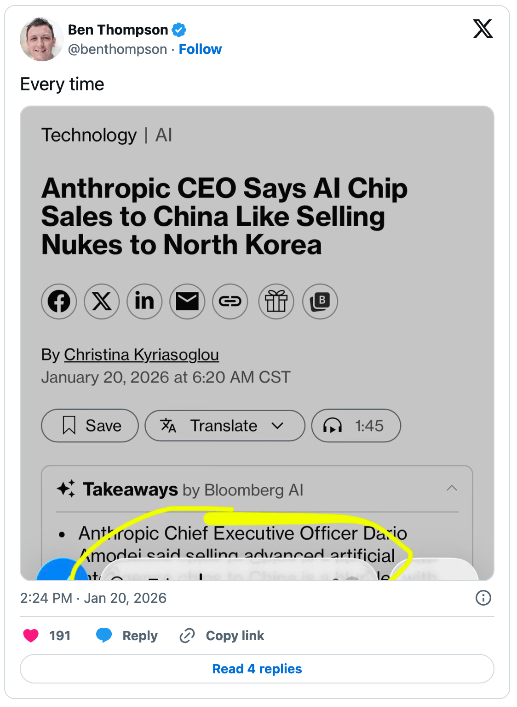
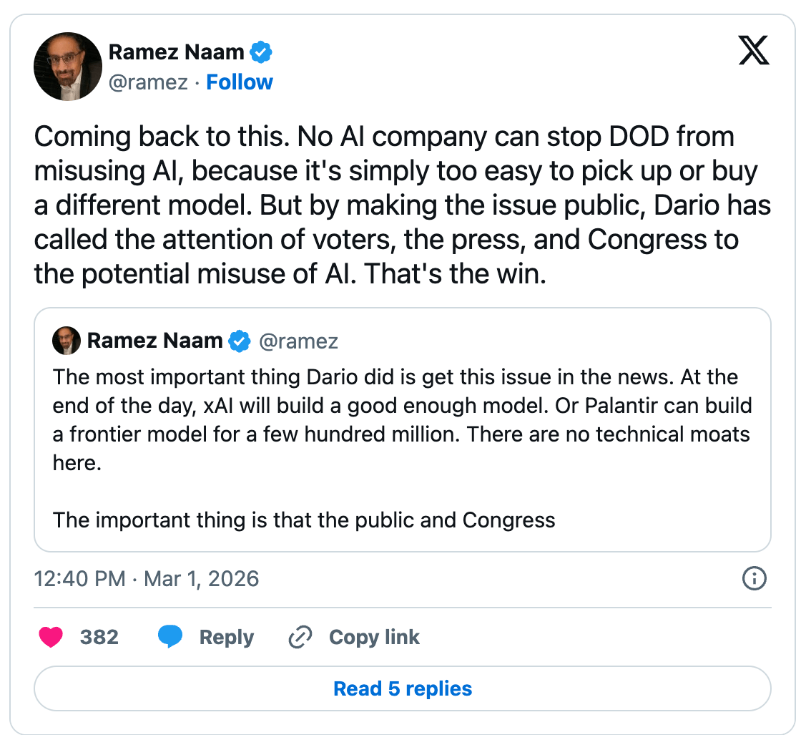

# Stratechery Article

**Source URL**: https://stratechery.com/2026/anthropic-and-alignment/

---

**Listen to this**post** :**

[Log in to listen](https://stratechery.com/wp-json/passport/v1/oauth/authlogin?signup_redirect_uri=https%3A%2F%2Fstratechery.com%2Fverify-your-email%2F)

**Just because you do not take an interest in politics doesn’t mean politics won’t take an interest in you.  
** ― _Pericles_

This is not an Article about the campaign being waged by the U.S. against Iran, but it’s a useful — and timely — analogy. There is a never-ending debate that can be had about the concept of International Law and who might be violating it. Some will argue that the U.S. is in violation for the attacks; others will note that Iran has been serially violating International Law with both its overt actions and its support of terror networks for my entire life.

What is important to note is that the entire debate is ultimately pointless: the very concept of “international law” is fake, not because pertinent statutes and agreements don’t exist, but because their effectiveness is ultimately rooted in their enforceability. That, by extension, means there must be an entity to enact such enforcement, with the capability to match, and such an entity does not exist.

Yes, there is the United Nations, but said body only operates by the agreement of its members, and their willingness to subjugate themselves to not only its edicts, but to also put forward the capabilities to enforce its mandates. In other words, the only agents that matter are nation states themselves, and the relative power of those nation states is not a function of lawyers and judges but rather their ability to project force and coerce others.

To put it another way, if, after this weekend, you want to hold onto the concept of International Law, then realize the debate has been resolved: Iran was in violation, because their military just had its clock cleaned by the U.S., which means the U.S. decides who is right and who is wrong.

### Anthropic vs. The Department of War

While most of the U.S., and certainly the rest of the world, was preoccupied with the happenings in Iran, another fervent debate has been ongoing in tech. Once again one of the parties is the United States itself, but the other entity in question is a private company, Anthropic. From the [Wall Street Journal](https://www.wsj.com/tech/ai/trump-will-end-government-use-of-anthropics-ai-models-ff3550d9):

> The federal government will stop working with Anthropic and designate the artificial intelligence company a supply-chain risk, a dramatic escalation of the government’s clash with the company over how its technology can be used by the Pentagon. While Anthropic’s relationship with the administration hit a new low, rival OpenAI said late Friday that it reached an agreement with the Defense Department to have its models used in classified settings, until recently a status only held by Anthropic. Friday’s quick-fire developments between the Pentagon and two Silicon Valley darlings are poised to shape the future of how the federal government and, particularly the Pentagon, uses cutting-edge AI tools.

Anthropic staked out its position earlier in the week in a [Statement from Dario Amadei on [its] discussions with the Department of War](https://www.anthropic.com/news/statement-department-of-war):

> In a narrow set of cases, we believe AI can undermine, rather than defend, democratic values. Some uses are also simply outside the bounds of what today’s technology can safely and reliably do. Two such use cases have never been included in our contracts with the Department of War, and we believe they should not be included now:
> 
>   * **Mass domestic surveillance.** We support the use of AI for lawful foreign intelligence and counterintelligence missions. But using these systems for mass domestic surveillance is incompatible with democratic values. AI-driven mass surveillance presents serious, novel risks to our fundamental liberties. To the extent that such surveillance is currently legal, this is only because the law has not yet caught up with the rapidly growing capabilities of AI. For example, under current law, the government can purchase detailed records of Americans’ movements, web browsing, and associations from public sources without obtaining a warrant, a practice the Intelligence Community has acknowledged raises privacy concerns and that has generated bipartisan opposition in Congress. Powerful AI makes it possible to assemble this scattered, individually innocuous data into a comprehensive picture of any person’s life—automatically and at massive scale.
>   * **Fully autonomous weapons.** Partially autonomous weapons, like those used today in Ukraine, are vital to the defense of democracy. Even fully autonomous weapons (those that take humans out of the loop entirely and automate selecting and engaging targets) may prove critical for our national defense. But today, frontier AI systems are simply not reliable enough to power fully autonomous weapons. We will not knowingly provide a product that puts America’s warfighters and civilians at risk. We have offered to work directly with the Department of War on R&D to improve the reliability of these systems, but they have not accepted this offer. In addition, without proper oversight, fully autonomous weapons cannot be relied upon to exercise the critical judgment that our highly trained, professional troops exhibit every day. They need to be deployed with proper guardrails, which don’t exist today.
> 

> 
> To our knowledge, these two exceptions have not been a barrier to accelerating the adoption and use of our models within our armed forces to date.
> 
> The Department of War has stated they will only contract with AI companies who accede to “any lawful use” and remove safeguards in the cases mentioned above. They have threatened to remove us from their systems if we maintain these safeguards; they have also threatened to designate us a “supply chain risk” — a label reserved for US adversaries, never before applied to an American company — and to invoke the Defense Production Act to force the safeguards’ removal. These latter two threats are inherently contradictory: one labels us a security risk; the other labels Claude as essential to national security.
> 
> Regardless, these threats do not change our position: we cannot in good conscience accede to their request.

I actually didn’t realize before this episode that the National Security Agency (NSA) is a part of the Department of War; that certainly provides useful context around the surveillance point. And, as we saw a decade ago with the Snowden revelations, the NSA can be both aggressive and creative in its interpretations of what is legal in terms of surveillance. One might have hoped that telecom companies in particular might have taken a stand like Anthropic did.

At the same time, what is the standard by which it should be decided what is allowed and not allowed if not laws, which are passed by an elected Congress? Anthropic’s position is that Amodei — who I am using as a stand-in for Anthropic’s management and its board — ought to decide what its models are used for, despite the fact that Amodei is not elected and not accountable to the public.

And, on the second point, who decides when and in what way American military capabilities are used? That is the responsibility of the Department of War, which ultimately answers to the President, who also is elected. Once again, however, Anthropic’s position is that an unaccountable Amodei can unilaterally restrict what its models are used for.

It’s worth noting that there are reports that Anthropic’s concerns may be broader than just fully autonomous weapons; from [Semafor](https://www.semafor.com/article/02/17/2026/palantir-partnership-is-at-heart-of-anthropic-pentagon-rift):

> Anthropic is one of the few “frontier” large language models available for classified use by the US government because it is available through Amazon’s Top Secret Cloud and through Palantir’s Artificial Intelligence Platform, which is how its Claude chatbot ended up appearing on the screens of officials who were monitoring the seizure of then-Venezuelan President Nicolás Maduro…
> 
> Soon after the Maduro raid, during a regular check-in that Palantir holds with Anthropic, an Anthropic official discussed the operation with a Palantir senior executive, who gathered from the exchange that the AI startup disapproved of its technology being used for that purpose. The Palantir executive was alarmed by the implication of Anthropic’s inquiry that the company might resist the use of its technology in a US military operation, and reported the conversation back to the Pentagon, a senior Defense Department official said.

Anthropic denied it objected to whatever involvement Claude may have had in the Maduro raid, but the Semafor story resonates given the trend in some tech circles to resist any involvement in military operations. And, to that end, one could argue that this stand-off is ending as it should: Anthropic and its models will be removed from the Department of War tech stack, and an alternative will take their place.

### North Korea and Nuclear Weapons

Amodei has been outspoken about other aspects of AI and national security; from [Bloomberg in January](https://www.bloomberg.com/news/articles/2026-01-20/anthropic-ceo-says-selling-advanced-ai-chips-to-china-is-crazy):

> Anthropic Chief Executive Officer Dario Amodei said selling advanced artificial intelligence chips to China is a blunder with “incredible national security implications” as the US moves to allow Nvidia Corp. to sell its H200 processors to Beijing. “It would be a big mistake to ship these chips,” Amodei said in an interview with Bloomberg Editor-in-Chief John Micklethwait at the World Economic Forum in Davos, Switzerland. “I think this is crazy. It’s a bit like selling nuclear weapons to North Korea.”

This rather raises the stakes of a messy procurement decision: consider the implications if we take Amodei’s analogy literally.

Start with Iran: beyond the fact that Iran has been responsible for the deaths of thousands of Americans throughout the Middle East and beyond, one of the arguments for the U.S. intervention is that Iran continues to pursue nuclear weapons capabilities. It’s North Korea that shows why: North Korea doesn’t need to buy nuclear weapons, because they already have them, and it certainly makes any sort of potential military action against them considerably more complicated. Nuclear weapons make you an effective lawyer in the (nonexistent1) court of international law!

In short, nuclear weapons meaningfully tilt the balance of power; the extent that AI is of equivalent importance is the extent to which the United States has far more interest in not only what Anthropic lets it do with its models, but also what Anthropic is allowed to do period.

This, I think, gives important context to the designation of Anthropic as a supply chain risk. [Secretary of War Pete Hegseth said on X](https://x.com/SecWar/status/2027507717469049070):

> In conjunction with the President’s directive for the Federal Government to cease all use of Anthropic’s technology, I am directing the Department of War to designate Anthropic a Supply-Chain Risk to National Security. Effective immediately, no contractor, supplier, or partner that does business with the United States military may conduct any commercial activity with Anthropic.

This would decimate Anthropic: at a bare minimum the company relies on cloud hosting from AWS, Microsoft, and Google, all of which have contracts with the Department of War; I imagine the same applies to Nvidia. Fortunately for the company, Hegseth’s declaration does seem out of step [with the law](https://uscode.house.gov/view.xhtml?req=granuleid:USC-prelim-title10-section3252&num=0&edition=prelim), which limits Hegseth’s authority to work covered by U.S. government contracts; in other words, AWS could still serve Anthropic models, as long as it doesn’t use Anthropic models for any of its services offered to the U.S. government.

Regardless, this is an extreme measure that has been met with near universal dismay, even amongst people who are sympathetic to the idea that a private company should not have veto power over the U.S. military. Why would the U.S. government want to kneecap one of its AI champions?

In fact, Amodei already answered the question: if nuclear weapons were developed by a private company, and that private company sought to dictate terms to the U.S. military, the U.S. would absolutely be incentivized to destroy that company. The reason goes back to the question of international law, North Korea, and the rest:

  * International law is ultimately a function of power; might makes right.
  * There are some categories of capabilities — like nuclear weapons — that are sufficiently powerful to fundamentally affect the U.S.’s freedom of action; we can bomb Iran, but we can’t North Korea.
  * To the extent that AI is on the level of nuclear weapons — or beyond — is the extent that Amodei and Anthropic are building a power base that potentially rivals the U.S. military.

Anthropic talks a lot about alignment; this insistence on controlling the U.S. military, however, is fundamentally misaligned with reality. Current AI models are obviously not yet so powerful that they rival the U.S. military; if that is the trajectory, however — and no one has been more vocal in arguing for that trajectory than Amodei — then it seems to me the choice facing the U.S. is actually quite binary:

  * Option 1 is that Anthropic accepts a subservient position relative to the U.S. government, and does not seek to retain ultimate decision-making power about how its models are used, instead leaving that to Congress and the President.
  * Option 2 is that the U.S. government either destroys Anthropic or removes Amodei.

Note that I’m not making the (very good) argument put forward by Anduril founder Palmer Luckey about the importance of democratic oversight; [Luckey wrote on X](https://x.com/palmerluckey/status/2027500334999081294):

> This gets to the core of the issue more than any debate about specific terms. Do you believe in democracy? Should our military be regulated by our elected leaders, or corporate executives?…
> 
> The fact that this is a debate over AI does not change the underlying calculus. The same problems apply to definitions and use of ethically fraught but important capabilities like surveillance systems or autonomous weapons. It is easy to say “But they will have cutouts to operate with autonomous systems for defensive use!”, but you immediately get into the same issues and more — what is autonomous? What is defensive? What about defending an asset during an offensive action, or parking a carrier group off the coast of a nation that considers us to be offensive?
> 
> At the end of the day, you have to believe that the American experiment is still ongoing, that people have the right to elect and unelect the authorities making these decisions, that our imperfect constitutional republic is still good enough to run a country without outsourcing the real levers of power to billionaires and corpos and their shadow advisors. I still believe. And that is why “bro just agree the AI won’t be involved in autonomous weapons or mass surveillance why can’t you agree it is so simple please bro” is an untenable position that the United States cannot possibly accept.

Again, I think this is a good argument; the one I am putting forward, however, is much more basic and brutal, and doesn’t have anything to do with belief or not in the American experiment (although I’m with Luckey in that regard): it simply isn’t tolerable for the U.S. to allow for the development of an independent power structure — which is exactly what AI has the potential to undergird — that is expressly seeking to assert independence from U.S. control.

### Complex Systems

I don’t, for the record, want Anthropic to be destroyed, and I want them to be a U.S. AI champion. I also, for the record, don’t trust Amodei’s judgment in terms of either national security or AI security.

In terms of national security, [I already commented on Amodei’s Davos comments on X](https://x.com/benthompson/status/2013709205245513811):

Last year I laid out in [AI Promise and Chip Precariousness](https://stratechery.com/2025/ai-promise-and-chip-precariousness/) why I believed a systemic view of the U.S.-China rivalry entailed some painful tradeoffs when it came to chips and China:

> The important takeaway that is relevant to this Article is that Taiwan is the flashpoint in both scenarios. A pivot to Asia is about gearing up to defend Taiwan from a potential Chinese invasion or embargo; a retrenchment to the Americas is about potentially granting — or acknowledging — China as the hegemon of Asia, which would inevitably lead to Taiwan’s envelopment by China.
> 
> This is, needless to say, a discussion where I tread gingerly, not least because I have lived in Taipei off and on for over two decades. And, of course, there is the moral component entailed in Taiwan being a vibrant democracy with a population that has no interest in reunification with China. To that end, the status quo has been simultaneously absurd and yet surprisingly sustainable: Taiwan is an independent country in nearly every respect, with its own border, military, currency, passports, and — pertinent to tech — economy, increasingly dominated by TSMC; at the same time, Taiwan has not declared independence, and the official position of the United States is to acknowledge that China believes Taiwan is theirs, without endorsing either that position or Taiwanese independence.
> 
> Chinese and Taiwanese do, in my experience, handle this sort of ambiguity much more easily than do Americans; still, gray zones only go so far. What has been just as important are realist factors like military strength (once in favor of Taiwan, now decidedly in favor of China), economic ties (extremely deep between Taiwan and China, and China and the U.S.), and war-waging credibility. Here the Ukraine conflict and the resultant China-Russia relationship looms large, thanks to the sharing of military technology and overland supply chains for oil and food that have resulted, even as the U.S. has depleted itself. That, by extension, gets at another changing factor: the hollowing out of American manufacturing under Pax Americana has been directly correlated with China’s dominance of the business of making things, the most essential war-fighting capability.
> 
> Still, there is — or rather was — a critical factor that might give China pause: the importance of TSMC. Chips undergird every aspect of the modern economy; the rise of AI, and the promise of the massive gains that might result, only make this need even more pressing. And, as long as China needs TSMC chips, they have a powerful incentive to leave Taiwan alone.

The key thing to consider is the opposite scenario: cutting China off from advanced chips doesn’t just reduce the likelihood that Chinese companies are dependent on a U.S.-based ecosystem, it also reduces the cost of destroying TSMC. More than that, if AI becomes as capable as Amodei says it will — the equivalent, or more, of nuclear weapons — then it actually becomes game theory optimal for China to do exactly that: if China can’t have AI, then it is, at least under current circumstances, relatively easy to make sure that nobody does.

Amodei is, as the quote above notes, cognizant of China as a threat generally; it concerns me that he consistently fails to acknowledge that the implication of his recommended course of action in terms of chip controls is to risk destroying AI for everybody.

Then again, Amodei isn’t really a fan of AI for everybody: he and Anthropic have been vocal opponents of open source models, and were major drivers of what I considered [a very misguided Biden executive order about AI](https://stratechery.com/2023/attenuating-innovation-ai/). Like the Taiwan situation, I think these positions evince a failure to think systematically:

  * First, were there only closed AI systems, then unimaginable power would be vested in the owners of those systems; it seems that Amodei thinks that power should be wielded by him (at a minimum, I would prefer that it be wielded by the U.S. government).
  * Second, the idea that AI safety can only be guaranteed by a limited number of responsible stewards ignores the massive incentives that exist to build other models. This was clear years ago when only a few companies were working on AI models, and has been proven out by what has happened in reality so far.
  * Third, in a world of AI proliferation, the best defense against AI will be AI; this means that more AI is actually safer than limited AI, which means open source is ultimately safer.

There is certainly room for disagreement on these points; what concerns me about Amodei and Anthropic in particular is the consistent pattern of being singularly focused on being the one winner with all of the power, with limited consideration of how everyone else may react to that situation. Or, to be more blunt, the reality that other people exist and they have guns and missiles and yes, nuclear weapons. Might still makes right, and I personally would rather not hand over the future of humanity to a person and a company that seems to consistently forget that fact.

### Who to Entrust

I do think [this post on X from Ramez Naam](https://x.com/ramez/status/2028178537711301068) is the most optimistic way to frame the debate this weekend:

I do have tremendous discomfort about AI’s surveillance capabilities in particular; there are a lot of safeguards we thought we had that were actually mostly due to the friction entailed in overcoming them. AI, even more than computers and the Internet, is a friction solvent, and I completely understand why Anthropic’s pushback on this specific point resonates broadly.

The way to address this new reality, however, is with new laws and through strengthening accountable oversight; cheering or even demanding that an unelected executive decide how and where such powerful capabilities can be used is the road an even more despotic future.

Our adversaries, meanwhile, will certainly be developing autonomous fighting capabilities (and yes, I admit my chip prescriptions make this more likely much sooner — tradeoffs are hard!); the U.S. will need to move in this direction if we are to remain the ultimate source of international law. And, by the U.S., I mean a democratically elected President and Congress, not a San Francisco executive. I don’t want that, and, more pertinently, the ones with guns aren’t going to tolerate it. Anthropic needs to align itself with that reality.

_I wrote a follow-up to this Article in[this Daily Update](https://stratechery.com/2026/technological-scale-and-government-control-paramount-outbids-netflix-for-warner-bros/)._

* * *

* * *

  1. Yes, The Hague exists; its subject to all of the same limitations as the United Nations ↩

### Share

  * [ Share on Facebook (Opens in new window) Facebook ](https://stratechery.com/2026/anthropic-and-alignment/?share=facebook)
  * [ Share on X (Opens in new window) X ](https://stratechery.com/2026/anthropic-and-alignment/?share=twitter)
  * [ Share on LinkedIn (Opens in new window) LinkedIn ](https://stratechery.com/2026/anthropic-and-alignment/?share=linkedin)
  * [ Email a link to a friend (Opens in new window) Email ](mailto:?subject=%5BShared%20Post%5D%20Anthropic%20and%20Alignment&body=https%3A%2F%2Fstratechery.com%2F2026%2Fanthropic-and-alignment%2F&share=email)
  *