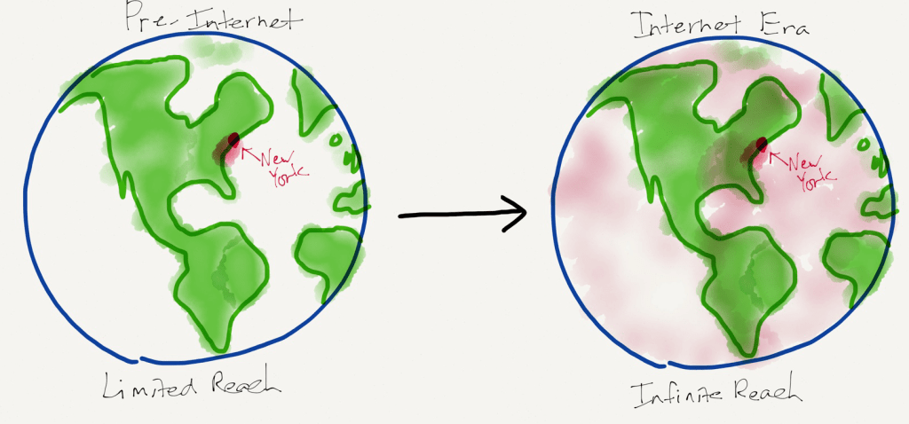

# Stratechery Article

**Source URL**: https://stratechery.com/2026/microsoft-and-software-survival/

---

**Listen to this**post** :**

[Log in to listen](https://stratechery.com/wp-json/passport/v1/oauth/authlogin?signup_redirect_uri=https%3A%2F%2Fstratechery.com%2Fverify-your-email%2F)

One way to track the AI era, starting with the November 2022 launch of ChatGPT, is by which Big Tech company was, at a particular point in time, thought to be most threatened. At the beginning everyone — [including yours truly](https://stratechery.com/2023/ai-and-the-big-five/) — was concerned about Google and the potential disruption of Search. Then, [early last year](https://stratechery.com/2025/apple-ais-platform-pivot-potential/), it was [Apple’s turn](https://stratechery.com/2025/apple-and-the-ghosts-of-companies-past/), as its more intelligent Siri stumbled so badly it didn’t even launch. By the fall it was [Meta’s in the crosshairs](https://stratechery.com/2025/sora-ai-bicycles-and-meta-disruption/), as the company completely relaunched its AI efforts as Llama hit a wall.

Now it’s Microsoft’s turn, which is a bit of a full circle moment, given that the company was thought to be the biggest winner from ChatGPT in particular, thanks to its partnership with OpenAI. I wrote in early 2023 in [AI and the Big Five](https://stratechery.com/2023/ai-and-the-big-five/):

> Microsoft, meanwhile, seems the best placed of all. Like AWS it has a cloud service that sells GPUs; it is also the exclusive cloud provider for OpenAI. Yes, that is incredibly expensive, but given that OpenAI appears to have the inside track to being the AI epoch’s addition to this list of top tech companies, that means that Microsoft is investing in the infrastructure of that epoch.
> 
> Bing, meanwhile, is like the Mac on the eve of the iPhone: yes it contributes a fair bit of revenue, but a fraction of the dominant player, and a relatively immaterial amount in the context of Microsoft as a whole. If [incorporating ChatGPT-like results](https://www.theinformation.com/articles/microsoft-and-openai-working-on-chatgpt-powered-bing-in-challenge-to-google) into Bing risks the business model for the opportunity to gain massive market share, that is a bet well worth making.
> 
> The [latest report from The Information](https://www.theinformation.com/articles/ghost-writer-microsoft-looks-to-add-openais-chatbot-technology-to-word-email), meanwhile, is that GPT is eventually coming to Microsoft’s productivity apps. The trick will be to imitate the success of AI-coding tool GitHub Copilot (which is built on GPT), which figured out how to be a help instead of a nuisance (i.e. don’t be Clippy!).
> 
> What is important is that adding on new functionality — perhaps for a fee — fits perfectly with Microsoft’s subscription business model. It is notable that the company once thought of as a poster child for victims of disruption will, in the full recounting, not just be born of disruption, but be well-placed to reach greater heights because of it.

I do, I must admit, post that excerpt somewhat sheepishly, as much of it seems woefully shortsighted:

  * OpenAI is still Azure’s biggest customer, but the fact that the maker of ChatGPT represents 45% of Azure’s Remaining Performance Obligations (RPO) is now seen as a detriment by the market.
  * Bing was briefly interesting [when it contained Sydney](https://stratechery.com/2023/from-bing-to-sydney-search-as-distraction-sentient-ai/); Microsoft quickly squashed what remains the single most compelling AI experience I’ve had and, one could make the case, Bing’s growth prospects.
  * All of Microsoft’s products have a CoPilot of some sort; it’s not clear how well any of them work, and both Claude and OpenAI are attacking the professional productivity space.
  * Microsoft 365 CoPilot has 15 million paying customers, but (1) that’s a tiny fraction of Microsoft 365’s overall customer base and (2) the rise of agents raises serious questions about the long-term viability of the per-seat licensing model on which Microsoft’s productivity business is built.

All of these factors — plus the fact that Azure growth came in a percentage point lower than expected — contributed to one of the worst days in stock market history. From [Bloomberg](https://www.bloomberg.com/news/articles/2026-01-29/microsoft-heads-for-worst-market-loss-since-deepseek-hit-nvidia) last week:

> Microsoft Corp. shares got caught up in a selloff Thursday that wiped out $357 billion in value, second-largest for a single session in stock market history. The software giant’s stock closed down 10%, its biggest plunge since March 2020, following Microsoft’s earnings after the bell Wednesday, which showed record spending on artificial intelligence as growth at its key cloud unit slowed. The only bigger one-day valuation destruction was Nvidia Corp.’s $593 billion rout last year after the launch of DeepSeek’s low-cost AI model. Microsoft’s move is larger than the market capitalizations of more than 90% of S&P 500 Index members, according to data compiled by Bloomberg…
> 
> The selloff comes amid heightened skepticism from investors that the hundreds of billions of dollars Big Tech is spending on AI will eventually pay off. Microsoft’s results showed a 66% rise in capital expenditures in its most recent quarter to a record $37.5 billion, while growth at its closely tracked Azure cloud-computing unit slowed from the prior quarter.

I laid out my base case for Big Tech back in 2020 in [The End of the Beginning](https://stratechery.com/2020/the-end-of-the-beginning/), arguing that the big tech companies would be the foundation on which future paradigms would be built; is Microsoft the one that might crack?

### The Beneficiaries of AI-Written Code

It can, when it comes to vibe coding, be difficult to parse the hype on X from the reality on the ground; what is clear is the trajectory. I have talked to experienced software engineers who will spend 10 minutes complaining about the hype and all of the shortcomings of Claude Code or OpenAI Codex, only to conclude by admitting that AI just helped them write a new feature or app that they never would have otherwise, or would have taken far longer to do than it actually did.

The beauty of AI writing code is that it is a nearly perfect match of probabilistic inputs and deterministic outputs: the code needs to actually run, and that running code can be tested and debugged. Given this match I do think it is only a matter of time before the vast majority of software is written by AI, even if the role of the software architect remains important for a bit longer.

That, then, raises the most obvious bear case for any software company: why pay for software when you can just ask AI to write your own application, perfectly suited to your needs? Is software going to be a total commodity and a non-viable business model in the future?

I’m skeptical, for a number of reasons. First, companies — [particularly American ones](https://stratechery.com/2024/the-e-u-goes-too-far/) — are very good at focusing on their core competency, and for most companies in the world, that isn’t software. There is a reason most companies pay other companies for software, and the most fundamental reason to do so won’t change with AI.

Second, writing the original app is just the beginning: there is maintenance, there are security patches, there are new features, there are changing standards — writing an app is a commitment to a never-ending journey — a journey, to return to point one, that has nothing to do with the company’s core competency.

Third, selling software isn’t just about selling code. There is support, there is compliance, there are integrations with other software, the list of what is actually valuable goes far beyond code. This is why companies don’t run purely open source software: they don’t want code, they want a product, with everything that entails.

Still, that doesn’t mean the code isn’t being written by AI: it’s the software companies themselves that will be the biggest beneficiaries of and users of AI for writing code. In other words, on this narrow question of AI-written code, I would contend that software companies are not losers, but rather winners: they will be able to write more code more efficiently and quickly.

### AI Competition

When the Internet first came along it seemed, at first glance, a tremendous opportunity for publishers: suddenly their addressable market wasn’t just the geographic area they could deliver newspapers to, but rather the entire world! In fact, the nature of the opportunity was the exact opposite; from 2014’s [Economic Power in the Age of Abundance](https://stratechery.com/2014/economic-power-age-abundance/):

> One of the great paradoxes for newspapers today is that their financial prospects are inversely correlated to their addressable market. Even as advertising revenues have fallen off a cliff — adjusted for inflation, ad revenues are at the same level as the 1950s — newspapers are able to reach audiences not just in their hometowns but literally all over the world.
> 
> 
> 
> The problem for publishers, though, is that the free distribution provided by the Internet is not an exclusive. It’s available to every other newspaper as well. Moreover, it’s also available to publishers of any type, even bloggers like myself.
> 
> To be clear, this is absolutely a boon, particularly for readers, but also for any writer looking to have a broad impact. For your typical newspaper, though, the competitive environment is diametrically opposed to what they are used to: instead of there being a scarce amount of published material, there is an overwhelming abundance. More importantly, this shift in the competitive environment has fundamentally changed just who has economic power.

The power I was referring to was Google; this Article was an articulation of [Aggregation Theory](https://stratechery.com/2015/aggregation-theory/) a year before I coined the term.

The relevance to AI-written code, however, is not necessarily about Aggregators, but rather about inputs. Specifically, what changed for publishers is that the cost of distribution went to zero: of course that was beneficial for any one publisher, but it was disastrous for publishers as a collective. In the case of software companies, the input that is changing is the cost of code: it’s not going completely to zero, at least not yet — you still need a managing engineer, for one, and tokens, particularly for leading edge models actually capable of writing usable code, have significant marginal costs — but the relative cost is much lower, and the trend is indeed towards zero.

If you want to carry this comparison forward, this is an argument against there even being a market for software in the long run. After all, the most consumed form of content on the Internet today, three decades on, is in fact user-generated content, which you could analogize to companies having AI write their own software. That seems a reasonable bet for 2056 — if we even have companies then ([I think we will](https://stratechery.com/2026/ai-and-the-human-condition/)).

In the shorter-term, however, the real risk I see for software companies is the fact that while they can write infinite software thanks to AI, so can every other software company. I suspect this will completely upend the relatively neat and infinitely siloed SaaS ecosystem that has been Silicon Valley’s bread-and-butter for the last decade: identify a business function, leverage open source to write a SaaS app that addresses that function, hire a sales team, do some cohort analysis, IPO, and tell yourself that you were changing the world.

The problem now, however, is that while businesses may not give up on software, they don’t necessarily want to buy more — if anything, they need to cut their spending so they have more money for their own tokens. That means the growth story for all of these companies is in serious question — the industry-wide re-rating seems completely justified to me — which means the most optimal application of that new AI coding capability will be to start attacking adjacencies, justifying both your existence and also presenting the opportunity to raise prices. In other words, for the last decade the SaaS story has been about growing the pie: the next decade is going to be about fighting for it, and the model makers will be the arms dealers.

### Agents and Work IQ

While this battle is happening, there will be another fundamental shift taking place: yes, humans will be using software, at least for a while, but increasingly so will agents. What isn’t clear is who will be creating the agents: I expect every SaaS app to have their own agent, but that agent will definitionally be bound by the borders of the application (which will be another reason to expand the app into adjacent areas). Different horizontal players, meanwhile, will be making a play to cover broader expanses of the business, with the promise of working across multiple apps.

Microsoft is one of those horizontal layers, and the company’s starting point for agents is what it is calling Work IQ; here is how CEO Satya Nadella explained Work IQ on [the company’s earnings call](https://seekingalpha.com/article/4863620-microsoft-corporation-msft-q2-2026-earnings-call-transcript):

> Work IQ takes the data underneath Microsoft 365 and creates the most valuable stateful agent for every organization. It delivers powerful reasoning capabilities over people, their roles, their artifacts, their communications and their history and memory all within an organization security boundary. Microsoft 365 Copilot’s accuracy and latency powered by Work IQ is unmatched, delivering faster and more accurate work grounded results than competition, and we have seen our biggest quarter-over-quarter improvement in response quality to date. This has driven record usage intensity with average number of conversations per user doubling year-over-year.

This feels like the right layer for Microsoft, given the company’s ownership of identity. Active Directory is one of the most valuable free products of all time: it was the linchpin via which Microsoft tied together all of its enterprise products and services, first driving upgrades up and down the stack, and later underpinning its per-seat licensing business model. That the company sees its understanding of the individual worker and all of his or her artifacts, permissions, etc. as the obvious place to build agents makes sense.

There’s one big problem with this starting point, however: it’s shrinking. Owning and organizing a company by identity is progressively less valuable if the number of human identities starts to dwindle — and, with a per-seat licensing model, you make less money. That, by extension, means that Microsoft should feel a significant amount of urgency when it comes to fighting the adjacency battles I predicted above. First, directly incorporating more business functions into Microsoft’s own software suite will make Microsoft’s agents more capable. Secondly, absorbing more business functions into Microsoft’s software offering will let the company charge more. Third, the larger Microsoft’s surface area, the more power it will have to compel other software makers to interface with its agents, increasing their capability.

### Microsoft’s Miss

This pressure explains the choices Microsoft made that led to its Azure miss in particular. Microsoft was clear that, once again, demand exceeded supply. CFO Amy Hood said in her prepared remarks:

> Our customer demand continues to exceed our supply. Therefore, we must balance the need to have our incoming supply better meet growing Azure demand with expanding first-party AI usage across services like M365 Copilot and GitHub Copilot, increasing allocations to R&D teams to accelerate product innovation and continued replacement of end-of-life server and networking equipment.

She further explained in the Q&A section that Azure revenue was directly downstream from Microsoft’s own capacity allocation:

> I think it’s probably better to think about the Azure guidance that we give as an allocated capacity guide about what we can deliver in Azure revenue. Because as we spend the capital and put GPUs specifically, it applies to CPUs, the GPUs more specifically, we’re really making long-term decisions. And the first thing we’re doing is solving for the increased usage in sales and the accelerating pace of M365 Copilot as well as GitHub Copilot, our first-party apps. Then we make sure we’re investing in the long-term nature of R&D and product innovation. And much of the acceleration that I think you’ve seen from us and products over the past a bit is coming because we are allocating GPUs and capacity to many of the talented AI people we’ve been hiring over the past years.
> 
> Then, when you end up, is that, you end up with the remainder going towards serving the Azure capacity that continues to grow in terms of demand. And a way to think about it, because I think, I get asked this question sometimes, is if I had taken the GPUs that just came online in Q1 and Q2 in terms of GPUs and allocated them all to Azure, the KPI would have been over 40. And I think the most important thing to realize is that this is about investing in all the layers of the stack that benefit customers. And I think that’s hopefully helpful in terms of thinking about capital growth, it shows in every piece, it shows in revenue growth across the business and shows as OpEx growth as we invest in our people.

Nadella called this a portfolio approach:

> Basically, as an investor, I think when you think about our capital and you think about the gross margin profile of our portfolio, you should obviously think about Azure. But you should think about M365 Copilot and you should think about GitHub pilot, you should think about Dragon Copilot, Security Copilot. All of those have a gross margin profile and lifetime value. I mean if you think about it, acquiring an Azure customer is super important to us, but so is acquiring an M365 or a GitHub or a Dragon Copilot, which are all by the way incremental businesses and TAMs for us. And so we don’t want to maximize just 1 business of ours, we want to be able to allocate capacity, while we’re sort of supply constrained in a way that allow us to essentially build the best LTV portfolio.
> 
> That’s on one side. And the other one that Amy mentioned is also R&D. I mean you got to think about compute is also R&D, and that’s sort of the second element of it. And so we are using all of that, obviously, to optimize for the long term.

The first part of Nadella’s answer is straightforward: Microsoft makes better margins and has more lifetime value from its productivity applications than it does from renting out Azure capacity, so investors should be happy that it is allocating scarce resources to that side of the business. And, per the competition point above, this is defensive as well: if Microsoft doesn’t get AI right for its own software then competitors will soon be moving in.

The R&D point, however, is also critical: Microsoft also needs to be working to expand its offering, and increasingly the way to do that is going to be by using AI to write that new software. That takes a lot of GPUs — so many that Microsoft simply didn’t have enough to meet the 40% Azure growth rate that Wall Street expected. I think it was the right decision.

### Token Foundries

There are some broader issues raised by Microsoft’s capacity allocation. First, we have the most powerful example yet of the downside of having insufficient chips. Hood was explicit that Microsoft could have beat Wall Street’s number if they had enough GPUs; the fact they didn’t was a precipitating factor in losing $357 billion in value. How much greater will the misses be a few years down the road when AI demand expands even further, particularly if [TSMC both remains the only option and continues to be conservative in its CapEx](https://stratechery.com/2026/tsmc-risk/)?

Secondly, however, it’s fair for Azure customers to feel a bit put out by Microsoft’s decision to favor itself. It reminds me of the pre-TSMC world, when fabs were a part of Integrated Device Manufacturers like Intel or Texas Instruments. If you wanted to manufacture a chip you could contract for space on their lines, but you were liable to lose that capacity if the fab needed it for their own products; TSMC was unique in that they were a pure play foundry: their capacity was solely for their customers, who they weren’t going to compete with.

This isn’t the case with Azure: Microsoft has first dibs, and then OpenAI, and then everyone else, and that priority order was made clear this quarter. Moreover, it’s fair to assume that Amazon and Google will make similar prioritization decisions. I didn’t, before writing this article, fully grok the potential for neoclouds, or Oracle for that matter, but the value proposition of offering a pure play token foundry might be larger than I appreciated.

All that noted, the safest assumption is that Microsoft, like the rest of Big Tech, will figure this out. Some software may be dead, but not all of it, at least not yet, and the biggest software maker of them all is — thanks in part to that size — positioned to be one of the survivors. It’s just going to need a lot of compute, not only for its customers, but especially for itself.

* * *

### Share

  * [ Share on Facebook (Opens in new window) Facebook ](https://stratechery.com/2026/microsoft-and-software-survival/?share=facebook)
  * [ Share on X (Opens in new window) X ](https://stratechery.com/2026/microsoft-and-software-survival/?share=twitter)
  * [ Share on LinkedIn (Opens in new window) LinkedIn ](https://stratechery.com/2026/microsoft-and-software-survival/?share=linkedin)
  * [ Email a link to a friend (Opens in new window) Email ](mailto:?subject=%5BShared%20Post%5D%20Microsoft%20and%20Software%20Survival&body=https%3A%2F%2Fstratechery.com%2F2026%2Fmicrosoft-and-software-survival%2F&share=email)
  *