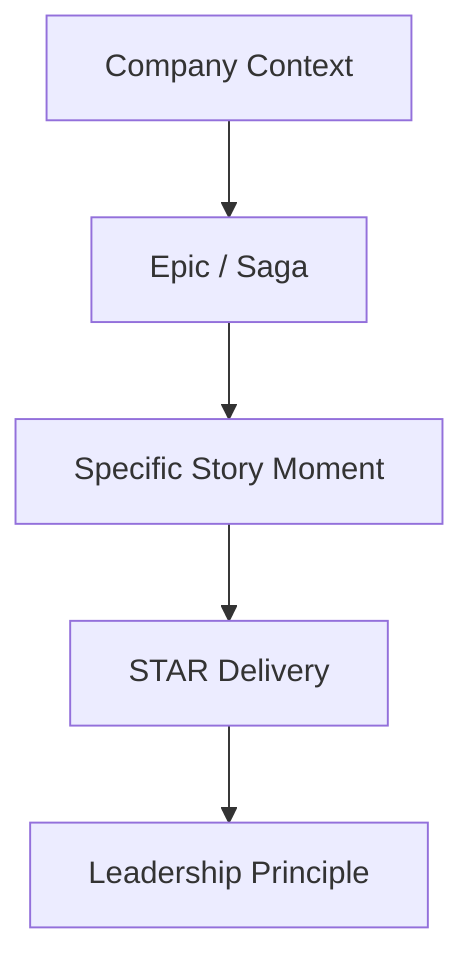

# Story Building Framework: The Hierarchy of Narrative

> **Purpose**: This document codifies the "hierarchy of narrative" approach to interview preparation. It ensures that every answer is grounded in strategic context (Company/Topic) while delivering specific, evidence-based evidence (STAR) aligned with core leadership principles.

---

## 1. The Narrative Hierarchy Structure

Effective storytelling follows a narrowing funnel:

1.  **Company/Context**: "Where was I?" (Macro environment, stakes).
2.  **Topic/Epic**: "What major initiative was I leading?" (The "Saga" over 6-18 months).
3.  **Specific Story**: "What specific moment illustrates the question asked?" (The conflict/decision).
4.  **STAR Format**: The mechanism of delivery.
5.  **Principle**: The underlying mental model or value demonstrated.

### Visual Model

---

## 2. Defining The Layers

### Layer 1: The Context (Company & Environment)
Before diving into the task, set the stage. Senior roles require "environmental awareness."
*   *Example*: "At Meta during the post-iOS14 signal loss crisis..."
*   *Example*: "At Infinera while we were transitioning from hardware to software..."

### Layer 2: The Epic (The "Saga")
An Epic is a sustained, multi-quarter initiative with high stakes. It is the "container" for multiple stories.
*   *Definition*: A strategic workstream that typically spans 6–18 months.
*   *Example Epics*:
    *   "Launching Marketing Messages in Ads Manager (MM)"
    *   "Building the Variance Reduction System (VRS) for HUD Settlement"
    *   "Red-Teaming Llama 3 for Child Safety"

### Layer 3: The Story (The Keyframes)
Within an Epic, multiple specific events happen. These are your "stories." Each maps to different question types.

| Epic | Story "Keyframe" | Question Type Map |
|------|------------------|-------------------|
| **MM Launch** | The decision to prioritize WCA over other features | *Product Strategy / Trade-offs* |
| **MM Launch** | The conflict with Ads team on attribution logic | *Conflict / Disagreement* |
| **MM Launch** | The timeline slip due to privacy review | *Failure / Mistake* |
| **MM Launch** | The "aha" moment of using click-to-WhatsApp signals | *Innovation / Creativity* |

### Layer 4: STAR Execution
The standard delivery mechanism, but tightened for senior roles.
*   **Situation**: 10% of time. The "Why does this matter?"
*   **Task**: 10% of time. "What was *my* specific mandate?"
*   **Action**: 60% of time. "What did *I* do?" (Strategy, Influence, Execution).
*   **Result**: 20% of time. "So what?" (Metrics, Lessons, Moats).

### Layer 5: Leadership Principles (The "Why")
Anchor every story in a principle. This shows you have a philosophy, not just luck.
*   *Amazon Mapping*:
    *   **Customer Obsession**: "I blocked the launch because the user exp was bad."
    *   **Dive Deep**: "I audited the code myself to find the scraping vulnerability."
    *   **Have Backbone; Disagree & Commit**: "I pushed back on Legal for the VPS definitions."
    *   **Invent & Simplify**: "We created IPA because existing attribution was too complex."

---

## 3. The "Story Matrix" Strategy

We do not memorize answers to 100 questions. We build **5-6 deep Epics** and map "Story Keyframes" to question categories.

### The Matrix Format

| Question Category | Epic 1: MM Launch | Epic 2: VRS / HEC | Epic 3: Llama Safety |
|-------------------|-------------------|-------------------|----------------------|
| **Influence / Conflict** | Fighting for WCA roadmap priority | Aligning Policy vs. Eng on "Variance" | Red team vs. Model release date |
| **Failure / Mistake** | Missed Q4 revenue goal | Complexity of initial algorithm | False refusal rate too high |
| **Ambiguity / Strategy** | Define "Marketing" vs "Service" msg | Define "Fairness" mathematically | Define "Safety" for open weights |
| **Execution / Grit** | Crunch for holiday launch | HUD deadline pressure | Red-teaming 405B model |

---

## 4. How to Use This System in Interviews

**The "Zoom-In" Technique**:

1.  **Interviewer**: "Tell me about a time you had a conflict with a partner."
2.  **You (The Signal)**: "I have a great example from my time at **Meta (Context)**, specifically when I was leading the **Marketing Messages Launch (Epic)**.
3.  **You (The Story)**: "We were integrating with Ads Manager, and I had a fundamental disagreement with the Ads VP on how attribution should work..."
4.  **You (STAR)**: [Execute STAR].
5.  **You (Principle)**: "This reinforced my belief in **Deep Diving** into the incentives of partner teams."

---

## 5. Next Steps for Tomo

1.  **Inventory Epics**: We have the list in `project_inventory.md`.
2.  **Mine for Stories**: For each Epic, we will extract 3-4 specific "keyframes" (Conflict, Failure, Strategy, Execution).
3.  **Map to Amazon LPs**: Tag each story with the principle it demonstrates.
