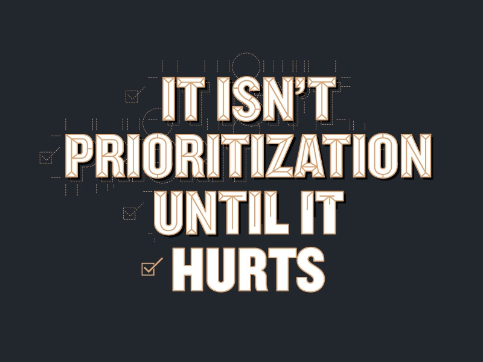
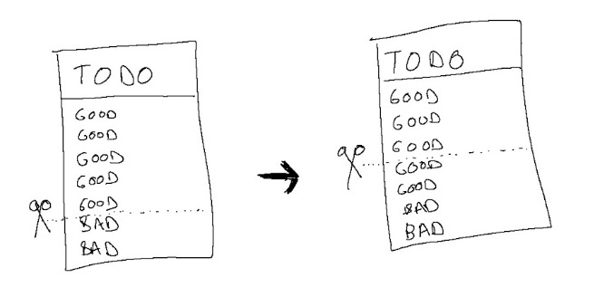

# It’s not prioritization until it hurts

[Poster](https://dribbble.com/shots/3248575--It-isn-t-prioritization-until-it-hurts-Ami-Vora) created by my wonderful former colleague [Leonardo De La Rocha](https://dribbble.com/shots/3248575--It-isn-t-prioritization-until-it-hurts-Ami-Vora)

Early in my career, I remember asking the most senior engineer I worked with to join an urgent meeting that week. They agreed. But when I sent the invite, they responded with, “Actually, I have that morning blocked off to do work, so I can’t join your meeting — sorry.”

At the time, I was irritated and even a little hurt by that response. Now, I have a ton of respect for it. That person knew how to get the time they needed for their goals. And of course, I figured out another way to solve my problem.

We sometimes think about prioritization as “cutting all the unnecessary work.”  But that’s not it. If something were unnecessary, we’d already have cut it!

Instead, prioritization means cutting things that **are** valuable so I can double down on **even bigger** goals. If I'm not disappointed by a few items on my “cut” list, like a product I'm excited about but don’t have time to work on or an interesting discussion I can’t join, I'm not cutting hard enough.

The top tip that has helped me do this?

**Don’t say no to several small ideas; say yes to a few big ones.**

When I look through my calendar and decline meetings, I don't really get much time back. I recover just a couple slots, and those issues find their way back to me anyway because I haven't fundamentally addressed them.

Instead, I say “YES” to a few big goals, whether it's shipping a big product or starting a new recruiting program, and then block time on my calendar for them. Whatever doesn’t make it on my calendar anymore, I know I need to delegate.  This forces me to be realistic about how much I can do, and also gives enough time to focus on those big priorities successfully.