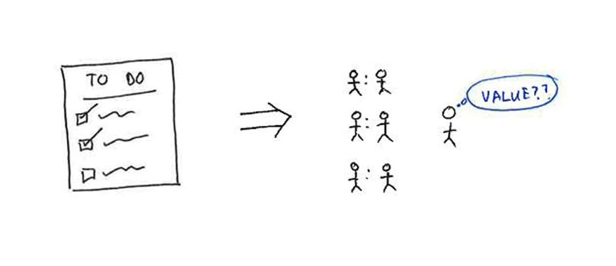

# Lessons I learned from becoming a manager

When I first became a manager I thought it’d be an easier, better version of my individual contributor role. I’d get more done, and everyone would listen to me. Perfect, right?

My experience, of course, was far more complicated. It took me a while to figure out that the skills that made me a good IC don't necessarily make me a good manager. To grow as a manager, I constantly have to let go of skills I pride myself on.

Here are issues I still run into every time my team scales:

#### **Problem #1:  My first responsibility shifts to the people, not the product.**

As an IC, I was successful when I did the right thing for the product. So when I see a product that has an unclear value prop or poor rollout milestones, I’m tempted to jump in and intervene. After all, those instincts are what got me here.

But as a manager, that’s no longer my job. My job is to make sure that the *team* can do the right thing for the product.

**What’s worked: Giving my team slightly more freedom than they (and I) are comfortable with.**

For years I tried to protect my team from failure by making sure I didn't throw anything too hard at them and jumping in as soon as things weren’t perfect. Then someone on my team told me a story about his toddler. *Nowadays, kids are learning how to ride bikes younger than ever because they use balance bikes. There’s no training wheels to get hooked on. You're over-protecting me — take off the training wheels.*

In my career, I’ve learned a ton from my failures. My team deserves the same opportunity: to try hard things, to fail, and to learn.  So I give everyone slightly more freedom than they're comfortable with, while supporting them and holding them accountable *—* and that’s led to faster growth for everyone.

#### **Problem #2:  The feedback loop changes from days to months – which means I don’t know how to measure my own value.**

I used to be able to check all my tasks off a list every day. Analyze beta results, decide which market to launch in first, get feedback from a customer *—* check, check, check. I could go home every day knowing exactly what I accomplished and feeling good about it.

But as a manager, my focus is on building a culture that results in the best products. It takes months to see the results of anything I might do, good or bad. I have to ask myself questions like, *Will my conversation with X today result in a better outcome in three months?* Before I recognized this pattern, not immediately seeing results felt like a crisis.

**What’s worked:**

**Find one thing at work I do for myself, not for my team** *—*a specific product no one else is looking at, a new strategy that I develop, or a meeting where I learn a lot. Finding a place to use my IC skills without stepping on my team’s toes helps me stay connected to what got me into this job and feel like I’m making progress on something.

**Celebrate every win.** Wins in management are often invisible. So when a peer tells me they’re more effective because of my team, or someone on my team says they’re more successful because of a conversation we had, I take a minute to feel good about it. Feeding that feedback loop gives me more energy to bring back to my team.

#### **Problem #3:  Managing people is emotional work.**

When I feel like I’ve let someone on my team down, I carry that remorse around for years. I get a twinge every time I think of anyone who was surprised by their performance review or whom I couldn’t make successful.

I've been surprised at how lonely managing people can be. I have fewer peers, and fewer people have my back or understand my problems. The people I’ve been working with side-by-side now expect something different from me, and the changes in those relationships can be isolating.

**What’s worked:  Finding my peers and celebrating wins together.** Connecting with other people in similar positions, even if I’m reaching out to them cold, has led to some of the best camaraderie and learning in my career.

I love supporting a team. I get to work with amazing people and, when I’m lucky, even have a hand in their growth.  But it’s not easy, and understanding what it takes *—* and that what I’m feeling is normal *—* has been key to my success and happiness as a manager.