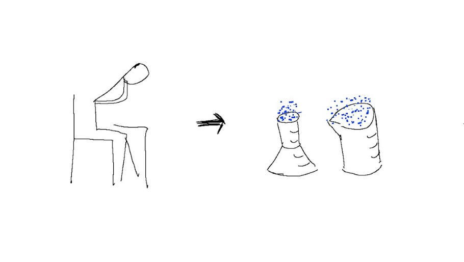

# Turning “What a failure” into “What a useful experiment” 

A few years ago, I was in a big meeting with a ton of senior execs, and I was trying to point out a weakness in our product. I could feel the group getting more impatient as I stumbled over my words and tried three times to explain myself.

Finally, my boss’s boss interrupted with “I can’t understand what you’re trying to say” – and we moved on. This happened years ago, but it felt like such a moment of failure I can still remember how embarrassed I felt.

We hear everywhere that “failure is part of growth.” But that never resonated with me – maybe because several studies show that [women are penalized for failures](https://hbr.org/2018/05/what-most-people-get-wrong-about-men-and-women) more than their counterparts. So every failure, even something as small as being unclear in a meeting, would make me feel bad for days.

Of course that’s an impossible way to live. Especially as my scope has grown (and my family has too), I spend most of my life struggling with failures of different magnitudes.

**What ended up working?**

Instead of thinking about these moments as failures, I try to think of them as **experiments**. If I spoke up in a meeting but was unclear, what did I learn? How could I be clearer next time? How did I feel, and how do I want to feel instead?

It also helps to remember that no matter what failure I’m dealing with today – running a bad meeting, losing a key hire, seeing a product not get traction – that same situation will certainly happen again in my career. So it’s important that I not only deal with the problem itself, but also learn how to recover fast from this kind of scenario so I won’t get unsettled next time.

That reframe helps me put each so-called “failure” into context; it’s not a big deal, just one experiment I tried that gave me some new information. In every case I learned something – what I could do differently, how I want to feel in the future – and I can put it into action next time. That redemption makes it so much easier to recover from the (daily!) moments when I am not as perfect as I’d like.