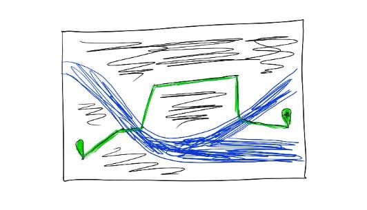

# Creating a product vision

A core part of working in product, of course, is creating a product vision and strategy.

Surprisingly, this isn’t always the most urgent thing — when I’ve been lucky enough to work on an extremely fast-growing product with a small team, sometimes what we needed most was just to keep up with users’ demands.

But over time, as products and teams scale, a clear product vision can inspire everyone on the team (from the most tenured to the brand new) and help every person understand how their work fits into the broader direction.  That guides individual teams to better, more consistent decision-making — which leads to a more coherent and useful product for our users.

Here’s what has helped me build a product vision:

1. **Be a facilitator — ask others for input and bring people along.**  There’s sometimes a mythology around product strategies — that they’re created by visionaries who lock themselves in a room and come out with a brand new direction.  That might work in small, tight teams where everyone already knows and trusts one another.  But in larger teams, it’s hard to ask someone to implement a fully complete strategy without them having a chance to weigh in — and you miss their insights at the same time.  I try to think about myself as the \*facilitator\* of the vision, not the \*creator\* of the vision.  The ideas for the vision should come from everywhere. If I’m writing a strategy, I build in steps to get input from a bunch of key people around the team, recap what I’m hearing, update the strategy, and repeat.
2. **Get a diverse range of inputs to inform the strategy.**  Some of my go-tos:

   1. **Data:**  Trends and insights specific to the product, broadly about global trends, and what competitors are doing.  Who has been using our products?  What features are most popular?  How is usage changing?  What are competitors doing, and what do their users most appreciate?  What’s changing in the world — economic changes, device availability, internet availability, etc — that will create more opportunities or challenges?
   2. **Research**:  What do our users say they love about our products or competitors’ products?  What do they find lacking?  How do those relate to our strategic goals?
   3. **Leadership opinion**:  I once ran a survey to my leadership team asking for their opinions on the product and world, with questions like “In 5 years, what % of our revenue will come from large businesses?” or “In 5 years, what devices will the median person carry?”  Whenever this disparate group universally agreed, I treated it as a “likely outcome” that could anchor the product strategy.  When we disagreed, I knew I needed to explore more deeply.
   4. **My own opinion:**  What is my personal experience from using the products and talking with users?  How does that fit in with all these data points?  What are the outcomes we need to avoid at all costs?  What do I think we should definitely do, and what do I think we should only try if we’re prepared to take big risks?
3. **Outline a range of full ideas**, including the most extreme I can think of that still works for the data points I have.  Which one feels most true?  Which one feels scary and risky?  What elements of that risky one illustrates a gap for us today?  Naming and fleshing out the extreme ideas helps me understand the full spectrum of ideas, and ensures that we’re not accidentally pursuing low-risk ideas out of inertia.
4. **Write a short, provocative draft recommendation.**  All these exercises help me hone in on a recommendation.  I try to keep this short enough that someone can read and internalize it rapidly, and provocative enough that every reader will have some kind of reaction.  I can always walk it back to a more neutral position, but being a little extreme in outlining big bets and what we’d need to deprioritize to get there helps people give me pointed feedback.
5. **Get feedback on my recommendation.** I try to involve a mix of long-tenured folks and people with fresher eyes.  That way we don’t just do what we always did, but we also don’t jump into a future that feels disconnected from what got us here.  That feedback helps me build a more complete (and slightly more neutral) vision, while still maintaining a strong perspective on what we should and shouldn’t do.
6. **Write it to appeal to the entire team.**  A key goal of the product vision is motivating and inspiring the entire team.  Of course, everyone finds motivation in different points.  So I try to outline different angles for each major point:

   1. The user story — X user in Y country asked us for this because it would simplify their life in Z way
   2. The compelling data — in 3 years, X% of people will be carrying Y devices
   3. The challenge — to do this, we’ll need to figure out how to support X device at Y reliability
   4. How it fits in — building this will let us support users as they go about X task every day alongside Y other products we build

That way, most people will see something that resonates specifically for them with each part of the vision.

Different versions of this system have worked at different scales — like an abbreviated process to a short document for a specific feature, or an extended workshop leading to illustrative prototypes for an entire product suite.

I’ve found that a strong product vision can point our entire team toward the future, and give us a map for how we’re going to get there. That way, every team knows the role our product will play in the future, so we each know how to make better decisions to get there together.

Thanks for reading The Hard Parts of Growth! Subscribe for free to receive new posts and support my work.