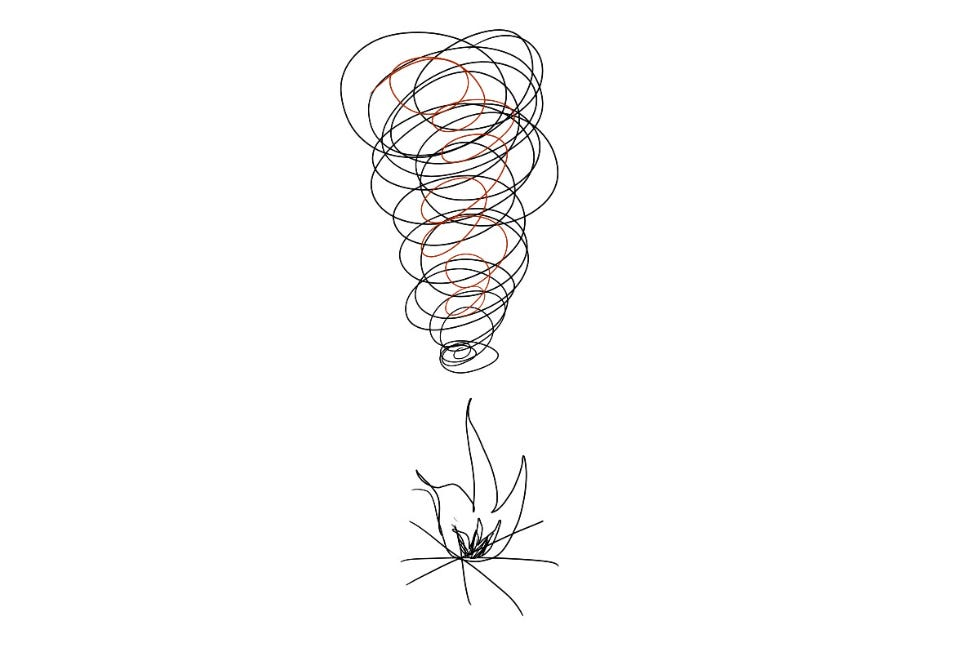

# Becoming my own “burnout spotter”

“You need to change something *now*,” my friend Annette told me.  “Because otherwise you’re going to tell me in a month that you’re burned out and need a new job.”

This was years ago, but that conversation sticks with me to this day!  Annette is a long-time friend and colleague who had listened to my feelings about work for years — and when she noticed I was heading down my typical burnout path, she called me on it to make sure I was preventing burnout before it started.

What did she notice?  That when I got into a rut at work, I slowly got irritated and bored — which turned into a downward spiral that ended with me feeling exhausted and like I needed to find something new, even when my role was actually a good match.  After observing that pattern a couple times, she started alerting me as soon as she noticed so I could do something about it.

What has worked for me to prevent burnout?

1. **Change something as soon as I see burnout signals.**  The early days of feeling “stuck” often feel manageable and normal, and my initial temptation is always to power through it even if things get worse.  But it’s a lot easier to prevent burnout than it is to address it later.  So nowadays as soon as I notice I’m on a decline, I try to immediately make little changes to get more energy every day — even if it’s just taking 5 minutes for a simple breathing exercise twice a day.
2. **Focus my attention on something energizing at work, even if it’s small.**  The temptation is to drop anything at work that’s the slightest bit unnecessary to try to save energy.  But when I do that, I usually end up cutting the most energizing things first — and cutting those means it’s even harder to stay engaged at work.    
     
   Instead, even if I’m reducing how much time I spend on work, I need to make sure that there’s something invigorating every day — a conversation with a peer who always has good ideas, a high-performing mentee who challenges me, a new domain I’m learning about — and make sure that I look forward to and celebrate the fire I get from those moments.
3. **Get more energy from something outside of work.** Dinner with friends, fingerpainting with my kids for an hour — these activities give me energy while reminding me that even when work is tougher, there are other sparks in my life.
4. **Enlist others to help.**  My colleague Annette was my first “burnout spotter.”  Friends say that their spouses, friends, or close work peers have played that role for them as well.  Listening to those people when they notice my energy drop — and even sharing my normal burnout patterns with them in advance — has been helpful to just have more folks on my side.

What I realized is that for me, burnout is usually less about the *number* of hours worked and more about the *trade* of what I get out for what I’m putting in.  When I’m working a lot but feeling a strong sense of momentum, learning, or accomplishment, I’m rarely feeling burned out.  It’s when I feel stuck, when I’m putting in time and energy without getting that sense of momentum, that I start to feel burned out.  Preventing this by making small immediate changes that turn into an upward spiral instead of a downward one has been a key lever on my own energy.

Thanks for reading The Hard Parts of Growth! Subscribe for free to receive new posts and support my work.