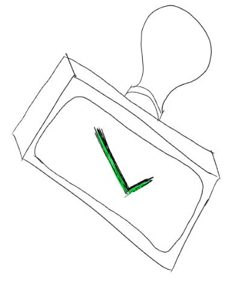

# Owning my wins means learning to own my failures

“I wouldn’t do it. But if you decide to, that’s on you.”

That’s what one of my best managers told me before the biggest presentation of my career so far.

I was preparing to speak in front of thousands of my peers, and wanted my manager’s take on my story. I was hoping they’d say, “Great idea!” or at least, “I support you!”

Instead, I got the line: “That’s on you.”

I was frustrated. Did that mean “don’t do it”?Should I follow my manager’s opinion and change my strategy? Or should I take the risk of pursuing my idea, and then have to own it if failed publicly?

At the time, my manager’s response was alarming and scary. What I wanted was comfort — someone saying, “whatever happens, I’ll protect you.” But in retrospect, what I got was better.

By sharing their opinion and trusting my judgment even if I disagreed with them, my manager gave me something even more powerful than approval: **ownership.**

Until that moment, I hadn’t realized how often I relied on my manager as a safety net. Of course I wanted a manager who’d always protect me and defend my decisions.

But if I only pursued ideas my manager supported, were they really *my* ideas? If my manager absorbed the consequences when something failed, didn’t that also mean they deserved the credit when things worked, not me?

For that presentation, I decided to take the risk of telling the story that I wanted. I prepared nervously, second-guessing right until I walked onstage. “Are you okay?” I remember one of my colleagues asking that morning, seeing the anxiety on my face. “You look exhausted!”

But it worked. It turned out to be one of the talks I’m proudest of — both because it landed well with the crowd, and also because I **knew** it was my ideas that drove it. Being prepared to own the risk of failure helped me own its success — a lesson I come back to all the time when I’m thinking about taking a new risk.

Thanks for reading The Hard Parts of Growth! Subscribe for free to receive new posts and support my work.