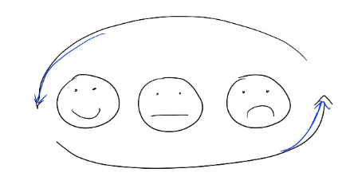

# 2 quick tricks to make giving feedback easier

Over my career, I’ve had to work hard on giving people tough feedback.

This hasn’t been easy — as an extreme introvert, I’d rather not talk to anyone in the first place, much less engage them in a potentially conflict-ridden discussion that I initiated myself (!). And what if I’m wrong — who am I to tell someone that they could do something better?

It’s helped me to try to think of it as a service to others — if I don’t share what I’m seeing, they might not know that something is holding them back, and never get a chance to fix it.

If I see a colleague do something that I don’t think is working, can I quickly pull them aside and share what I observed, so they can choose whether they want to change their approach? Or if my manager is making a decision I disagree with, can I clearly and casually share what I think?

I’ve found two tricks that make giving feedback easier:

1. **If I ever find myself saying anything, good or bad, about colleague A (let’s call them Alice) in a discussion with Bob, I force myself to say it directly to Alice ASAP.** Treating this as a hard-and-fast rule made me better at giving quick feedback. It also made it easier for these conversations to be non-judgmental and casual, rather than waiting and letting pressure build up in my head.  
      
   This rule plays into my sense of integrity too — I know I’m never “talking behind someone’s back,” and Alice will never be surprised by their performance feedback from me.  
     
   Using this rule also creates a strong balance between giving kudos alongside more constructive feedback, making these conversations a lot easier.
2. **Don’t hide what I’m feeling.** Often the hardest part of giving feedback is managing my own concerns about how it comes off.  Will it (and I) seem defensive?  Would a new relationship get off on the wrong foot? Will the person think I’m too extreme?  
     
   The best way I’ve found to dispel these concerns is simply to **be vulnerable and say what I’m honestly feeling during the conversation itself.**

For example:

* “We’re just starting our partnership, so of course I’m worried that sharing feedback this early could set us off on the wrong foot.  I’m doing it because I think it can make our partnership stronger from the beginning. I’d also love any advice from you on how I can show up better.”
* “I know this could come off as if I’m blaming someone else instead of holding my team accountable. I definitely don’t intend to do that. I’m following up with my team too — I just want to make sure that you and I are seeing the same thing across the board.”

Just sharing whatever’s in my head starts the conversation from a place of vulnerability and partnership, which takes the burden off me to single-handedly manage all the emotion and sets us up for a more honest conversation.

And the more I’ve shared this kind of quick, casual, honest feedback (and asked for the same in return), the more strong and trusting my relationships have become.

Thanks for reading The Hard Parts of Growth! Subscribe for free to receive new posts and support my work.