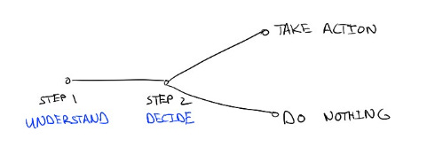

# Dealing with hard feedback

Early in my career, my manager told me during a performance review that “being the smartest person in the room is pointless if no one wants to work with you.” More recently, I got feedback from a colleague that “of course no one can help you if you don't ask for help.”

Moments like these became inflection points in my career and how I think about myself. But the advice was also really difficult to hear. I want to already **be** perfect, and hearing that I'm not is never easy.

Here are a few tips that have helped me respond to and grow with difficult feedback:

1. **Focus on understanding the feedback before thinking about addressing it**. When someone gives me feedback, it's tempting to immediately talk about how I’ll respond to it. Then I don't need to think too hard about the criticism because *Look! I already have a plan to address it!* And of course the person sharing feedback should be happy because I'm taking action on it right away.  
     
   But I find I internalize feedback more deeply if I focus only on listening. When I move straight to solutions, I don't take time to process what I’m hearing — which means I ignore useful information and discount the work of the person sharing it. I try to remember that the person is giving me feedback because they believe in me, and I owe it to them and myself to truly understand what they see.
2. **Choose what to address.**  It took many years to realize that if I'm doing my job well and taking a bold stand, I'll **always** get feedback. Getting none isn't a sign that I'm perfect — it's just a sign that I'm not being bold enough.

   So now when I hear an observation about how I’m presenting myself, I listen, think about it...and sometimes decide I won't take action on it. It's important that I understand the feedback, because that's useful new information, and helps me understand the cost of what I’m doing — but sometimes accepting criticism and continuing the way I am is still the right tradeoff.
3. **Use the feedback to expand my map of the world.**  Not only is the person giving me feedback doing extra work to identify how I can get better and taking the risk of telling me something I might not want to hear, they’re also sharing something about how they see the world.  If they’re telling me I’m “too impatient,” they’re not just commenting on my performance — they’re telling me how they believe a successful leader presents themselves, given their experiences.  This gives me entirely new tools to think about success.
4. **Look for other places I should be applying this same feedback.** The best feedback not only applies systemically at work, it also crosses into my personal life. When I was told I don't ask for enough help at work, I wondered: where do I need to ask for more help at home?  It turned out that getting just 10 more minutes a day of childcare made my commute (and therefore my whole day) 90% less stressful — but I had never before thought to ask for that.

For years I thought of feedback as a signal that I was doing something wrong. Hearing it made me focus on immediately changing that part of me so people wouldn't object to it again. Colleagues didn't like how aggressive I was? I spoke more quietly and made sure everyone else talked first. People found me difficult to work with? I started meetings with a joke and made sure everyone was comfortable. I made myself as unobjectionable as possible — and, in the process, I lost some qualities I really cared about, like my intensity and emotion.

These tactics gave me back my ownership of how I choose to respond to feedback and a sharper perspective on it. That’s helped me see the immense value of difficult feedback, and the people who do me the service of giving it.

Thanks for reading The Hard Parts of Growth! Subscribe for free to receive new posts and support my work.