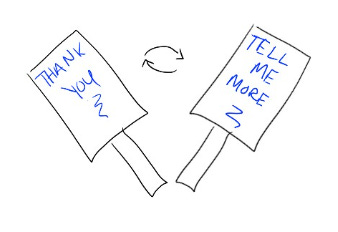

# Soliciting hard feedback

We hear all over that “feedback is a gift.” But how can we get that feedback in the first place? The times most of us get tough criticism — annual performance reviews, or when something is going really wrong — are infrequent and way too slow.  Imagine how much faster we could grow if we had those insights in real-time and could take quick action to respond.

Here are a few tactics that have helped me get hard but useful feedback:

1. **Identify a few people who will have the toughest feedback and ask them specifically*****.***  If I haven't gotten strong feedback in a while, or if I’m hitting a ceiling and I don't know why, I make a list of the people whose feedback I've been subconsciously avoiding — they're likely to have the toughest and most useful observations for me.
2. **Ask questions that force people to think about what I could be doing better**.  It’s all too easy for people to respond to general feedback requests with, “Things are going much better than last year — I can’t think of anything you can do better!”  So I ask a few questions to change the frame, like, “If I were to step into my manager’s job \*today\*, what gaps would keep me from being successful?”  That forces people to not just think about whether I’m doing better than I was last year, but whether they see me on track for the next role I want.
3. **Proactively seed the hardest feedback.** When I get a hint of difficult feedback, I ask several colleagues, “Hey, I got some feedback that I come off as impatient. Can you think of times when you've seen that and what I could do differently?” Acknowledging the criticism myself makes it safer for people to elaborate and brainstorm with me.  It converts them from potential adversaries who are worried they’ll be unkind in giving me hard feedback into allies who are just helping me debug what’s happening.
4. **Force myself to listen**.  Anyone giving me feedback, even if it feels emotional or unfair at the time, really is giving me a gift. They're doing extra work to identify how I can get better, and taking the risk of telling me something I might not want to hear.  When they share their thoughts, I try to limit my response to two phrases: “Thank you” and “Tell me more.” I pretend I have a little sign printed with those two phrases on either side and I can only flip between them. When I notice that I'm jumping to defend myself, that's a signal that I'm fighting the feedback — and therefore I need to hear it the most.
5. **Keep people talking for 10 minutes*****.*** Most people will start with what's easiest to say — the good stuff, or minor quibbles they've observed. If I keep asking for more, they'll use up all of the easy feedback in the first 5 minutes and finally get to the tough stuff I need to hear the most.
6. **Thank everyone and show them the impact their words had on me*****.*** I try to thank people in the moment for sharing (though it can be hard when the feedback is particularly tough), and then circle back later to describe the impact our conversation had on my behavior. If I choose not to take action on feedback after thinking about it, I explain why. The easier I can make it for people to be honest with me, the better feedback I'll constantly get.

Receiving feedback is hard. I'm constantly tempted — and sometimes succumb — to just avoiding it altogether. But when I can really listen, hard feedback shows me my blind spots. The easier I can make the process of getting and internalizing that feedback, the faster I can grow.

Thanks for reading The Hard Parts of Growth! Subscribe for free to receive new posts and support my work.