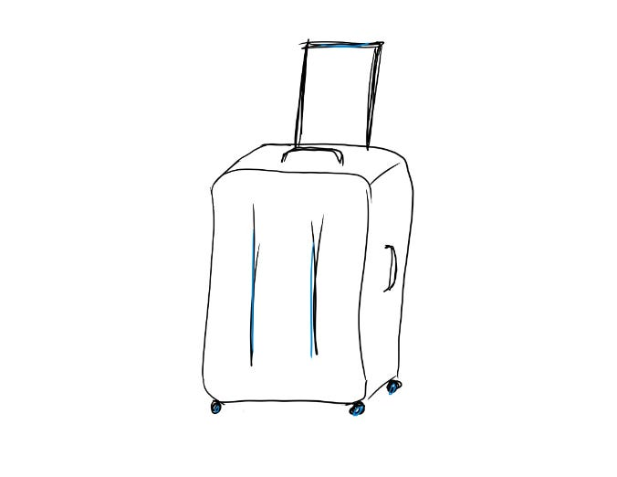

# 5 tips to make context-switching work for me

“Okay,” I thought to myself this morning as I looked at my calendar.  “I’ve got 4 back-to-back 1:1s, a 30-minute work block, a strategy discussion, late lunch, and 2 product reviews before another work block.  How am I going to show up for my team, keep my energy high, and still get done what I need to today?”

As my scope has grown, one constant challenge is figuring out how to make progress on a bunch of different problems simultaneously.  I love the variety of my day. But I sometimes find it mentally exhausting to try to keep context on everything I’m working on and quickly make progress on each effort.

What has worked for me?

1. Most importantly (and I’m sure not a surprise to anyone who’s been reading this newsletter) I try to **understand whether I really need to be working on all these efforts**.  Is inertia or a desire to be “in the room” causing me to join something where I’m actually not central?  Prioritizing what’s truly important, clarifying ownership, and stepping out of projects or meetings where I can empower people who are better suited to run them is my best tool.
2. **Context-switch hours, not minutes.** It’s tempting to multi-task during a meeting and try to get some slack messages out, especially when I’m remote and people can’t visibly see me checking out.  But when we all do that, it makes the meeting less useful and we have to set up even more time to solve the key problems. Plus (even more convincing) I discovered multitasking during meetings makes me more tired at the end of the day.

   Nowadays, I try to focus throughout a meeting, even if there are a couple minutes that aren’t relevant to me.  I keep my phone slightly out of arm’s reach so I can’t reach for it automatically the minute I get bored, keep my zoom window maximized and everything else hidden with notifications off, and keep post-it notes nearby so I can jot down anything that occurs to me rather than immediately opening slack.  It’s generally better for me to be 30 minutes late in responding to a slack than to be tuning in and out of meetings.

   If I find myself frequently multitasking in a meeting anyway, I ask the meeting owner if it’s okay for me to drop out and “give my vote” to someone else in the meeting.
3. **Use time in between meetings to intentionally change context.**  Whether it’s a 5 minute buffer or just 30 seconds, I’ll pour myself a cup of tea and look out the window, do 5 quick burpees, or just visualize myself setting down suitcases with the knowledge from my last meeting and picking the knowledge for my next meeting.
4. **Done is better than perfect.** If I see I only have 5 minutes before my next meeting and I’m not *quite* done with what I’m working on, I try to get it “good enough to send around” and send it anyway.  That helps me reduce the amount of open threads I have in my head and also helps unblock anyone who’s waiting on my update — and usually what I’m working on is pretty close to done anyway.
5. **Use timers for my “must-dos”.** Every Monday morning, I write out my “must-dos” for the week, and then block out time for each in my calendar.  But if we’re halfway through the week and I haven’t made enough progress, in my next work block I’ll set a 20-minute timer and tell myself I’m going to “only focus on one must-do task” until the timer goes off.  I always get more done in that 20 minutes than in an hour-long undirected block.

These tips have been key to helping me manage context-switching.  But the force multiplier on all of them is a deep belief in the mission of what I’m doing.  Whenever my meeting stamina slips and I have trouble staying engaged in whatever we’re doing, I remind myself of what our customers need from us and how lucky we are to serve them, and that always helps me clear my head and dive back in.

Thanks for reading The Hard Parts of Growth! Subscribe for free to receive new posts and support my work.