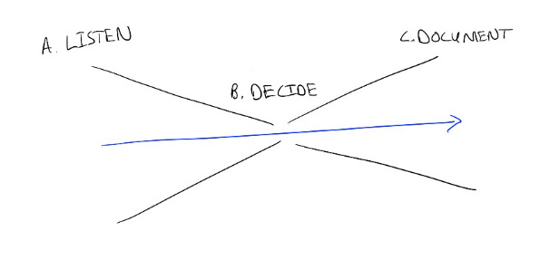

# Learning to make decisions in a new space — Listen, Document, Decide

As someone who recently [started a new job](https://news.faire.com/2022/12/05/ami-vora-joins-as-chief-product-officer/), I have to learn how to make decisions in a brand new space.  It’s tempting to jump into decision-making right away.  After all, that’s what leaders do, right?

But of course, when I’m new, I just don’t have the context to do that well.  And later, I often end up regretting those hasty early decisions.

What’s helped me through this part of ramping into a role is to break down the parts of a decision, so I can figure out what to focus on when.

When I look at it up close, every decision really has 3 parts:

* A. Listen
* B. Decide
* C. Document & execute

We all tend to focus on (B), making the decision, since that feels like the measure of whether we’re doing a good job.

But I’ve seen the best results when I actually focus first on (A), listening — which is a great way to understand not just the context, but also how individual people feel about the problem.

While I’m ramping, I shuffle the process and focus next on (C), documenting and executing.  I can hear how others are thinking through the decision and what principles they are using to decide, which helps me train myself on how decisions are made.  Then I can write all that down, figure out next steps, and send out notes.

That way I’m immediately useful; even though I don’t have the information to actually make the decision yet, just writing and distributing the notes and action items takes a burden off the team and forces me to think through the decision process.

Over the course of a few days or weeks, listening and documenting naturally lead into decision-making.  I listen more actively and ask better questions, so the decision options become clearer, and I document thoroughly so the next decision becomes clearer.

Documenting what I’m hearing also could be a general service to other people on the team.  In any fast-moving industry, anything written more than a few weeks ago is likely out of date, which means that what I’m learning may be the best snapshot of what’s really happening today.  Can I publish what I’m learning so that it becomes a resource to the people around me, whether they’re also new or veterans in their role?

It’s also helped to have responses handy when I’m feeling pressure to decide something right away, like, “I expect to be able to make this kind of decision quickly in the future.  But right now I’m still ramping and want to be respectful of the team’s time, so let me get some feedback and I’ll get back to you tomorrow with a decision.”

Focusing on this clear sequence gives me a map for my ramp. It helps me deal with my worry that I can’t make decisions right away, because by listening and documenting, I know I’m laying the foundation for decision-making and helping my team.  And when I do start making big decisions, I’ve tested out my thinking first by calibrating it with the people around me.

Thanks for reading The Hard Parts of Growth! Subscribe for free to receive new posts and support my work.