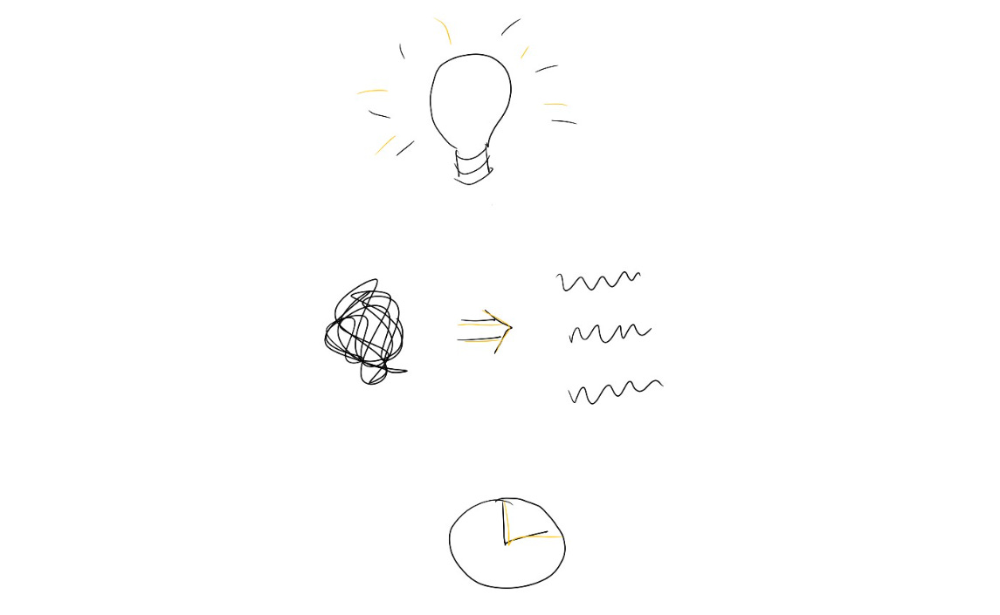

# The 3 key jobs of building a product: Recognize the problem, Structure a solution, and Execute

In my first full-time official job after college, I became a product manager.  I showed up to my shiny new office (with a closing door!) ready to create broad strategies, defining everything we were going to build, and explaining why it was awesome!

But honestly, I wasn’t great at that job.  Instead of outlining grand visions, I felt like I spent my time trying to fit together oddly-shaped puzzle pieces of customer needs and resource constraints, and I was never really sure if I was doing it right.

After a year or two, I moved out of product into other adjacent jobs, and it took almost a decade before my work led me back.  In that time, I got clearer about how I wanted to operate as a PM, and what it would take for me to add value in the role.

Every PM job is different, and so is every successful PM. And nowadays, function lines are blurring, so anyone can take on the jobs of pushing a product forward. But I’ve noticed 3 common components that all successful builders do.

1. **Recognize the customer problem:**  As a PM, I don’t have to come up with the problem myself, but I do need to identify it.  Whether it comes up in deep customer research, a colleague’s off-the-cuff observation, a requirement needed for the company’s current strategy, I need to call it out and build conviction that it’s the most important problem to solve now.  The best way I’ve found to do this is to deeply understand the customer and always be on the lookout for what they’re struggling with.  That way I have a natural radar for the patterns coming up in their experience.
2. **Structure a solution:**  What are the hypotheses for why the problem might occur, and what would we do to test each hypothesis?  Who is the audience we most need to solve this for right now?  What are ambitious-but-attainable milestones we can work toward?  What does success look like?  Above all, why are we making these choices?  It takes judgment to frame each of these micro-decisions so we can come up with clear principles and make consistent decisions.  This is the core of the PM job — turning a general problem into an actionable solution.
3. **Execute on the solution:**  I need to make sure that the solution actually ships.  I have to create a sense of urgency and a system that holds us accountable as a team. This means clarifying and documenting what needs to happen and when, dividing up all the needed workstreams amongst the team, and picking up the leftovers myself.  I’ve had the fun of following up on bugs, checking dashboards to understand retention, writing marketing copy, or just bringing donuts to the launch event — all ways to learn (and test-drive) other disciplines. My mental image is “flowing to wherever the water is lowest” — whatever the rest of the team can’t cover, that’s what a PM needs to carry.
4. **(Repeat — on bigger, harder problems each time)**

Breaking down the job this way has made the PM role much more approachable.  Earlier in my career, I often ran into a mythology that made me think only a very narrow set of people could be successful at product management — for instance, powerful orators who loved getting onstage to describe the grand product visions which sprang fully formed from their minds.  I didn’t feel equipped to do that.

Instead, simplifying the job into an elevated, structured way of repeatedly solving deep customer problems has opened up how I think about the value I can add, and given me a stronger toolset to attack a variety of problems wherever they are.

Thanks for reading The Hard Parts of Growth! Subscribe for free to receive new posts and support my work.