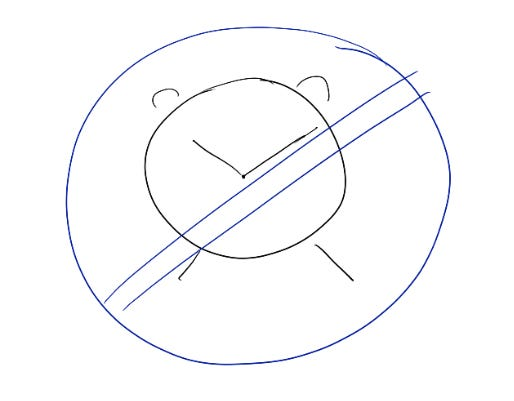

# Unlocking simplicity: Customer empathy as a (not-so-secret) weapon

My last couple posts have been about how simplicity in strategy and design is a competitive edge. But how do you decide **what** to simplify?

The best way I know? Spending time with the customer. This sounds easy, but it’s so hard!

If you’re like me, the hardest part is to be patient. Some part of my brain is always asking, “what’s the ROI on this 30-minute slot?” And I have to tell you — spending time with customers often does **not** feel high ROI in the short term. In fact, the most useful customer sessions feel like a punch in the gut. How many times have you watched someone use your product and thought — “But there’s a button right there! I built it *just for you!!!”* I get it! That feeling of frustration and the unpredictability of any specific customer session means it’s tempting to sacrifice customer time for more urgent tasks.

But I try to resist that. Even though being hands-on with customers can feel low ROI in the short term, it’s the **highest** ROI in the long term, because it gives me an intuition for how to build today and what to build next. Every time I feel confident that I’ve understood something important about my customers, I click into higher gear with my ideas and team.

My trick for speeding that up: Every couple weeks, I hold a recurring time slot in my calendar for “something customer-related”. This is a good Friday afternoon task, when (let’s be real) it’s hard to get big things done. Staring at that empty slot on my cal forces me to fill it.

My go-to exercises:

1. Use my product (surprising how educational this is!) and take notes + file bugs
2. Check out product reviews on Youtube, X, Facebook, Reddit, etc
3. Join UX research
4. Read support tickets
5. Watch hotjar recordings
6. Visit a customer

Visiting customers in person is my favorite. When I was at Faire (a marketplace for independent retailers), I could literally walk into stores in my neighborhood and ask where they get their products and how they felt about Faire — it was retail therapy disguised as customer research 🙂

One memorable customer was a nursing director at a hospital who also ran a gift shop in the labor & delivery ward. She said, “Faire changed my life. Now I can help new families can get what they need while they’re still in the hospital, so they have an easier time in their first few weeks.” As a mom of 3 difficult babies, I know exactly how meaningful that is. Whatever I built, I thought to myself, is this simple enough for Nancy to understand when she’s got 5 minutes between delivering babies?

That’s what I always look for — the kind of emotion that comes with someone saying “this product changed my life”, or even “this flow makes me so mad!” That deep emotion tells me what truly matters to our customers. It gives me a map for what to build, what to protect, and what’s getting in the way, and there’s no better way to find that insight than by spending time with the customer.

Thanks for reading The Hard Parts of Growth! Subscribe for free to receive new posts and support my work.