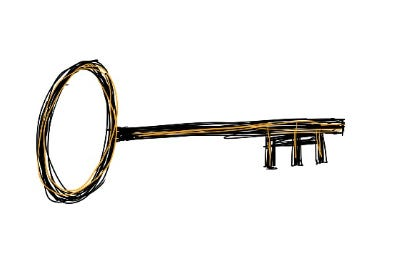

# If I can see a problem, it’s mine to solve

In 2007, I joined Facebook as a temp. I wasn't tied to a role; I just wanted to work on something that mattered.  Over 15 years, I followed interesting problems — from developer comms, to running a small VC fund, to ads, and beyond — and ended up working across Facebook, Instagram, and WhatsApp as the company grew. (At some point, someone hired me full-time. 😊 )

In retrospect, jumping straight into solving whatever problems I saw was a great way to keep adding value.  But at the time, I constantly had to remind myself to just take on those problems instead of waiting for someone else to give me permission.

What held me back?  I used to think there was an omniscient group of “senior leaders” who would know the most important problems and hand them out to the people who could best solve them. I longed to be the kind of person who got called to solve the hardest company problems, and I waited to get tapped on the shoulder by someone who knew better.

But over time, I realized that if I'm close enough to see a problem, I'm probably best positioned to solve it. In fact, what if no one else can even see it?  That realization gave me permission to step into problems, even when I’m not the perfect person to solve them.

One simple way to do this:  if I’m new to an area, I ask my manager or an experienced peer a simple question: “What are you doing **today** that I can take off your plate?” That way they can scan their calendar and pick something tangible and immediate, like running a meeting or tracking down an escalation. They get a little time back, and I can handle something that will quickly expose me to the most important work of the team.

Of course, like with any sort of growth, this route comes with a lot of normal frustrations.  When I run into those, it’s helped to:

1. **Remember that stepping up is supposed to feel terrifying.** I’m tackling something hard that I’ve never done before – no wonder it’s uncomfortable!
2. **Take perfection off the table.** I know I’m not the exact right person to solve most problems. But once I remember there’s no perfect solution to a problem, then I can propose my imperfect solution – and almost always, making progress today is better than waiting for something perfect.
3. **Think of learning as the reward.** Most of the time, stepping up doesn’t mean an immediate reward. But every time, I've learned something big – about a new product area, or how to work with different people, or cutting-edge industry info.

Sometimes I’m worried about stepping on people’s toes, but every leader I’ve worked with has been thankful to have extra attention. Every time I’ve said, “I notice you spend a lot of time doing X, so I took a stab at a draft for you.  Does this help? Feel free to use it,” a leader has been happy to consider whatever I’ve put together — especially when I'm clear that I'm not looking for credit but just to get to a better solution.

Thinking about new areas like this isn’t easy.  How can I justify spending time on added problems when I’m already stretched at my core job?  But taking on these sorts of problems is how I gathered skills for future jobs.  And making time for these new problems meant my job always stayed fresh and interesting, with new domains and new people I’d never run across otherwise.