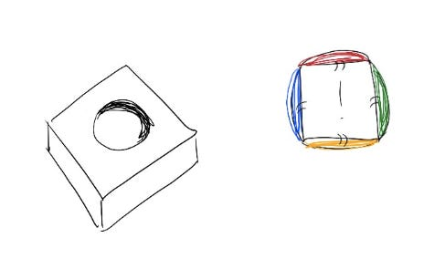

# Reframing “I need to change who I am” to “I can add to who I am”

In a performance review several years ago, my manager sat me down, took a deep breath, and gave it to me straight: “You’ve got to be friendlier. It doesn’t matter if you’re the smartest person in the room if nobody likes you.”

It wasn’t the first time I’d heard that kind of suggestion. For most of my career I’ve gotten feedback on how to change myself to be more successful.

One manager told me to be more “folksy” so I didn’t intimidate people, suggesting I model myself after a senior salesman with a Southern drawl we worked with. Another manager suggested I dress more neutrally to “come across as more senior.” Another told me to take it easier when people around me weren’t executing fast enough, telling me, “people are uncomfortable with how impatient you are.”

All of these managers were strong advocates for me. They had my back and were genuinely trying to show me how to be more successful. And I tried it all!

I stopped using bullet points in emails so I didn’t sound bossy. I slowed down my rapid East Coast diction and started every meeting with smiles and small talk. For a year I wore only earth tones. (Can you imagine??)

And honestly? For a while, it worked.

The small stream of constant negative feedback that seemed to follow me around — that I was too intense, too aggressive, too focused, too arrogant, **just too much** — stopped.

But after a few years, I hit a stage of leadership where my team needed to know what I thought. What was my vision? What did we need to change? Where was I going to lead them? And I realized that in the attempt to make myself unobjectionable, I lost my voice. I had sanded down all my opinions until I wasn’t sure any more what I really thought.

What helped me build my voice back up?

Instead of trying to make myself smaller to fit every mold, I focused on **expanding my range**.

If I found someone was uncomfortable hearing direct constructive feedback from me, I didn’t need to stop giving it or stop holding them accountable — I just needed to find additional ways to highlight the issues I was seeing. Maybe I could share even more context about how I’m feeling — not just that I’m feeling a sense of urgency, but that I trust them to solve the problem and I have their back.

Instead of minimizing parts of me that made people uncomfortable, this reframe has helped me add more skills that work for different scenarios and audiences.  Now, every time I run into a new problem, I have a few more tools to try. That’s helped me be more comfortable in a broader range of situations.

Most importantly, it’s made me feel like I’ve given myself permission to still be \*me\* — intense, direct, fast-talking, constantly imperfect — while also giving me room to keep getting better.

*(Happy new year! Wishing you all the best for an amazing 2023.)*

Thanks for reading The Hard Parts of Growth! Subscribe for free to receive new posts and support my work.