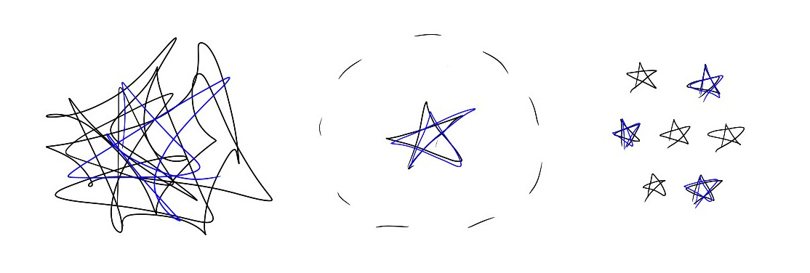

# To get promoted, get better at complexity, autonomy, and throughput

As many companies kick off performance reviews this time of year, I often get the question, “How do I get promoted this coming review cycle?”

Across my career, I’ve noticed that the people who get promoted usually distinguished themselves by handling 3 different kinds of challenges:

1. **Complexity**:  How difficult a problem can you solve?  Sometimes this masquerades as “scope” or “breadth” or “depth” — all different ways to describe why a problem is hard.
2. **Autonomy**:  Can you handle the problem with minimal guidance?  This doesn’t mean “solve it yourself at all costs” — but instead, can you take the lead and pull in your manager and others appropriately to keep them informed or get their support when needed?
3. **Throughput**:  How many hard problems can you solve at the same time?

These 3 axes make sense.  After all, think about how much a company can accomplish with a bunch of people who can independently handle multiple thorny problems simultaneously!

Of course, it’s hard to get better at all of these areas simultaneously.  In fact, I’ve found that normally my improvement on these axes goes in order. For any given type of problem, I get better first at handling complexity, then autonomy, then throughput.

For instance, if it’s the first time I’m tackling a problem that requires heavy cross-functional collaboration, I’ll probably need a lot of guidance from my manager and other colleagues to sort through how to engage with each team — and I’ll probably only be able to focus on this one problem right now.  So I can handle a complex problem, but without significant autonomy or throughput.

After I work with the team for a while, I’ll start understanding the normal patterns of how these problems work.  In a cross-functional collaboration, it’s easy to get out of sync on goals and deadlines, so I’ll have to work extra hard to make sure everyone’s aware of changes. Seeing those kinds of patterns means I won’t need as much day-to-day guidance and can operate more autonomously.

And then as I keep working on cross-functional problems, I’ll figure out more efficient systems.  For instance, I could use a single weekly meeting to gather status updates, and then immediately publish the notes to the entire team of stakeholders and their managers so everyone across the teams has the same up-to-date information at the same time.  Setting up those systems frees me up to take on more hard problems simultaneously and increase my throughput.

These 3 axes have been helpful to think about when reflecting on my career progress (and writing my own performance reviews!).  When I think,  “Where have I made progress on complexity, autonomy, and throughput for the problems I worked on in the past year, and what would help me take the next step now?,” I get a new appreciation for how I’ve grown in the past year, and new clarity for what I could focus on next.

*Happy new year, all!  Wishing you all the best in 2024!*

Thanks for reading The Hard Parts of Growth! Subscribe for free to receive new posts and support my work.