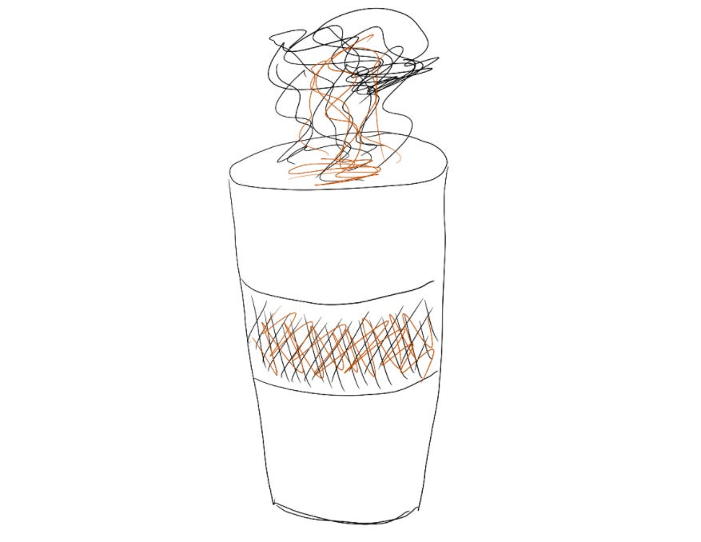
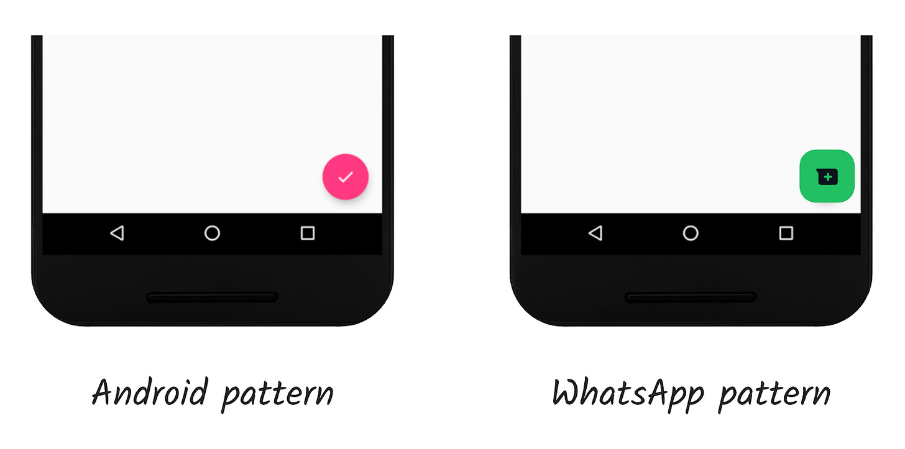
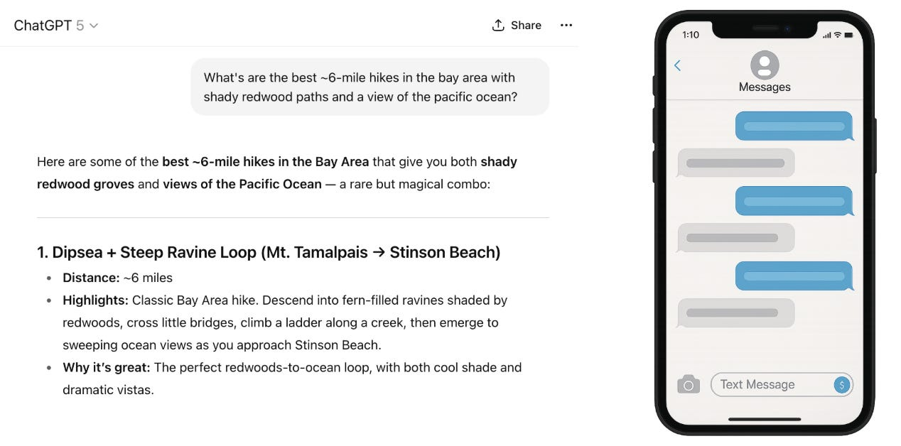

# Simplify your product design — borrow familiar patterns

Last week’s post was about how [simplicity is a competitive advantage](https://amivora.substack.com/p/simplifying-your-product-strategy) when the world feels so complicated. But what does it mean for a product to be “simple”?

Earlier in my career, I loved the idea of putting my mark on an app with something unique and exciting — maybe new gestures to open up functionality, or frequent updates that would engage the user.

But after working on products that are designed to be accessible to anyone, I’ve realized I need to be a lot more intentional about those choices. Individually, novel ideas and exploration are fun. But added up, they ask the user to learn a whole lot of new gestures and directions they’re not yet familiar with.

Instead of trying to invent a new design pattern for every single feature, what if we could make products feel familiar and usable by borrowing patterns the user already knows?

Simple products are immediately familiar and usable. When I pick up a knife or a cup, I never have to think to myself, “How do I use this?”, even if I’m at a friend’s and have never seen their tableware before.

That sense of familiarity is what we wanted for WhatsApp too. We wanted to make sure our users wouldn’t feel like they needed to **learn** how to use the app, but could just start calling and messaging.

We had to ask ourselves — what will make this product familiar to billions of very different people around the world?

Well, the only thing we really knew about all those potential WhatsApp users is that they had a phone. So we matched the patterns of the phone’s operating system, because that’s the one thing we knew that the user would already be familiar with.

If Android normally had an floating action button in the bottom right, that’s where WhatsApp would put its button. This meant WhatsApp would feel familiar even if you've never actually used the app before.

The question I always asked was “where would the user naturally put their thumb? Put the button there.” If you’re watching a Hotjar recording, you can see where someone pulls their mouse, or where someone’s eyes track in qualitative research. Users are telling us where they expect to find something — put the button there!

For another industry example of how familiar patterns make hard things feel easy, think about all the new genAI chat bots. This is wildly complicated frontier technology. How is it possible that hundreds of millions of consumers could pick it up overnight?

Because even though these AI systems are built on complex foundations, they borrow a messaging interface that we’ve all been using for decades. That familiar interface means that everyone can use this amazing tech without needing to learn anything new. The *content* is exciting, novel, and complex — but the *interaction* *pattern* is familiar.

One shortcut I always think of when designing a new product is: what other apps or physical products are my users likely to be using? Are there any patterns I can borrow from those to make a new product automatically intuitive? If a user normally swipes right to dismiss notifications, can swiping right dismiss new alerts inside my product instead of making the user find an “x” to tap on? Making these small gestures familiar can add up to making a whole product feel more simple and intuitive, instead of like yet another new thing to learn.

Another shortcut is to use design systems — a group of consistent, repeatable components you can use anywhere — which are explicitly meant to solve this problem. And as a bonus, design systems make it a lot faster and easier to create consistent products.

Of course, this adherence to consistency is really limiting in lots of ways! There are lots of interesting gestures and interaction patterns that people aren’t familiar with, but which could be a great addition to a product.

The takeaway isn’t to only ever use neutral, standard patterns. It’s to be intentional about new patterns, rather than assuming that novelty should be the default. Novelty creates excitement and engagement in the short term — but often, people are carrying so much cognitive load that simplicity actually leads to more engagement long-term.

Thanks for reading The Hard Parts of Growth! Subscribe for free to receive new posts and support my work.