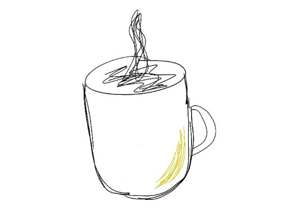

# Creating delight: 90% “how”, 10% “what”

I often hear the definition of delight get conflated with “surprise,” usually in terms of product functionality adding something unexpectedly fun. “I didn’t expect my friend would be in my neighborhood and we could meet up!” “Wow, my favorite band is coming to my city!”

I’m always excited to try products that offer that sort of fun surprise. But to me, the most delightful products are often the ones where the **functionality** is expected and reliable, but the **experience** of using that functionality is unexpectedly good.

My favorite coffee mug doesn’t do anything new or unexpected. It just holds my coffee without leaking. But it feels good in my hand, cools my coffee at just the right rate, and is a color that makes me unexpectedly happy.

These products make me think of the people who built them — the artisan who decided that butter yellow would be a perfect color to cheer up an early morning coffee, my bank’s customer service team who seamlessly transferred all my recurring bills to my new credit card so I wouldn’t accidentally miss any payments, the developer who thought to include an explanation in an ad about why I was selected to see it — and how they put more into the product than they had to so I could have a better experience.

I’ve sometimes found myself thinking for too long about “what” to build, trying to find something exciting and unexpected.  But I’ve often felt the most satisfaction when I choose to build something a little more “obvious,”  then spend 90% of my time thinking about “how” to build instead.

As humans, we spend so much of our time on “toothbrush tasks” — unexciting but essential things we need to do to keep our lives moving.  And there is so much hidden opportunity here, because every time we improve those, we can have an impact on how people spend most of their day.

How can we put more into these day-to-day tasks than our users expect — smoothing even boring tasks into thoughtful, delightful experiences?

Thanks for reading The Hard Parts of Growth! Subscribe for free to receive new posts and support my work.