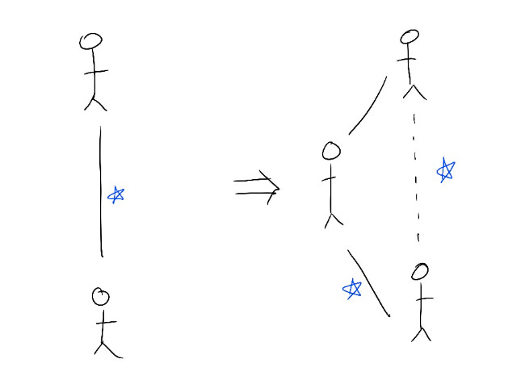

# Layering a team (and getting layered)

I've been layered many, many times in my career, often by former peers. I resented it every time, until a manager sat me down and told me: *“You think every time you get a new manager, you're being demoted. But actually, you've got a new senior ally who will look to you for guidance. You can even expand your role since they’ll need your help to ramp up!”*

Since I internalized that, my career grew dramatically every time I got a new manager — because I learn something new from them, and also because I do part of their job while they ramp. What better way to get a look at the next level than to partner with a manager who’s still onboarding?

Now, it’s part of my job to create space for new managers on my team.

Here are 7 tips which have helped me do this over the years:

**1) Make sure this change truly sets up the team for more long-term impact.**

I’ve been tempted by lots of short-term reasons to layer a team, like *X person on the team wants to be a manager,* or *The manager of this team left so I have to replace them,* or *I don’t have time to manage everyone.*

That info is helpful for guiding and mentoring, but it doesn’t necessarily mean that layering the team is best for the long-term.

Instead, it’s a good time to assess what the team needs right now — whether it's finding the right manager or joining forces with another team.  If possible, it’s helped to manage the team myself while I’m thinking through the long-term setup so I can see up close what the team needs.

**2) As soon as possible, be transparent with the team that I'm looking for a new manager.** It can be tempting to keep it quiet until I find a leader and can be concrete about next steps, but that will feel like a bait-and-switch to the team.  I'd rather tell them I'm opportunistically looking for a new manager even if it might take several months, and trust that they know I’m looking out for their individual careers too.

**3) Show each person on the team how they will have even more opportunities with a new manager.**

Every time I plan to bring in a new manager, I hear common and understandable concerns from the team — *Will this limit my growth?  I don't think I can learn from a new manager.*

These are important questions and I’m as clear as possible about my goals: hiring a new manager that everyone can learn from, the benefits I want them to bring, and partnering with them to support everyone’s growth. Think of everything we can gain from a new manager: new skills, new energy, fresh eyes on old problems, and a new ally on the team.

One former direct report who’d been worried about getting layered ended up thanking me later on for hiring a manager who brought new passion to the team.  Hearing that is one of my favorite things.

**4) If appropriate, give the team a chance to interview for the role.** If they're qualified, I set expectations that they'll be held to the same high standards as external candidates.  If they're not, I try to be clear about the gaps I see while explaining how I can support them in getting there for future roles. This is an opportunity for folks on the team to get clarity on what additional skills they would need to manage the team, which gives them an actionable roadmap for their career growth.

**5) Be clear about the team’s involvement in the interview loop — I'm interested in their take, but I'm accountable for the decision.** Rather than ask the team to do assessment interviews and find someone they all agree on (impossible), I ask one team member who’s trusted by their peers to do a lunch conversation on management style to get to know the candidate better. If I decide to hire the manager, I set up a meet-and-greet with the team before they start, so the manager can informally meet everyone after the team knows they're coming on board.

**6) Stay connected to the team even while I create space for the new manager.** I ask everyone 1:1 what they’re worried about with a new manager. Most people feel a general loss of importance and recognition. What that looks like concretely, though, is a loss of **access** — to information, relationships, and new opportunities. I try to address that head-on by finding new ways to share information (like broadly publishing notes so everyone can see the same info), and committing to office hours or quarterly 1:1s with key team members to make sure we can still talk about their careers.

**7) And of course when a new manager is ready to join, [onboarding them successfully](https://amivora.substack.com/p/onboarding-a-new-leader-onto-your?s=w) is key.**

Bringing on a new manager is a judgment call, which means not everyone will agree with me, and there will never be clear data to tell me I've done everything correctly. Every time a new leader or a team hits a bump, I second-guess my decisions.

Once, I had multiple people leave one of my teams when I brought in a new manager.  That meant weeks of sleepless nights wondering if I did the right thing.  But my job as a leader is to make a judgment call about what will be best for the team long-term, even if it means some short-term pain.  And after some ramp-up time, that team that suffered turnover became even stronger and happier under their new manager than ever before.

Thanks for reading The Hard Parts of Growth! Subscribe for free to receive new posts and support my work.