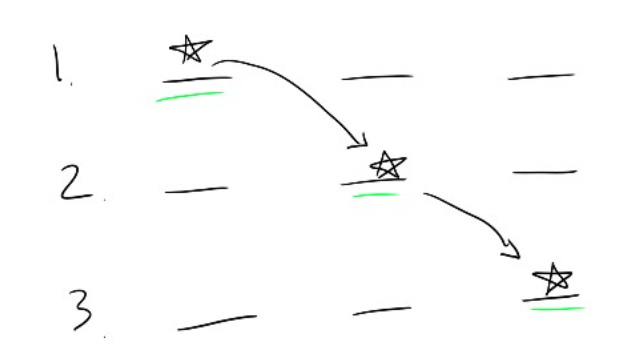

# To build trust in complexity, offer small choices and fast feedback

I strongly believe [product simplicity and predictability are a superpower](https://amivora.substack.com/p/simplifying-your-product-strategy). They give the user a sense of control, which is a gift when the world feels so complicated.

But some things are legitimately complicated — regulated banking signups, shopping flows where the user needs to narrow the search based on specific preferences, error cases where something went wrong.

So what will give the user a sense of control when predictability is hard to come by?

My take: Giving the user a chance to **participate** in the process by laying out the steps, enabling them to make specific choices, and offering a clear feedback loop on each small decision. This may make the flow longer, but it gives users a chance to viscerally understand what’s happening. It turns helplessness into action.

For instance, a while ago I got an alarming privacy notification on an important app and was prompted to go through a privacy checkup and recovery flow. It was a moment of fear. What if my account was compromised? My mind started spiraling and I desperately wanted a sense of control.

But the product’s recovery flow calmed me down. Why? It:

1. Laid out all the steps I’d go through, giving me a clear roadmap for what to do.
2. Channeled my anxiety into actions, even if they were small. There were prompts like “Check whether password is compromised? Yes / No”. If I think about it, is that a necessary prompt? Who would say “no”? But in the moment, the ability to participate in the process of securing my account gave me a sense of control.
3. Gave me fast feedback on each choice by turning each step green on completion.

By the end of the now-green list, I felt a sense of relief. Realistically, that product could have taken all those actions without my input. But following along step-by-step and getting to participate in each step gave me a sense of control.

I saw the same thing with a new AI tool my team was working on. Our temptation was to take user input up front and magically come back with a solution. That’s the promise of AI, right? But we realized our customers didn’t yet trust the magic black box of AI recommendations. Instead, what helped was intentionally inserting more feedback steps where we would explain what we were considering and offer the user a chance to change direction at each step. It added more friction, but it built trust faster and got our users comfortable with the new AI toolset. Then over time, we could remove those interim feedback steps and automatically make decisions for the user.

Compare that to a customer service page where you type a question into a contact form and just get a message that says, “Thanks, we’ll take care of it.” You don’t really get an understanding of the overall process, a chance to make smaller decisions or updates, or any feedback on whether you made the right choices. I’m always stressed about whether I did it right!

I think this applies to people too. When I’m building a new relationship, like with a new manager or peer, I try to frequently outline what I’m doing and why, and give them a chance to redirect. After a few weeks, we know each others’ style and I can stop.

Action is the best antidote to fear. Especially when someone is stressed out and longing for control, it helps to ground them in a clear step-by-step process, give them a chance to participate in solving their problem, and letting them know the impact of each choice. That naturally creates some relief, and helps them channel their concern into action.

Thanks for reading The Hard Parts of Growth! Subscribe for free to receive new posts and support my work.