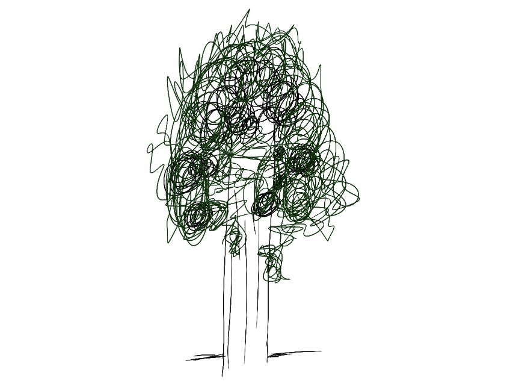

# Making it through a work fire

When I’m in the middle of what feels like a fire — whether it’s a small crisis at work or navigating how fast our industry and world are changing — I find a little bit of comfort thinking about the giant sequoia, the massive California trees I fell in love with on my first trip to the west coast decades ago.

These huge trees depend on fires. The heat of a raging forest fire warms up the sequoias’ pinecones, causing them to open and drop their seeds into the newly clear ground. Without stress, these trees wouldn’t survive.

At some point in growing as a leader, we’ll all be thrown into a moment that feels “on fire.”  People will be stressed, the next steps will be unclear, and finding the best outcome will feel existential.  In addition to actually solving the problem, how do you take care of \*yourself\* through the process of leading through a fire?

Here’s what helps me:

1. **Draw a line between what I can control and what I can’t.** In the middle of a fire, it can feel like I don’t have any control at all. New surprising information keeps coming up, I’m getting emails full of urgency and exclamation points, and I feel pressure to show progress every few hours. But there are also things I can control: how I feel, the way I communicate, the expectations I set, who I can ask for help. Drawing a clear line and expecting churn on one side but agency on my side reminds me that I have more control than I realize.
2. **Think about how much capacity I’m building.** Every time I step into a fire, I end up developing new skills — I make space to focus on it by doing a better job prioritizing, or I find a new way to communicate that helps people stay up to date, or I come up with principles that will guide how I approach other problems in the future. When I come out of a fire, I always find that I’ve raised the ceiling on how much I can do, because this temporary push resulted in building more capacity than I had before.
3. **Convert frustration into action.** Uncertainty often makes me feel frustrated or fearful because I’m not sure what the outcome will look like. I’ve found the best way to combat fear is to take an action. That can be volunteering to help organize a response, thanking someone for their work, or even creating a sense of connection by opening difficult meetings with a corny joke (I have hundreds!).
4. **Reach out.** My instinct in times of stress is to hunker down and power through by myself. I think, “If I can just get through this phase, everything will be fine.” But I’ve always had better success when I reach out to others, whether to ask for feedback, support, or just talk about how we’re feeling. I’m always surprised by how similarly we all feel — and how much stronger our team and response is when we connect.

What works for you?