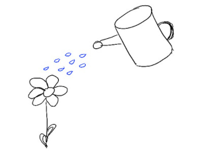

# Reframing “Giving myself what I need is selfish” to “Giving myself what I need is a service to the people around me”

This past winter, I was exhausted. Having a third kid during the pandemic, working through another eventful year at WhatsApp, and scaling our teams left me feeling like I was stuck going through my daily task list without space to think.

But even taking a week off, declining important meetings, or spending a few hours writing felt so selfish. After all, my team was working around the clock, my partners were waiting for my input, and our users always deserve the best products faster – how could I possibly step away?

One of the best self-hacks I’ve learned is to **reframe the things I need in the context of how it helps the people around me**.

When I finally took a few weeks off, I came back to work with a ton of clarity — about how we could refresh our product vision, how I could empower my teams more, and how we could focus on the future.

When I spent a few days at the beach by myself, I came back with extra patience, smiles, and love for the pile of kids who started climbing over me before I could even take off my shoes.

I was better able to support both my team and my family because I gave myself the time I needed.

This self-hack extends to basically anything that feels “selfish.” When I got feedback that I needed to promote my work so I’d be more visible, I felt low-integrity and inauthentic every time I tried. But reframing the problem from “how can I promote myself” to “how can I best represent my team” made it clear that I needed to speak up more on behalf of my teams who were working so hard to ship great products.

There’s also [plenty of evidence](https://projects.iq.harvard.edu/hbowles/publications/areas-interest/gender-and-negotiation) that women in particular achieve better outcomes on things like negotiations when they’re doing them on behalf of others. So when I focused on representing my team instead of myself, not only was it easier for me to talk about my work, I did a better job. I was more direct, more confident, and willing to clearly state our successes.

Finally, I’ve found an unexpected pattern. When I identify something I need, there’s a good chance the people around me need something similar for themselves. When I take a vacation, my team can see that it’s okay to do the same even in times of stress. When I wait to answer emails until the morning, it’s easier for everyone I normally message to also have a relaxing evening and come back to work refreshed. When I felt like I didn’t get to hang out with enough senior women product leaders, I started a dinner series for Bay Area women in product and found that many other women felt the same. (Thanks to these amazing women, these dinners eventually took on a life of their own and turned into the [Women in Product conference](https://www.womenpm.org/).)

Sometimes just taking the plunge and doing what I need helps other people get what they need too. Reminding myself of that makes it easier for me to be generous to myself.