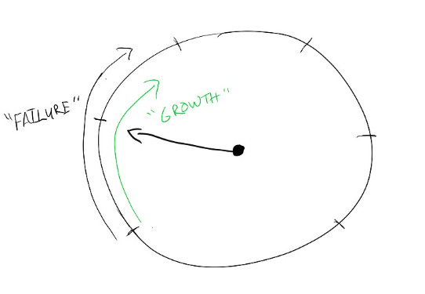

# 0 failure = 0 growth

In one of my first jobs, my manager told me: “It’s good to learn from mistakes. But a really smart person learns even before they make a mistake.” That fit nicely into my high-achieving, by-the-book mindset, and for years I tried to strive to make no mistakes at work.

As you can imagine, I failed pretty miserably.

Worse, aiming for zero mistakes made me unwilling to take a bold stand on anything — I was too afraid to be wrong.

I’ve spent most of my career trying to unlearn my fear of failure. I haven’t gotten comfortable with it by any stretch, but I’ve found 3 tactics that help me deal with it.

I shared my first tactic last year:  [Turning “what a failure” into “what a useful experiment](https://amivora.substack.com/p/turning-what-a-failure-into-what).”

Today I’ll share my second tactic:  Remembering that 0 failure = 0 growth.

I learned this idea the first time I presented my team’s work at a product review.  To put it mildly, it did not go well.  I was in a new job at a new company, I didn’t know all the people in the room, and I wasn’t as familiar with the structure and expectations as I should have been.

Afterward, I groaned to a colleague, “I don’t think I should do those anymore. I wasn’t very good at it.”

They said, “Why would you have been good at it?  You’ve never done it before.  You should expect to be pretty bad at things you’ve never practiced.”

That wasn’t how I normally looked at the world.  I was terrified of other people thinking I was weak or incompetent, so I had organized my life to only do things I already felt confident about, especially in public.

But if I wanted to grow in my role and work on the cutting edge of the tech industry, I’d be doing new things every day — dealing with new team dynamics, new competitive pressures, and new tech developments all the time.  If I wanted to keep learning, I had to embrace taking risks and trying something new, even if it meant others sometimes saw me fail.

Of course, this pattern still pops up today.  Even if I’m walking into a familiar forum, there are still moments which catch me off-guard and make me feel like a failure.  And while those are difficult, I try to remember how each of those moments teaches me something new — about how to react to something unexpected, adjust my stance in the moment, or even just think about what I’d do differently next time.

Setting my personal dial to zero failures felt “safe”, but it also meant that I could only work on things that didn’t publicly challenge me.  And it took years of slowly nudging that dial up to realize that it was okay — I **could** take more risks.  I ended up forgetting how uneasy those stretches of growth felt, even while what I learned stuck with me.

In my next post, I’ll share my 3rd tactic for dealing with failure: budgeting for failure.

Thanks for reading The Hard Parts of Growth! Subscribe for free to receive new posts and support my work.