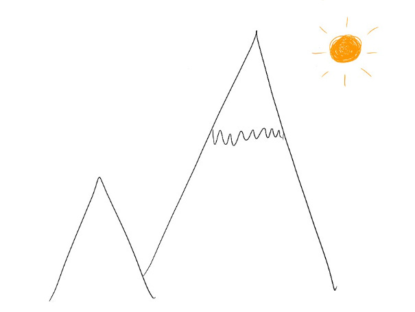

# Finding a global optimum always feels like a hill climb

A few years ago, I was talking with a brand new manager about how they could empower their team.

“How about asking someone on your team to lead this high-profile project rather than trying to do it yourself?” I asked.

“But whenever I ask them to take on a project, they don’t do as good a job as I do!” the manager exclaimed.

I totally understand that reaction. Whenever we hit a new level of scale, it can feel like everything gets worse. It’s tempting to jump in and take control the same way that has worked for me before.

This reminds me of a hill climb problem. Imagine I'm at the top of a hill, a local optimum, where things are going well. But I can see an even bigger mountain, a global optimum, ahead. Unfortunately, to get to that peak, I have to descend down the hill, cross through the valley, and clamber halfway up the mountain just to get back to the same success I had. Only then can I start climbing higher toward the mountain summit.

The hard part is that when I'm in the valley, I don’t know whether I'll even reach the mountain. I don’t know how long it takes to cross the valley, what new problems will arise down there, or whether I'll have enough energy by the time I make it to the mountain to start climbing again.

In my experience, the best way to get to that global optimum is to focus on what the future enables us to do — in this case, scaling the “mountain” to a fully empowered team.  Of course, there might be a slight dip in performance as a new team figures out how to operate. That’s normal.  But once they do, the entire company will have far more capacity.  The dip will have been worth it.

This metaphor applies beyond scaling teams to scaling products or companies.  How many times have you seen a company that’s doing great expand into a new market — and the disruption causes the entire company to do worse, until they hit a new rhythm?

The first time I saw this up close was during the consumer shift to mobile.  Companies that were doing well on desktop had to decide whether they continued dominating a shrinking desktop share, or took the risk of reducing their (successful!) desktop investments to focus on a new and uncertain mobile market they weren’t guaranteed to win. And this dynamic has played out across the tech industry repeatedly, whether it’s companies identifying new customers, new use cases, or new tech (generative AI, anyone?) as the mountain ahead.

What’s helped me most is to recognize the shape of these problems.  Every time I’m on top of a hill, whether it’s feeling like my team is happy and operating well or that my home life is stable, it is extremely scary to think about disrupting it — with new people, a new strategy, or a new activity for my kids.

But knowing what the process feels like — that descending into imperfection will be hard, traversing the valley will be tiring, but then we’ll be on a higher peak in the sunshine above the clouds — makes it a lot easier to take on the crossing.

Thanks for reading The Hard Parts of Growth! Subscribe for free to receive new posts and support my work.