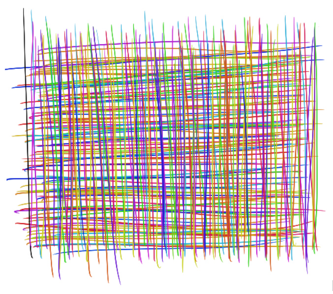

# Make every pixel earn its space — a simple formula

When I’m working on a particular product feature, I often have an immediate instinct to take up as much space as possible in the product. It makes sense! After all, I’m excited about the feature I’m spending all my time on, and want the world to see it. It’s clearly important, or I wouldn’t be spending time on it. Maybe I even want to change the app navigation so my feature gets a whole new place to live.

But there’s a natural limit to how many pixels a user can actually take in: every screen holds a limit of so many pixels and no more. And if I take up more pixels with my one specific feature, that means there’s fewer pixels to go around for all the other ones. Users might notice my product more, but it’s hard for them to get all the value they’re looking for from the rest of the product — because there’s literally less visual room for other features.

This isn’t only about the number of pixels a feature takes up. It’s also about how many times a user sees that visual footprint, because every view takes up space in the user’s mind.

So I have a rule of thumb for how much visual space a feature or NUX should take inside a product:

> A feature’s value to a user should be greater than the amount of space it takes up given how often it shows up – ie,
>
> (User value) has to be >> (pixels \* frequency)

This basically means that **the visual footprint of a feature should be proportional to how much value the user gets from it.**

For example, an icon in a navigation bar has to add a lot of value. The icon takes up a small amount of space, but it’ll be seen by a user every time they look at the app. That icon has to be immediately understandable to a range of people, accessible to people with low visibility, clear on a range of screen sizes and device types, and is worth a ton of iteration.

Similarly, for a full-screen NUX, I ask myself, “Does this new feature add so much user value that it requires a full screen, even if it’s only shown once? Does it really require four additional screens of explanation?” Unless it’s a major addition or change, it generally doesn’t, because the user value of the new info doesn’t merit a full screen of explanation.

In a messaging product like WhatsApp, this meant we invested a lot of time refining small-but-frequent visual indicators like icons and controls, or in ironing out smaller details like color palette and chat bubble legibility in large-and-frequent main views like message inboxes or calling UIs.

Making every pixel earn its place helps me hold a high bar for everything we put in front of a user. This quick rule of thumb helps me remind myself of what the user is looking for across the app (not just my specific feature), and aim to make the app overall a better reflection of where the user finds the most value.

Thanks for reading The Hard Parts of Growth! Subscribe for free to receive new posts and support my work.