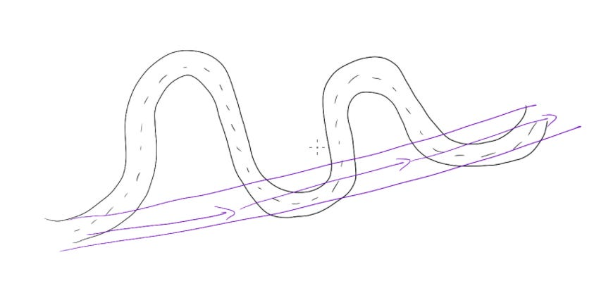

# A shortcut for building confidence in my product opinion

As someone who often gets pulled into very different problems, one of the hardest parts of my job is to build confidence in my product opinion fast.  Without conviction that I’m making the right decision, how can I lead?  So it’s been key to learn **how** I learn — how I can quickly understand a domain and build confidence about what to build next.

My personal hypothesis: everyone has different triggers that help them feel confident in their decisions.  So figuring out what specific methods work for me gives me a shortcut to build confidence in a new space.

We can all name a bunch of different ways that people tend to learn.  I’ve seen people be successful by going deep into:

1. Qualitative customer info: reading research or talking with customers directly.
2. Product experience: using the product as a customer to viscerally understand its functionality and feeling.
3. Internal data: building a deep intuition about customer behavior through the numbers.
4. External market trends: analyzing competition, industry trends, and consumer patterns to predict what will happen next.
5. Financial modeling: evaluating the economic impact of different product decisions on long-term business success.
6. Creating mocks or prototypes: working through different solutions to see how they feel in practice.

The key is that for most of us, **finding the one or two of these methods that match our strengths is a shortcut for learning fast**, rather than trying to go deep on all of them at once.  There’s an overwhelming amount of information out there — enough that I can convince myself that I constantly need to do more research in order to find the perfect answer.  But as I wrote in “[Execution beats strategy every time](https://amivora.substack.com/p/execution-beats-strategy-every-time),”  we usually don’t need a perfect answer immediately. We need a good-enough answer that we can iterate quickly on over time.  Getting to that good-enough answer gives me a little island of knowledge to stand on as I build a more complete map of the world.

What normally unlocks my confidence? Feeling like I have unique insight on the customer.  Maybe it’s through talking with enough customers that I can hear patterns in their stories, maybe it’s by using the product every day in the way a customer does, or maybe it’s by sitting in a customer’s store and just observing how they spend their day.  Your shortcut might be deeply understanding the dashboards, or analyzing industry trends to foresee the future.

But I always notice that I can build a lot more conviction fast when I feel like I have a customer on my shoulder, whispering in my ear — and so I’ve learned to optimize for building that intuition as quickly as possible.  Then I can fill out my perspective with more data and market trends to make sure everything fits together.  Figuring out my own typical personalized learning plan has been a great time-saver, and has given me a lot more confidence in approaching new problems.

Thanks for reading The Hard Parts of Growth! Subscribe for free to receive new posts and support my work.