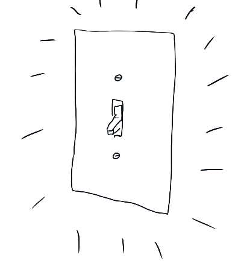
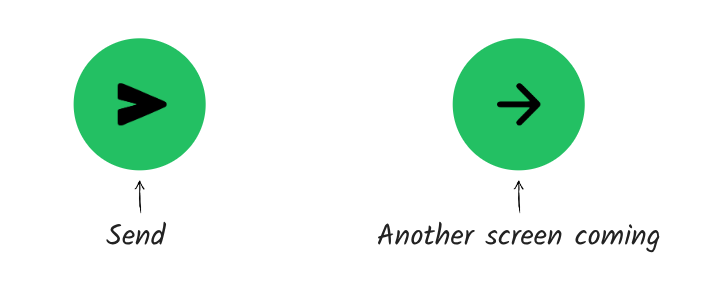

# To make something simple, make it predictable

One of the simplest tasks I perform every morning is turning on the lights. I flip the switch, the lights go on.

In reality, turning on the lights is actually a complicated process, probably involving solar panels, power grids, neighborhood transformers, circuit breakers, and more. But all I know is that every time I flip a light switch, the lights go on.

To make a product feel simple, every time a person takes a particular action, they should see the same result. That predictability means the user always understands their place in a product.

As an example, for WhatsApp we prioritized using consistent patterns throughout the app. I’m not talking about anything fancy — just things like “whenever you see a triangle button you’re going to send a message; when you see an arrow you’re not going to send yet.”

A user might not be able to articulate the difference out loud. But they quickly developed a reflex for when they should pause and think more versus when they could keep tapping.

There’s an added bonus here: **not only is predictability key to simplicity, predictability is also a substitute for control.**

You can’t always give a user total control — after all, you’re designing the product, not them. But you can help them understand **what will happen** every time they take an action, which is almost as good.

In my house, I can’t control how the lights work without a ton of extra effort — like adding a dimmer, or customizing how much power goes to my house. But if I know that every time I flip a switch, the lights go on, I’m fully in control of whether or not I have enough light to read by.

In the same way, if I know exactly what will happen every time I hit a specific button in a product, I am in control. I can always choose exactly the action I want to take.

Of course, if I flip a switch in my house and the lights don’t go on, suddenly I’m worried. Is the power out? Did a lightbulb blow? Did I do something wrong?

When I hit a button in a product that looks like one I’ve hit before but it does something different, or when features and buttons move around unexpectedly, I start to feel like the product isn’t “mine” — and that maybe I’m at fault for not understanding how things work. It’s like someone came into my house and moved my furniture around while I was sleeping, and now I’m banging my knees on a couch in the middle of the night.

Sometimes those changes lead to an exciting sense of discovery — “Here’s something new for me to try!” But sometimes they lead to a sense of frustration or confusion — “Did this light switch always work this way, and I just never understood it?”

Predictability gives users a sense of control. It also gives us control as builders — so we can be intentional about where to create moments of excitement and where to focus on simplicity and ease.