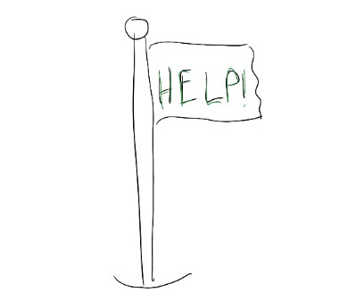

# Asking for help is a competitive advantage

A few years ago, I was talking with a colleague about a high-profile project at work.  I said offhand, “That project looks so exciting — I wish I could work on it.”

My colleague said, “Oh, who have you told that to?”

I said, “Hmm, you? Just now?”

I could \***feel**\* my colleague’s frustration at my response.  They pointed out (remarkably calmly) that I had all the ingredients for a great pitch.  I knew all the people involved, I knew how the project was going, and I knew what skills I’d bring to make it stronger.

I still balked. I had trained myself to never ask for help, out of fear of looking weak or worrying that I’d “waste” a favor on something I wasn’t even 100% sure I wanted.

What helped me?

1. Instead of worrying about looking weak, I try to reframe asking for help as a way to enlist people in my journey. I've found most people are really excited to help others out, but aren’t sure how. So by telling my colleagues what I need — like, “Long-term, I’d like to explore a path toward X job;  can you suggest a person I can talk with to get more info about that?” — they get to support me on my way.
2. Instead of worrying I’d ask for help and then realize I didn’t actually want what I asked for, I remind myself that it’s okay to change my mind!  We do this in products all the time.  We start with a hypothesis, learn, then pivot — and it's okay to do that in my career too.  Any help was still very useful, because it gave me information which helped me make a better decision about the future.

It took me a while to swallow my reluctance and ask to be considered for that project my colleague and I talked about — and even longer before I actually got asked to work on it.  But when I finally did get invited, it was career-changing, and asking for help made the difference in getting there.

I’m still not great at this.  I still have to remind myself that asking for help isn’t something I need to reserve for “emergencies”, and also that it’s okay to ask lots of people for support because not everyone can help immediately.

It’s been useful to notice that some of the most successful people around me constantly ask for help — and aren’t fazed when the person they’re talking with can’t pitch in right away.  Asking for help has become a competitive advantage for them.  It’s something I’m reminding myself to keep practicing too, so I keep getting the help I need to tackle hard problems.

Thanks for reading The Hard Parts of Growth! Subscribe for free to receive new posts and support my work.