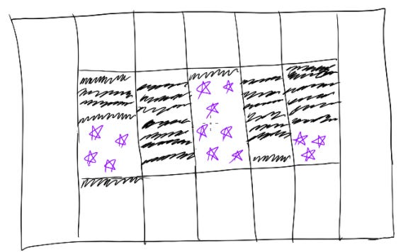

# Getting out of meetings and into focused work

Do you ever open up your calendar in the morning and sadly realize that you’ll spend your whole day in back-to-back meetings, with zero time to create or think?  This is one of my least favorite feelings — and if I feel it a few weeks in a row, it’s time to change something.

One key trick is to be extra intentional about what meetings I join.

Sure, every meeting looks like just 30 minutes on a calendar. But the real costs are the preparation, context-switching, and Swiss-cheesing of my calendar so my dedicated thinking time has to wait until 5pm — or worse, after my kids’ bedtime. That takes a toll fast.

How do I get myself out of constant meetings?

1. **Remind myself that meetings aren’t work — they're a cost of getting work done**. I always enjoy joining reviews with senior leaders or discussions with my peers because they're interesting and make me feel important. But when I look at what I got done each week, “invited to strategy review” and “discussed plans” don't make the cut. “Shipped X” is much stronger. What meetings will make “shipped X” a reality?  Can I look at my calendar and decline all the meetings except those?
2. **Visualize alternatives.** If I didn’t spend my day in meetings, I could drive from San Francisco to San Diego, or listen to 8 albums of new music, or cook 12 meals.  Or in work terms, I could probably do 3 deep analyses, or visit 2 customers, or write 2 complete strategy docs.  Is sitting in a day of meetings truly more valuable for customers than that?  This realization helps me push myself to change something when I feel like I’m stuck.
3. **Create meeting slots for my goals.** When I write down my priorities every Monday, I hold time on my calendar for the specific goals I write down.  That means I have to prioritize those blocks against what’s already there — and let some meetings fall off. Whenever I do this, it feels for a while like I will never get all my work done. But after a few weeks, those extra meetings magically disappear as I find other systems to solve those problems or hand off that work.
4. **Empower others to lead meetings just like I would with projects**. This load-balances work and gives other people a chance to step up. These lines come in handy:

   1. I see Alice is invited to this meeting and can represent for the whole team. Alice, sound right?
   2. Bharati, can I provide anything async to unblock the team rather than waiting for a meeting?
   3. Carmen, this is closest to your work.  Are you up for joining this meeting in my place and leading this from now on?
   4. Apologies, I’m 100% focused on [my specific priorities] for this week and won’t be able to join — is there anything you need from me so the team can make progress?
5. **Celebrate wins and get social connection beyond meetings.** One of the best things about meetings is that I get to see all my amazing colleagues and talk about what we’re doing.  “Deep thinking work” just doesn’t replicate that same feeling of togetherness.  So I make sure that I'm connecting with colleagues a few times every week — whether it’s quick catchups in the microkitchen, joining social gatherings, or intentionally taking time during the meetings I do join to connect socially.

I’m always worried that declining meetings might seem disrespectful, like I don’t think something is worth my time — which is absolutely not the reality.  When I decline things, it’s helped to share what I’m spending time on instead so people can see what I’m prioritizing, and check-in to make sure no one is waiting on me.  And as I've tried these tactics, I've been able to create more space for what’s important – both inside and outside work.

For more tips that have helped me control where I’m spending my time, check out “[Making my calendar work for me](https://amivora.substack.com/p/making-my-calendar-work-for-me).”

Thanks for reading The Hard Parts of Growth! Subscribe for free to receive new posts and support my work.