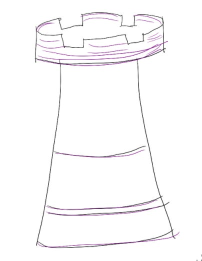

# The goal of a “strategy” is to change our own team’s behavior

“What I really want is to work on…is strategy,” I’ve heard from colleagues on every team I’ve been on.  And it’s no surprise — big strategy projects can sometimes seem like the most exciting and high-profile projects in a tech company.  They call to mind visionaries who change the world by thinking about big-picture problems

Don’t get me wrong, strategy is important. If you have a bad strategy, it’s hard to be successful no matter how much work you put in. But often these grand strategies often end up being underutilized — or, worse, a waste of time.

Why?  Because creating a strategy doesn’t directly change anything for our customers.  Customers don’t care about our strategies — they care about their experience with the product in their hands.  So **for a strategy to be useful, it actually has to change our behavior as a team to create better customer outcomes.**

That means that to be effective, a strategy should help every person on the team make better decisions day-to-day, even as the world changes dramatically around us. I call this a Minimum Viable Strategy, that covers:

1. *What changes about the world in the future, and what problems will people grapple with?* That shows the opportunity ahead of us.
2. *Are that problem and audience big enough to create a business that matches our ambition?* That inspires us with what success looks like. This is where I see a lot of teams make mistakes — they choose to focus on a problem they specifically have (how many personal productivity apps have you seen?) or a niche vertical they can win, but then can’t grow. This may be totally fine — it all depends on the size of the business you’re aiming for.
3. *What is our product solution to that problem?* Then teams can independently make decisions that match that solution.
4. *Why should we build it, and why will we win?* Then everyone is connected to the excitement and motivation of building a great product for our customers.
5. *What will each team build to support that product vision?* Then every person feels ownership and accountability for their piece.
6. *What is this team not focusing on?* Then people can deprioritize things. This is another place people often make mistakes — they want to keep options open, so they try to go after every possible growth option even when it’ll be lower leverage than winning their core audience.
7. *What are future growth options?* That way we know we can keep growing the business as things change.

The goal isn’t to guess what the entire future will look like. Instead, the goal is to validate that the opportunity is real and make sure everyone is clear on the overall direction. Then the team can make decisions aligned with that strategy, without constantly needing more input. And keeping the strategy minimal makes it easier to update it as the world changes dramatically around us.

To make sure we’re ready to build a complete strategy, I’ve found it’s helpful to set up the exercise by asking specific questions up front, like:

1. How can we build enough conviction in this strategy that we’re willing to ask our team to act differently because of it?
2. How can we be specific enough about what we do and don’t need to do, so anyone on the team will know how to change their day-to-day behavior to match the strategy?
3. What has changed that requires a new strategy now?  If the answer is “not much”, would our customers be better served if we did a shorter refresh of our existing strategy and focused more of our resources on execution?

A good strategy matters. But it’s not the main job — putting products in people’s hands is the main job. The strategy is just the enabler, to make sure we’re headed in a direction that makes sense and to get our teams lined up around the problem. That way we can build and iterate on the right thing for our customers.

Thanks for reading The Hard Parts of Growth! Subscribe for free to receive new posts and support my work.