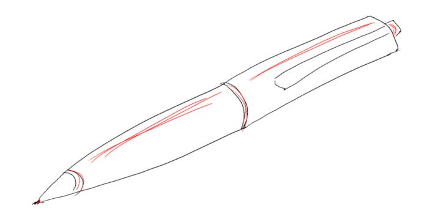

# The “red pen” trick to improving my writing

I once had a manager who reviewed my work in an unusual (and honestly kind of frustrating!) way. They’d ask for a printout (?!), and then they’d take a red pen from behind their ear and cross out words, sentences, even entire paragraphs without mercy. No inline questions or happy faces — just lines through anything they thought was unnecessary.

Believe it or not, this was not particularly fun! I had to watch as all the creative thoughts I was so proud of were littered with red strikethroughs. But as it turned out, those brutal edits were the best thing that ever happened to my writing.

When my ideas were surrounded with filler, it was hard for the reader to know what the real point was. But when I distilled my message down to just a few, carefully chosen words, the ideas cut like a sharpened knife.

Most importantly, this process forced me to take a stance. As someone with a deep-seated fear of being wrong, I’d often hedge my ideas with a raft of data, alternate ideas, and softeners so every reader could choose their own takeaway and no one could criticize me. But these red pen cuts forced me to sharpen my own thinking until I built a message I had conviction in.

What worked for me?

1. **Cutting too much and seeing what fails.** If my writing still works when I remove a phrase, I don’t need it. I imagine I have a character count limit and delete words or entire paragraphs. It’s okay if I don’t answer every question — that’s what followups and appendices are for. It’s more important that the main points are undeniably clear.
2. **Removing unnecessary “I” phrases.** How often have you written “I think X happened” or “I think Y is not going well” just to make a difficult statement more palatable, when in fact it’s clear that “X happened” and “Y is not going well”? Not only does removing these sorts of phrases make writing cleaner, research says it makes the writer seem more powerful. Objective writing is easier to read, and it highlights what is truly an opinion that’s up for debate.
3. **Making lists.** If I don’t know where to start, lists are a great stepping stone. Each idea has a separate line, and each line is numbered. That forces me to clarify the priority of items both for myself and the reader. (This is a trick from Naomi Gleit, the GOAT of execution.) Now anyone can follow my thinking step-by-step or show me exactly what idea they disagree with.

In the end, those ruthless red pen edits transformed not just my writing but my thinking, and it gave me a tool to apply everywhere. For a new product, what features can I cut to clarify what the product is for? When I’m describing a team’s performance, what should I state as objectively true, versus something that’s open for debate?

I owe so much to that manager’s ruthless focus on clarity. What once felt like destruction turned into a powerful tool, not just for my writing but for helping me cut through noise and focus on what’s important across my life.

Thanks for reading The Hard Parts of Growth! Subscribe for free to receive new posts and support my work.