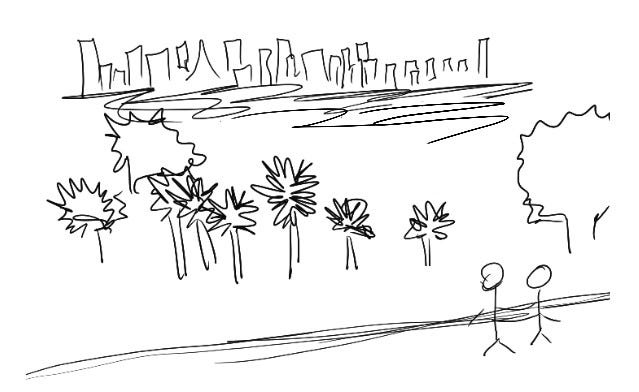

# Find your central product metaphor

When I’m building a product, I think a lot about what it should **feel** like.

Metrics tell us what people will do in the short term — feelings tell us what they’ll do in the long term. If someone is using my app but is secretly unhappy about it and wishing for an alternative, I won’t see that in the numbers. But if a competitor comes on the scene my users will be willing to switch, or if a bad press story comes out my users will be more likely to believe it rather than stop and think critically about it.

I try to keep this in mind when we’re designing a product. As builders, we should have a clear intention for how we *want* people to feel, and design the experience to cue that. What’s the best analogy or metaphor I can come up with to describe that feeling?

A good shortcut for me is to compare these feelings to the physical world. For example, if I’m building a product like video calling, should it feel like sitting in a park with your friends on a sunny Saturday, bumping into anyone who might show up? Or of sitting in a quiet room, waiting to have a meeting with a colleague?

Establishing this kind of **central metaphor** has two benefits:

* The entire product development team can share that metaphor, so we all have the same feeling and goals in mind as we’re building. That way, every individual product decision works toward creating the same feeling, so the product feels more coherent.
* It gives users a bridge to implicitly understanding the product. Even if they don’t explicitly know the metaphor I have in mind, the cues we give will help them understand how the experience hangs together, and therefore how they can relate to it.

In the case of video calling, the common feeling we decide to build toward might inform a range of implicit product and design questions, like:

* How heavyweight the notification is that someone joined / left your space — did they just drift away, or close a door behind them with a noise or visual change?
* The design aesthetic — does it remind you of a garden with a warm palette and organic lines, or a futuristic meeting room with crisp angles and cooler colors?
* Who should be allowed in — only people you invited, or only people you know, or anyone?

For WhatsApp, the central product metaphor I think about is “face-to-face communication with people you know, reflecting how you’d normally have a conversation in the physical world.”

This starts with small features — like the way those blue checkmarks light up like a friend’s face lights up when they hear you, or the way a typing indicator reminds you that someone else is about to talk and we should let them take a breath first.

In the physical world, you’re likely to connect with your friends and family in a kitchen or a living room, chatting when you can and stepping away when you need to. To mimic that ease, we made our group calls “joinable,” so you can enter and leave an ongoing group call anytime.

You probably wouldn’t tape-record all your conversations with your friends and keep that history forever. So we give people the option to turn on disappearing messages. That way, their message history only sticks around for as long as they choose.

Walking into a store or up to a customer service desk and talking to someone knowledgeable is one of the best ways to solve your problem. WhatsApp business products focus on building that same feeling of personal, convenient communication with the people at businesses large and small.

Of course, these sorts of metaphors can be limiting, and there’s lots of value in features outside our core metaphor.

But I’ve found that a central metaphor is a great shortcut. It gives us a natural universe of problems to play in, and a shared language to discuss them.

Most importantly, that metaphor comes through to the people using our products. Even if they’ve never personally lived in the specific metaphor we’re reflecting — playing bocce in a San Francisco park or walking through a teeming market in Mumbai — they’ll feel that the entire product experience hangs together, which makes it easier for them to find their place in it.

Thanks for reading The Hard Parts of Growth! Subscribe for free to receive new posts and support my work.