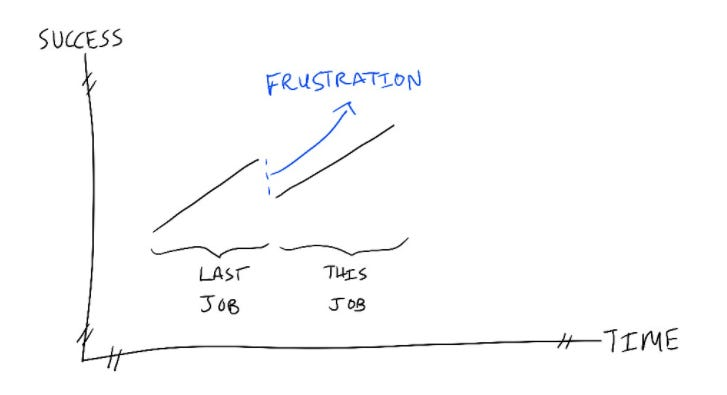

# Onboarding a new leader onto your team (or joining a team as a new leader yourself) 

How many times have you seen a senior industry leader who's done amazing things in their past roles come into a new company or team and...struggle? Whether it's by coming in hot and trying to change things too fast, or feeling like an impostor and not speaking up, it's hard to be a new leader.

Put yourself in their place.  As a new leader, you subconsciously expect to be as valuable at the beginning of your new job as you were at the end of your last job, where you had years to build up a full understanding of the domain, people, and culture.

But now, you've suddenly walked onto a shaky salt marsh. You don't know the people, the history, or even the vocabulary. Suddenly, you feel like you're not doing a good job — and that's a blow to your self-esteem and even your identity.

I often see new leaders deal with this frustration by trying to get big things done immediately through sheer force of will, like charging off in new product directions or declaring new org structures. But in the process, they burn out their new relationships and themselves — all while feeling like they're not delivering what they came here for.

Here’s what’s helped me onboard new leaders onto my team:

1. **Define what impact looks like with an overly prescriptive ramp plan, including an overall arc for what they will learn when.** My typical plan suggests one area per week that the new leader should fully understand — a product area, team, or customer set. That way, they can feel the momentum of learning something new every week and see that there's no pressure to solve all the problems immediately. I share the plan with the leader, but also with their ramp buddies, team, and cross-functional peers so we can all be accountable for giving the leader enough time to ramp. I’m clear through the process that I won’t always be this prescriptive; this is just a way for me to support their ramp before I give them space.
2. **A couple weeks in, give them one small end-to-end task.** This could be a simple eng task, solving a specific product problem, or writing documentation. What better way to understand how things work than by actually contributing? In the process, they'll start building their network; they'll have meaningful work conversations with their colleagues, rather than just coffee chats. And doing one small task gives the leader some real experience and confidence — a tiny stable platform over the salt marsh to stand on.
3. **Connect them to an assigned ramp buddy and other new leaders.** Do you remember how lonely it is to be new, to feel like you don't know how to add value, and you haven't yet found your crew at work?  Pairing them with a supportive onboarding buddy creates a safe space for them to ask questions, and connecting them to other new leaders helps normalize their feelings of isolation and ramping up.  Can I connect new leaders in a lunch group or coaching circle so they can discuss what's working for them together?
4. **Use their fresh eyes to improve things** — **which also helps them see their value.** I usually recommend that all new folks keep a list of what they’re seeing that doesn’t make sense. Then, after six weeks, when they have enough context to see which of those oddities might be justified, they should publish their revised findings and pick one to follow up on.  Being new is a great opportunity — new leaders see what doesn't make sense, and by sharing their perspective, they can contribute immediately.
5. **If they'll manage people, help their new teams get value from them immediately so the relationships start off on the right foot.** Even while they're ramping on a new domain, the leader can immediately act as an executive coach for their teams — someone who can ask questions and support their careers. As the new leader’s manager, I can help by setting up those relationships instead of asking the new leader to do all the work. Even setting up initial meet-and-greets with the team myself shows how enthusiastic and supportive I am about the leader's arrival.
6. **Make time to give the leader fast feedback and support through their struggles.** Every new leader struggles at some point in their ramp. That doesn't mean they're not a fit, it just means our job as their manager is to help them. Prioritizing spending time with them weekly to hear about what’s working + giving them clear feedback about what to do better will help them get up to speed fast, which gives the entire team more capacity.

It's tempting to ask new leaders to hurry up and get their hands dirty. After all, we have problems to solve now! But when most new leaders join a company, they're planning on staying for years. From that perspective, the cost difference between a 3-week ramp and an 8-week ramp is negligible — and a solid ramp is well worth the investment. Many of the strongest leaders I know took 3-6 months to onboard successfully.  And in some roles, I feel like I took years.