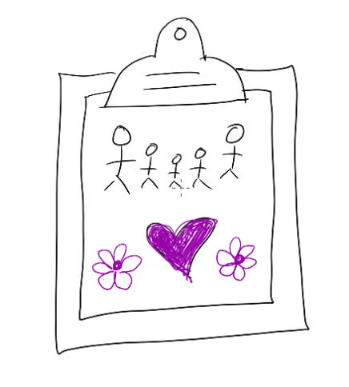

# How becoming a parent (or having a life outside work) has made me a better leader

As the mom of 3 young children, I often get asked the universal question:  “How can I have it all?” I completely understand why! The world is full of narratives telling us how if we’re working parents we’re always failing — never fully present at home, never fully present at work, always letting people down at both. This is particularly on my mind as we head into Mother’s Day in the US. But of course, it doesn’t just apply to people with families — it’s something that anyone with major personal commitments outside of work grapples with.

Whenever people ask me this, I’m always honest that I don’t feel well-positioned to give any advice.  After all, I have the privilege of a ton of resources and support both at work and at home, and I still have a seemingly-infinite list of ways that I haven’t been as present as a mom and leader as I want.  Next week alone, I’ll miss my 5-year-old’s “Muffins with Mama” event for a leadership offsite, and I’ll miss my team all-hands for a portfolio day at my 8-year-old’s school.  Of course, everyone will be fine — my daughter and I will bake our own muffins this weekend, and my team will do a dazzling job leading the all-hands without me.

But to combat that feeling of never meeting expectations — and with a deep appreciation for the luxury of having these choices at all — I keep a running counter-narrative in my head of all the ways being a parent (or having any commitments outside of work, whether it's family, pets, or a personal passion) makes me a \***better**\* leader at work.

1. **I’m more efficient.** I used to have infinite time to work, but childcare and school constraints mean I have to prioritize and delegate more aggressively.  That means my whole team is always doing high-pri work and they get pulled directly into harder problems.
2. **I’m more willing to take work risks.**  I used to worry about what people would think of an email I wrote or how I ran a meeting.  Now, all my fear is centralized in three pint-sized humans running around a California playground.  Spearheading new company directions or publishing a public newsletter feels comfortable by contrast.
3. **I take real breaks.** If there’s a way to multitask toddlers, please tell me!  Until then, there’s a few hours every morning and evening where I **have** to take a break and clear my head with the mundanity of cooking dinner or making school lunches or singing bathtime songs — and realize how great spending that time is.  When I get back to work, it’s with fresh eyes and more clarity.
4. **I’m more emotionally accessible.** With my *very* visible pregnancies, there was no hiding what I was going through! So instead, I shared stories of what I was feeling, my kids growing up, my miscarriages, my tiny victories and frustrations — and heard the sympathetic and hilarious stories of the people around me.  The day-to-day kid stories give me something to connect and laugh with other people about no matter what.
5. **I feel more powerful.**  It’s really easy to not see myself as powerful or successful. And that makes sense — research shows that [women who are successful aren’t well-liked](https://hbr.org/2013/04/for-women-leaders-likability-a), and I really want to be liked.  But after having my first baby, I walked around for months thinking, “I made a tiny human!  I can do anything!”  That made it a lot easier for me to see myself as someone who is powerful enough to make decisions and be accountable for them at work.

Of course, having kids is a **very** personal decision, choosing how to work is a very personal decision, everyone’s life is complex no matter where they land on those topics, and even having these choices is a privilege.  But if you do happen to decide to have children and work a demanding job — or have other passions alongside work, family or otherwise — I wanted to share one counter-framing to the frequent negative narrative that’s been helpful for me.

Thanks for reading The Hard Parts of Growth! Subscribe for free to receive new posts and support my work.