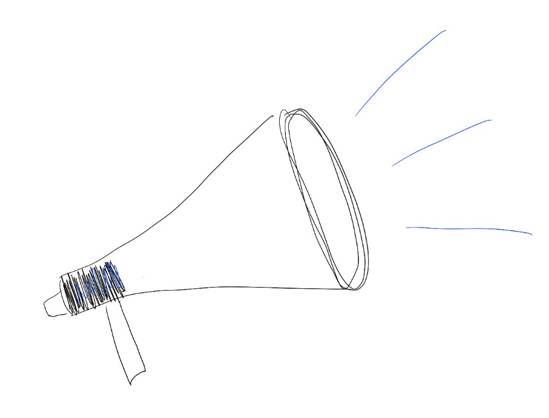

# Learning to speak up

For a long time, I got feedback that I was “too aggressive” in how I communicated — too much, too fast, too bold. (How many women have gotten similar feedback?)  At some point, I got overwhelmed by that feedback and I decided to stop talking so much.  But once I started down that path, I couldn’t seem to stop; it got harder and harder to speak up in meetings, and easier to focus on elevating the voices of others rather than sharing my imperfect opinion.

But after a few years, I hit a level of leadership where my team needed to hear **my** voice, and I had to re-learn how to communicate boldly and clearly.

What helped me polish my communication and get more comfortable with speaking up again?  Here are a few of the tactics that worked:

1. **Choose one clear goal.**  Clear communication can mean a lot of different things:  “I want my executive team to feel confident in my team’s progress based on my updates”, or “I want to be a public speaker who captures people’s attention”, or “I want to make concise, insightful points in design critiques.”    
     
   Choosing a clear goal gives me a roadmap of what to focus on, and a built-in way to measure if I’m getting better — by asking my exec team, or looking at audience surveys, or seeing whether designs changed after I gave feedback.
2. **Choose one form of communication and repeatedly practice it.**  Whether it’s writing weekly notes, giving prepared speeches, or moderating panels, I’d choose one thing to get better at and then focus on practicing just that for several months.    
     
   Focusing on one thing was easier than trying to get better at all forms of communication simultaneously.  And in order to get good at any single method, I had to consider my words, figure out my natural tone, and think about what vocabulary and stories I would use.  All of that work transferred to other forms of communication, plus got me used to using my voice in a larger forum.  So something as simple as writing a note to my team about what I’m working on each week ended up making it easier for me to give large all-hands talks to my team about our product vision and roadmap.
3. **Get an accountability partner.**  When I was trying to speak up more in meetings, I shared my goal with a close colleague and asked them to make sure I talked at least once every 15 minutes.  If they noticed I haven’t talked in a while, they had my permission to put me on the spot and say, “Ami, what do you think?”  That way I could practice speaking up, even if I’m unprepared.  Or they could ping me after the meeting with a quick message of “red”, “yellow”, or “green”, so I get real-time feedback of how I’m doing against my goal.    
     
   When I was focused on writing more (which is where all of these notes started!) a colleague and I set up a group where we could exchange first drafts and hold each other accountable for publishing on schedule.
4. **Set mental commitments.**  If I didn’t feel comfortable sharing my goals with a colleague, I practiced holding myself accountable.  In meetings, I’d set a mental timer to make sure I said something every 15 minutes.  That helped me get used to drawing attention to myself and managing the conversation, even if all I said was just “Time check — we need to move on.”
5. **Understand what gives me confidence to speak up.**  I always feel more confident speaking about products when I can advocate on behalf of a user.  So when I am struggling to speak up, I know I can start by channeling a particular user — someone I’ve met in research, or someone I know — and speak on behalf of their needs.  That makes me feel like the spotlight isn’t on me, but on the user where it belongs.

What helps you speak up?

Thanks for reading The Hard Parts of Growth! Subscribe for free to receive new posts and support my work.