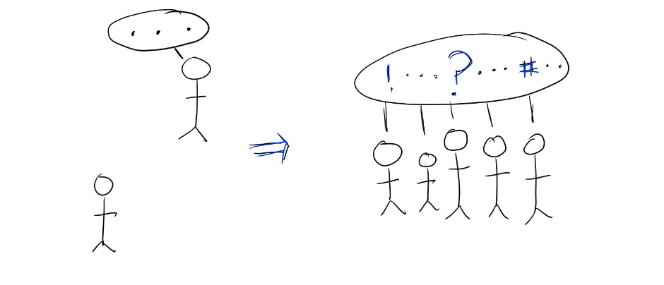

# Activating peers and advisors instead of getting stuck "finding the perfect mentor"

For most of my career, I desperately wanted a mentor.  Especially as a woman in tech, I repeatedly heard that mentors would help me unlock all the secrets of the industry by being my guide through everything I didn’t know.  When other people casually mentioned how their mentors gave them advice on a hard problem or career choice, I felt jealous and even a bit helpless.

I had built up an impossible conception of my ideal mentor — someone who was a lot like me (a woman, working in tech, choosing to have a large family, growing her career) but who still had an hour every month to spend with me, acting as an oracle for problems I couldn’t even articulate out loud.  It’s a high bar!!

It took me a while to realize that in reality, I got the best advice and support not from a single mentor several steps ahead, but from activating the generous people already around me.

I found the best success by asking for help from 3 groups of people:

1. **My peers.**  When I’m going through difficult problems, my peers are often the only people going through the same ones!  Just like me, my peers didn’t always know all the answers immediately — but together we could talk about the patterns we were seeing, brainstorm new approaches, and share any best practices we were learning.  And of course, just being able to vent and bond with each other led to some of the strongest relationships I made at work.
2. **Subject matter experts.**  Instead of looking for a single mentor who was good at every problem that could ever come up in my career, it's been great to call different people who are uniquely good at a specific problem I needed help with right that minute.  For instance, when I needed to run my first reorg?  I asked for 20 minutes with a senior colleague who led a large and flexible team, and they talked me through their typical method of making org changes.  These bite-sized, specific requests were a lot easier for advisors to say “yes” to than ongoing open-ended mentorship, and I got the benefit of learning from whoever’s the best at a particular problem.
3. **My manager.** We’re often directed to find mentorship outside our management chain, but I’ve grown a ton from advice from my direct managers.  After all, they have the most ongoing context on me and the problems I’m facing.  It helped me to realize that my managers wouldn’t always automatically know how to help me — so the onus was on me to ask for something specific and hold them accountable for giving that to me.  For instance, I could make a request like, “I’m facing this problem today — do you have a best practice for this, or can you connect me with someone who does?” or “I’m trying to grow in this way — what are the gaps that you see, and how can you help me close them?”

I’ve been lucky to have many senior people around me, in and out of my management chain, who have been really generous with their time and support.  But I had mentally turned “finding a mentor" into one more new, different hoop that I had to jump through in order to be successful.  Realizing that I could get all the advice I needed from people who already knew me was an immense help — it gave me access to the relevant, immediate knowledge I needed, and it gave me confidence that I had the tools I needed to grow my career.

Thanks for reading The Hard Parts of Growth! Subscribe for free to receive new posts and support my work.