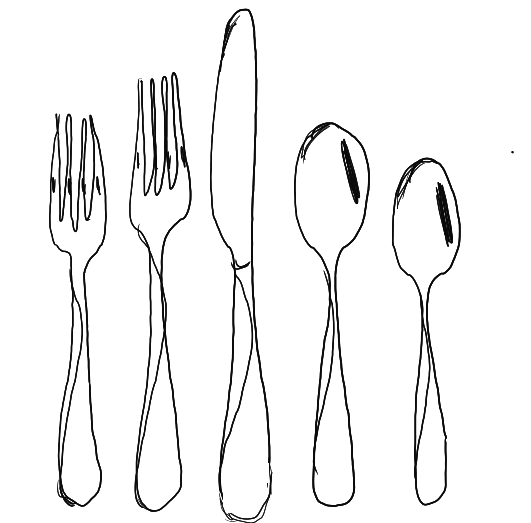

# Human needs are universal; product solutions are unique

#### 

When I see a feature doing well, it’s tempting to feel an instinctive desire to copy and paste that feature onto whatever I’m working on. After all, it’s working for another app!

Or if a set of values is working for one team, I think, “We should try that in my team too!”

But people often intentionally hire different products for different jobs, and different values are needed for different teams.

On a recent road trip, I noticed every roadside restaurant gave us sporks — a spoon with the functionality of a fork grafted on.  How convenient!  But when I’m sitting down for a comfortable meal at home, I still prefer eating with a separate fork and spoon — the spork just isn’t right for my family dinners.

When I see a successful feature in another product, I try to fight the temptation to just copy it, and instead focus first on the underlying human needs that it’s solving.  After all, that feature is exposing a need that people have, and showing me one way that they’re able to meet that need.  How should I address those same human needs through the specific lens of my product?

Some of our core needs are universal: to connect with each other, stay informed, feel a sense of worth, protect our families.

Some are specific to who we are, where we live, what kind of work we do.

I try to discipline myself to:

1. Understand what a successful feature is doing
2. Go deep on the human need it’s solving, and other ways that human need is expressed and solved
3. **Only then** think about how that need could be solved by my app

A clear sequence of understanding the human need before thinking about addressing it within a product has helped me resist the temptation to transplant a feature that’s working elsewhere directly onto my app.

It also helps me mentally outline the constraints for the products I work on. Placing constraints on a product is one of the hardest parts of building it.  And of course we need to frequently reassess those constraints; user needs change as the world changes.

But recognizing and being intentional about those constraints helps define the product — it helps the user understand what the product is **for**, and makes sure that a product solves the specific job people are hiring it for. And it ensures that when we build something new, we’re focusing on solving a human need in a way that feels at home for the people using the product.

Thanks for reading The Hard Parts of Growth! Subscribe for free to receive new posts and support my work.