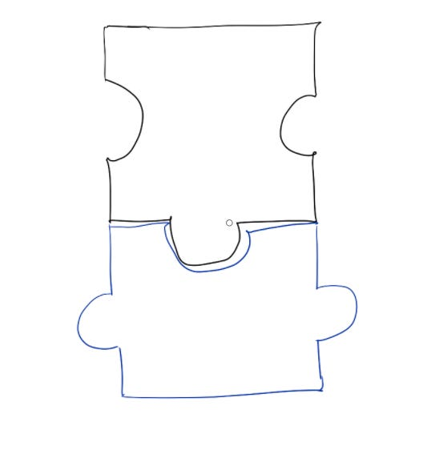

# My manager owns context, I own the recommendation

When I walked into one of my first leadership reviews, I felt ready. I had gathered all the information and I was prepared to explain it all to my manager so they could make a decision.

I diligently started walking through all the info our team had collected, slide by slide, bullet point by bullet point.

Luckily, my manager took advantage of a pause in my monologue to turn to me and say, “Thanks for all this info.  So, what should we do here?”  I was surprised!  Of course, I had my own opinion about what the right decision was, but I thought my role was just to **present** all the information.  That way, my manager could understand all the info and make the decision themselves — basically, do my job, but better.

It took me a while to realize — that’s not reasonable or even possible!  I’m always going to be closer to my work than my manager is, so I shouldn’t expect them to understand it the way I do.  Instead, the best service I can offer is to build a clear recommendation, and outline the decision framework for how we got to this recommendation.

What I need from senior leaders around me isn’t to understand all the exact same info I learned.  Instead, I need them to offer **complementary** infothat will help our team make a stronger decision, like**:**

1. More context about what’s happening around the company or the industry
2. Decision-making frameworks I might not be thinking about
3. Pattern-matching based on other decisions they’ve seen
4. Identifying other options or logical gaps I’m too close to see
5. Sometimes, just giving me a vote of confidence that my thinking makes sense and they believe in me

Internalizing this has changed what I look for in a manager.  I stopped thinking that my manager needs to be good at all the same things I’m good at, and that my job is to give them a deep understanding of everything I’m working on so they can make the important decisions.

Instead, I started asking myself — how can I frame my recommendations so my manager can engage with them and challenge my assumptions, and then I can learn from how they think?  Sometimes this means outlining my decision criteria clearly so my manager can disagree with specific ones and I can understand the principles they’re using. Sometimes it means sharing intentionally provocative “hot takes” about things we could do differently so I can hear context I might be missing.

Focusing on getting info and frameworks from my manager that are different from what I already know has been really additive. Not only did it give me permission to own my own recommendations, it’s meant that, no matter what my manager’s past experience has been, I’ve learned unique skills from them that I’d never stumble across on my own.

Thanks for reading The Hard Parts of Growth! Subscribe for free to receive new posts and support my work.