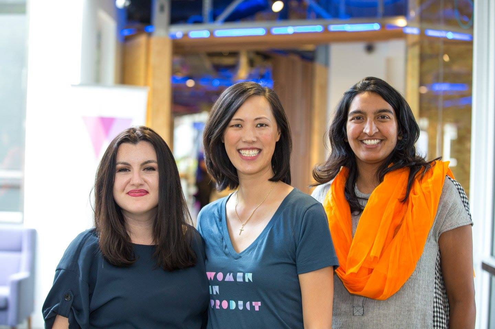

# Seeing Yourself through Others’ Eyes (guest post by Deb Liu)

*How to view yourself the way your advocates do*

Okay, this post is a little different.  [Deb Liu](https://www.linkedin.com/in/deborahliu/), the CEO of Ancestry and my longtime friend and colleague, writes an amazing blog called [Perspectives](https://debliu.substack.com/).  Today we decided to do a blog swap where we each wrote about something the other person was bad at.  I wrote about "How to say no" for her blog (something Deb is notoriously bad at, as you can see from her never-ending list of accomplishments), and she wrote "How to take credit" for mine.   
  
What I did not expect was for her to write an ode to how great I am :facepalm:.  While I'm a little embarrassed to post this, I am so thankful to have a friend and partner like Deb — and I'm trying to learn the lessons she highlights in her post.  Please check out her blog over on [Perspectives](https://debliu.substack.com/) for more of Deb’s lessons from tech, leadership, and parenthood!

—

Let me tell you about my friend Ami Vora. She is an incredible product leader who balances visionary leadership with focused execution and is well-respected by everyone who has worked with her. Her two superpowers are her ability to challenge the status quo with respect and influence and her ability to change altitudes, going from high level into the details and back in any discussion.

Ami has done many incredible jobs in her storied career. She took Instagram Ads and Facebook’s native mobile apps to market. She was the head of product for Meta Ads, which was then Meta’s largest product team. She was the first external CPO of WhatsApp as they became the largest messaging app in the world and is currently Faire’s first ever CPO.

So, why am I telling you all these things about Ami? Well, for one thing, she is the actual author of this blog I’m guesting on. But the second reason is more important: Because she would never, ever tell you these things herself.

Fidji Simo, Deb, and Ami at the first Women in Product conference, hosted at Meta

## **Seeing yourself from the outside**

Recently, two different leaders in the industry asked me separately about Ami, each for different reasons. I started talking about how amazing she was and about all of the interesting and impactful things she’s done. After I’d finished telling all my stories about her, one of them said, “I wish Ami could see herself like you see her.”

I was a little taken aback. I’ve always felt like I see Ami completely clearly. We worked alongside each other in many different capacities. As her close colleague for over a decade, I saw her crush job after job after job. When things were dicey for our first Women in Product Conference, she stepped in and landed it. She went onstage at seven months pregnant to give our keynote a couple years later.

I knew what Ami was capable of, and I was happy to share it with others. But I found myself wondering if she was willing to do the same for herself.

Studies of professors show that [students rate female instructors lower](https://www.forbes.com/sites/mariaminor/2021/03/19/are-female-professors-held-to-a-different-standard-than-their-male-counterparts/) across the board than male instructors. Some interventions, like encouraging students to be objective with their ratings, [helped reduce this bias](https://journals.plos.org/plosone/article?id=10.1371%2Fjournal.pone.0216241), but it continues to be a systemic issue in higher education.

In the workplace, I have also seen people assume women are less senior or qualified than their male counterparts. I can’t even count the number of times I’ve been in a meeting with a male colleague, watching whoever was talking look straight at him the whole time even though I was the decision maker (or, in some cases, the more senior member of the team).

We are taught from a young age to be good girls. We’re told that we shouldn’t brag. That it’s unbecoming to be bossy. That we don't want to “oversell ourselves.” We are expected to be the helpers in the background. We’re supposed to support others without owning our contributions.

That is why I wish I could be the walking billboard for Ami. I wish I could broadcast to everyone how awesome she is, and that way they would instantly know. (Don’t tell Ami this, but the real reason I suggested we trade blog posts for each other’s newsletters was so I would have the chance to tell you the truth about who she really is!)

## **When hard work gets overlooked**

[As Adam Grant points out](https://www.instagram.com/adamgrant/p/C4QxOWMpi4-/), studies show that women are often expected to do the “office housework”: subtle labor behind the scenes to help their teams be successful. If they're not willing to stay late to do it, they're punished, but even if they do the extra work, they're not rewarded. The opposite is true for men. Male managers are given credit if they stay late to help their teams, but they're not punished if they choose not to.

Throughout her career, Ami did so much for those around her. She helped quietly, moving things around to make other things happen. She coached and mentored. She cared and nurtured. But she never put herself out there and shared the quiet work she was always doing to make others successful. She was someone who worked behind the scenes to make sure the trains ran smoothly for everyone else.

I remember a time when I spoke to a group and asked about self-evaluations. It was review season, and it was time for everyone to assess their own performance. Somebody raised their hand and asked, “What if I'm bad at self-promotion?”

My answer was, “If you consider it self-promotion, you are definitely not going to do a good job at it.” That conversation makes me think about Ami. Nobody wants to be seen as arrogant or self-aggrandizing, but she was so subtle that others missed the incredible work she did.

Ami giving the keynote at Women in Product, 7 months pregnant. She joked, “I know what you’re thinking, I’m so committed to women in product that I’m going to give birth to one right now onstage”

## **Remembering and amplifying who you are**

Ami is a hidden gem—and I bet you know a lot of hidden gems just like her in real life. You wish other people could see them the way you see them. You wish they could have a flashing neon sign above their heads like in “Free Guy” with a scoreboard proclaiming their excellence.

Maybe some of you even wish that for yourselves.

It can be hard to take ownership of your own success, especially for women, introverts, and other groups who are often told not to ask for too much or make too much of a fuss. Even if you’re not in one of those groups, you might still struggle to find a balance between amplifying your achievements and not “rubbing people the wrong way.” But you can’t assume that others will carry that neon sign for you. If you do, the world may miss out on all the amazing things you’ve done and have to offer.

I'm not saying that we should brag or oversell ourselves. Instead, we should have confidence and take ownership of the things we’ve done. Finding a way to authentically own our success is an important skill we too often overlook. If this is something you struggle with, try this exercise:

* **Ask three people to describe you for a referral.** I would suggest a former manager, a close colleague, and a mentor. What do they say? What are the themes that emerge? Reflect on the patterns you notice and the achievements they highlight. These aren’t fibs or exaggerations—these are descriptions from people you respect and care about.
* **Have a friend who is a hiring manager or recruiter review your LinkedIn.** It’s important to have this person be someone involved in hiring. Their job is to see what people amplify, and they make decisions based on the pictures people paint of themselves. What are their observations? Where are you not painting a full picture of yourself?
* **Do the [superpower exercise](https://www.linkedin.com/pulse/how-do-i-find-my-superpower-deborah-liu/).** Reflect on the talents, traits, and interests you have that don’t come easily to others. Have others do the same. (I suggest asking people from your personal life, your social life, and your work life to get a full picture.) Review the data you’ve collected and look for common themes. What did you learn about yourself that you didn’t know? What do others see that you are missing?
* **Reflect on the things you tell yourself.** Once you’ve collected all these outside opinions, take a moment to think about how you talk to yourself. The things we say to ourselves directly affect the ways we present ourselves to others. Are you selling yourself short?

There are people in your life who are advocating for you. They are mentioning your name as a candidate for a new opportunity or championing you at a networking event when someone asks. They are spreading the word in ways you can’t imagine. Your job is to understand what these people say behind your back and start to see yourself the way they do.

I never fail to be blown away by Ami’s accomplishments, talents, and dedication. I wanted to feature on her newsletter so I could share them with all of you—and encourage you to take ownership of your own superpowers.

Amplifying yourself isn’t easy. In the beginning, it can feel strange and uncomfortable. But the world deserves to know who you are and what you’re capable of. You don’t have to wait for others to share your greatness; you just have to learn to see the greatness in yourself.

*Plug from Ami: Thank you, Deb, for an embarrassingly kind post. Go check out Deb’s blog at [Perspectives](https://debliu.substack.com/) for more lessons from her storied career!*

Thanks for reading The Hard Parts of Growth! Subscribe for free to receive new posts and support my work.