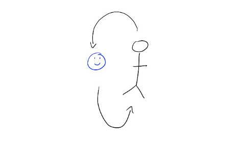

# Leadership hack: Feed my own feedback loop

“You need to tell me something I’m doing well!” I said to my close colleague a few years ago. “I’ve only heard about what’s not working lately. I need just one sentence about something good so I don’t get demoralized.”

That single conversation (repeated every quarter or two, with various audiences) consistently helps me turn a slow slide toward discouragement into an infusion of energy, so I can put my heart back into building the best products and teams possible.

So much of life is made of feedback loops, where we try something, see how it goes, and then adjust our behavior next time based on the reward. That reward is what motivates us to keep trying. One Stanford professor [points out](https://www.npr.org/2020/02/25/809256398/tiny-habits-are-the-key-to-behavioral-change) that video games will exclaim “you’re doing great!” every time you accomplish the smallest task, because that encouragement keeps you playing. And as the parent of three small children, it has been drilled into my head to give immediate praise every time a kid does something I want them to do again.

But especially in high-performing environments, we often skate right by that feeling of reward.  My career hit an inflection point when I decided to feed my own feedback loop — taking time for a small celebration after doing something hard so it’d be easier to keep doing difficult things every day.

The hardest part of this change was actually acknowledging that I **needed** a reward — even something as trivial as a few words of affirmation from my peers. It’s not something I want to want. I’d like to think of myself as intrinsically motivated and unaffected by what people think of me. But that’s just not accurate. Why be dishonest with myself about it?

Even though I know I need these small signals, seeking them out can still be awkward. It felt weird the first few times I accosted one of my peers and asked them to say something nice. But sharing that it was important to me to occasionally feel some wins was both liberating and surprisingly effective.

Other tactics that see me through: making a list every six months of what I learned, keeping an email folder marked “praise” of nice things people have said to me, or taking 30 minutes every Friday afternoon for a phone 1:1 with a colleague just to catch up.

Learning how to be generous to myself has been a huge part of growing as a leader. It’s really easy for me to see all the things I’m failing at, and that will always be true. So I also need to build a system which gives me energy to keep tackling hard problems day after day. That could be a workout routine, a little indulgence every day, or people — at work and in life — who see and validate parts of me that are easy to forget about otherwise.

Thanks for reading The Hard Parts of Growth! Subscribe for free to receive new posts and support my work.