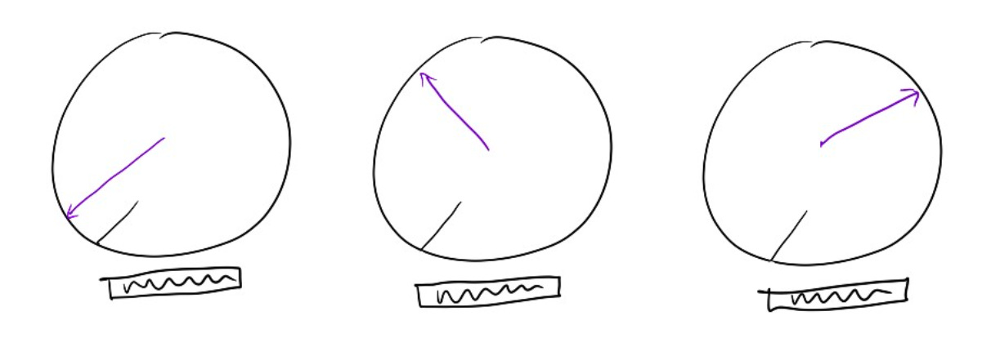

# Finding my voice using a "series of dials"

Several years ago, a thorny topic came up at work, and we had a sequence of difficult meetings to try to sort through options.  It was hard to get everyone on the same page, especially with senior leaders on all sides of the issue.

“I need you to be more forceful,” said my manager.  “You need to express your opinions about this, or we might not get to the right decision.”

But I had been trained, through years of [trying to be more likable](https://amivora.substack.com/p/reframing-i-need-to-change-who-i), to be quieter and more accommodating. How could I suddenly pound the table for my decision in a room full of people who outranked me, even if I knew it was the right one?

“Before you walk into the next review, turn up the ‘forceful’ dial in your head,” my manager urged me. “You have all these dials you can control — just choose which ones you need to turn in each meeting.”

That idea really stuck with me.  I walked out of that 1:1 imagining a series of dials in my head — like a control panel, with each dial neatly labeled with “funny”, “outgoing”, “empathetic”, and, yes, “forceful.”

What if I turned my “funny” dial to 10 on a day when everyone’s energy was low?  Would it feel out-of-place?  Would I feel inauthentic?  Or would it be a nice way to pump some energy into the group and make us feel more connected?

I was surprised by what I learned when I played with these settings.  When I turned up “forceful” people weren’t taken aback but usually comfortable and respectful, and when I turned up “funny” I made myself happier as well as my team.  It turned out there were a lot of modes I had never thought to try but which all felt authentic to me.

I still use this mental image today.  If I’m speaking at a big event, can I turn up “expressive”? If I’m hosting an event, can I turn up “outgoing”?

And for the thorny issue we were trying to solve?  I took my manager’s advice and turned up my “forceful” dial in the next review.  I was a little uncomfortable at first, but we landed in the right place.  The idea of a system of dials gave me a fast, easy way to experiment with how I show up and what works in different settings — all while discovering what feels true to me.

Thanks for reading The Hard Parts of Growth! Subscribe for free to receive new posts and support my work.