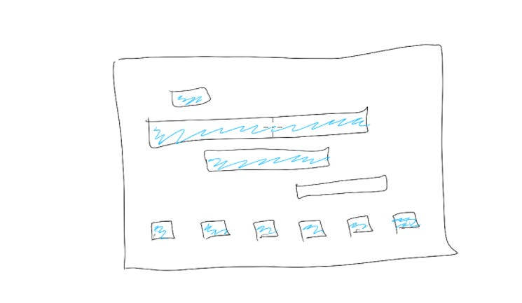

# 5 tips to plan my career like I plan my product

One of the best pieces of advice I’ve heard for career growth is “Build your career like you would your product.” We’ve built up all these skills when we’re planning products, with clear priorities, milestones, tradeoffs, and success metrics. Why wouldn’t we use those skills to support our career too?

One leader I worked with took this thinking a step further with an analogy I love: “If you were your product, what changes would you make — *and when will you ship your next version?*” I try to build the same discipline and fast iteration we bring to our products into my career growth plans.

Of course, it often feels a little selfish to focus on my personal growth when there’s so much urgent work piling up in my inbox. But I've found clearing just 1-2 hours a week to invest in myself not only gives me fresher eyes on my day-to-day problems, it's also a [service to the people](https://amivora.substack.com/p/reframing-giving-myself-what-i-need?s=w) around me. How can I support my team through bigger problems every day unless I’m getting better too?

**5 tactics that have worked for me:**

1. **Every year I write a**[“year in review” vision](https://medium.com/thrive-global/facebooks-carolyn-everson-why-writing-a-vision-has-been-game-changing-for-me-c7271093fc47), inspired by an amazing leader and former colleague, Carolyn Everson — basically writing a press release for the “product” of the upcoming year. This forces me to actually get realistic about my goals, so instead of thinking to myself “I'd like to take more family trips this year,” I map out how it will actually happen. Have we picked a vacation time for next quarter? Who will book flights? What are the blockers to making it happen?

2. **Write 1-2 personal growth goals into my performance reviews at work every half** and share them with my manager and team. I include deliverables, tactics, and goals, just as I do for product plans. That means I can't use “Get better at writing” as a goal — I have to think about how many pieces I want to publish, how much time I'm willing to devote to them, and how I'll know when I'm successful. Sharing my goals with my team also creates the permission (and accountability) for getting it done.

3. **Recognize what’s working by frequently asking myself, “What have I learned recently?”** Just like looking at a dashboard to understand where a product is successful, asking this question every few months helps me identify growth in myself that I might not even have recognized. Once I recognize and name the skills I'm learning, I end up using those skills more proactively.  And I build a stronger feedback loop about what I’m learning, so I'm more likely to keep learning new things in the future.

4. **Do “customer research” with my colleagues by asking, “If I were to step into my manager’s job \*today\*, what gaps would keep me from being successful?”** (Or if I don’t want my manager’s role, I name someone's job I do want). For a long time I thought of feedback as a list of issues that I had to fix about myself.  In my mind, “no feedback” translated into “good feedback.” But just like doing market research for a product, asking for personal feedback highlights "feature requests" for skills I didn't even know I needed. Then I can go get those skills I need and be ready for what I want next.

5. **Iterate and evolve.** Just like with a product, no matter how well I plan, I can’t control outcomes. Some ideas are great but it’s not the right time, some directions don’t work and I’ll need to pivot, and I need to give myself time and grace to learn as I go and keep trying new things.

What helps you prioritize your growth?

Thanks for reading The Hard Parts of Growth! Subscribe for free to receive new posts and support my work.