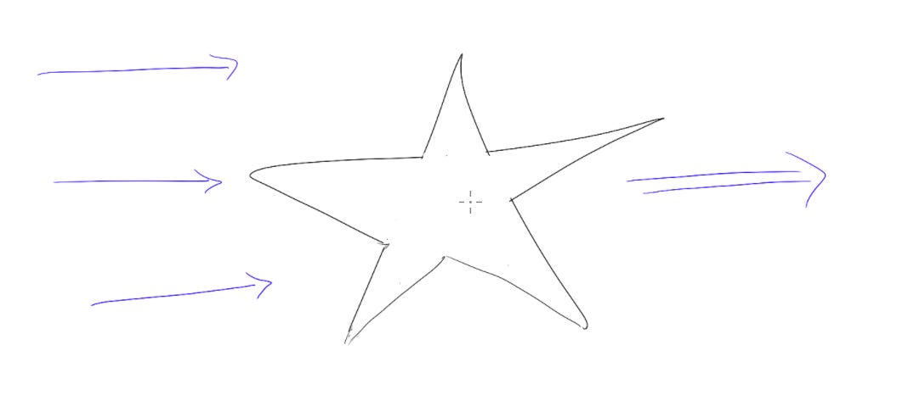

# Making the tradeoff between speed and quality

“We need to ship faster,” I said to my team.  “We know what we need to build, and the best thing we can do for our customers is get it into their hands faster.”

They looked back skeptically. “If we ship faster, how can we make sure that we’re building to our quality standard?  Are you asking us to cut corners?”

This exact conversation has happened not just once, but on nearly every team I’ve been on.  And I’ve been on both sides of it!  So how much time should I spend on improving quality v. focusing on velocity of shipping?

This is a never-ending tradeoff, and I don’t have perfect answers.  But here are some principles that give me a way to talk about it:

1. **State that we won’t ship a bad product.** I find even saying that out loud makes people breathe a sigh of relief.  Otherwise the decision seems abstract and binary — as if by focusing on speed, we have to throw quality out entirely.  But what’s the point of shipping a bad product?  It just won’t work for customers, and we won’t learn from it.
2. **Quality mirrors customer priorities.**  Sometimes the things that we think of as “quality” (which I’ve heard refer to everything from in-product animation to a final 3-year product strategy) are important, but aren’t what the customer would prioritize.  When working on business tools, for instance, I had a long list of UI updates that would make me personally really happy.  But what our customers wanted most were more sales — and they’d rather that we spend more of our time building new products to help them find new customers rather than updating the UI.  So that’s what we did — and our customers loved it.
3. **The intent is to shorten the entire process, not cut corners.** A major concern I’ve heard is, is “does this mean I won’t have time to do my job well?”  Designers worry they’ll need to sacrifice design exploration, or engineers worry they’ll need to ship an untested product.  No. Instead, we’re trying to streamline the whole process from “having an idea” to “shipping a validated, viable product.”  That means that the best way to speed things up isn’t normally “shorten design exploration” or “skip testing” but instead “let’s break this idea into shorter milestones” or “let’s make it easier to validate this opportunity size”.
4. **We’ll empower teams to make intentional tradeoffs.** The goal is not to hold to an arbitrary up-front rule across the board. Instead, it’s for each team to have an intentional conversation about the particular decision they’re making right now.  How can we explicitly balance what the customer wants, the risks of this direction, and whether we’re going to get high fidelity learnings from this version of the product?  All that adds up to shipping something we can be proud of.

These principles never fully solve the question of how to balance speed and quality, or spit out a formula for exactly what we should be doing.  But I’ve found them useful for turning an emotional or philosophical debate into a tactical team discussion, and for giving me some starting principles on how to deliver value faster to our customers.

Thanks for reading The Hard Parts of Growth! Subscribe for free to receive new posts and support my work.