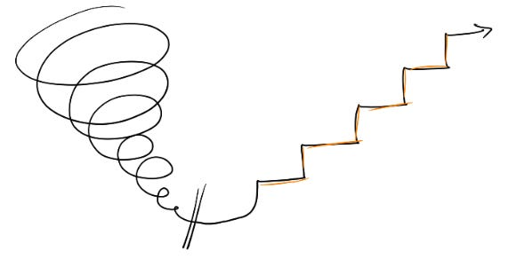

# Is it time to look for a new job? And how do I start?

We all know the feeling — you’re feeling a little sluggish at work. Your slack pings with messages, and instead of feeling curious and energized, your mind just feels tired. You find yourself wondering if you’re really in the right place, if you’re really being valued the way you deserve, or if, just maybe, there’s something better out there for you. Sound familiar?

Of course it’s a luxury to have the choice of keeping a reliable job and considering moving to another one, especially in an industry where so much is in flux and jobs are changing overnight. But this is still one of the most frequent questions I get asked, so I wanted to share what has worked for me.

For years, this sort of job doubt was a regular pattern for me. It seemed to happen every summer — I’d get this sinking suspicion that maybe I wasn’t in the right role, or I wasn’t making as much progress as I wanted, and I’d feel weeks of swirling angst.

That limbo is one of the most insidious things I’ve felt at work. I have doubts about my current role so I’m not fully energized and committed, and yet I’m not really doing anything to find a new role. I’m just stuck. The longer I stay in a half-in, half-out state, the more tired I get, and the worse my performance gets.

It took me a while to break that pattern. The key for me? Channeling all that angst into a concrete plan to actually understand the jobs out there right now, instead of just imagining there’s something great for me. Then I can truly compare whether my current job is actually the best one for me. And having a clear plan snaps me out of limbo, and gives me a palpable sense of progress that re-energizes me overall.

What works for me?

1. **Set a timeline.** How long should I give myself before making a clear decision about my current job? I usually give myself 8 focused weeks to really understand what other roles are out there. If I don’t find the right thing by then, I’ll know my current job might be the best one for me right now. That gives me the freedom to mentally commit to staying for 6 more months, and I come back to my current job re-energized and more conscious of the value I get from this job.
2. **Write a pitch about myself + get feedback.** Early in my career, one company required me to present a deck about who I was, what I had built, and what I had learned. This turned into a great way to describe my values and get confident about the skills I bring. Now I try to do that same exercise for any job search. It helps me build clarity about my skills and confidence that they’re useful.   
     
   Putting together a pitch isn’t easy. It can be hard to even recognize everything you've done, and [research](https://psycnet.apa.org/record/1998-00299-006) says it's particularly hard for women to take credit for their accomplishments. What ended up working for me: getting friends, colleagues, and former managers to write a few sentences about my strengths and accomplishments, or pulling themes directly from past performance reviews. My supporters gave me far stronger and more positive words than I would have dreamed of using myself. I then repeat that narrative to myself until I internalize it.
3. **Figure out what I’m optimizing for.** There are so many rows in my mental spreadsheet I could prioritize: role, compensation, size of company, title, status, flexibility, etc. I have to decide which 1-2 factors I really care about in my next role. Then I can focus on jobs that fit those filters.
4. **Prioritize + operationalize the time.** My current job will naturally keep me too busy to look for another role. But a new job is my future — so I need to carve out enough time to do it justice. Setting aside dedicated time every week, like every Friday afternoon from 3-5pm, means that whenever I meet someone I’d like to talk to about a role, I can just say “how about if we meet this Friday afternoon?” And if I’m not meeting with someone, I use that time for outreach, research, or prep. It forces me to do some work on planning my future every week.
5. **Be confident.** I have to walk into every conversation convinced that the company would be lucky to have me, with a few reasons for exactly why. If I don't believe it, neither will they.
6. **Find my honest fit.** The recruiting process isn't about fooling an interviewer into giving me a job — it's about finding a match. I try to be my shiniest self during interviews, but still myself. I imagine that I've known the interviewers for years and am already friends with them. How would I act then? If the real me isn't a fit during the interview, I'm not going to be a fit later either.
7. **Maintain the rhythms of my normal life.** Any job search is stressful, and it’s tempting to put everything on hold until it's over. But especially given how unpredictable the process is, it helps to acknowledge that I’m going to be more stressed than usual, and keep trying to do what I would normally do — seeing friends, working out, adding new projects at work. Also having a few close colleagues I can confide in who understand what I’m going through has been invaluable.
8. **Give myself time.** Whenever I feel time pressure, I'm tempted to make compromises I don’t actually want. But I'll be in a new role for the long term. The right role for me might come up sooner or later than I want. Staying in my current job longer than I'd planned or keeping my ears open even when I'm happy at my job has helped me find what's right for me long-term.

**My biggest unlock was to create a week-by-week roadmap.** Getting really specific about what I need to do helps me track progress and feel good about what I’m learning. For example, I put together something like this, and then adapt it over time.

1. *Week 1: Figure out what I’m looking for + start prep.* Get comfortable with my pitch about what I bring, and put an up-to-date summary on LinkedIn. Figure out my “dream jobs” and “dream companies.” Start dusting off the skills I’ll need to demonstrate in an interview: check out the latest tools, walk through interview questions, etc.
2. *Week 2-3: Fill the funnel + prep.* Asking friends, recruiters, or investors “Can you intro me to any interesting companies?” doesn’t work. They don’t know what’s relevant to me and don’t have time to think about it. What works: “I’m interested in X role at Y company where I can offer Z skills. I see you’re connected with hiring manager A who’s leading a team there. Can you intro me to them? I’ve attached a short blurb you can forward.” Repeat.
3. *Week 4-5: Narrow the search.* Meet with the companies I’m interested in, and understand what the role looks like and what they’re looking for. I take lots of notes so I can keep everything straight, about what people say, what I think a company needs, how I'd feel working there.
4. *Week 6-8: Interview.* If I’ve discovered a role that really piques my interest, interviewing is the only way to know if I’m a match. It’s challenging to do these while working, since it requires context-switching and going deep on different problems simultaneously. But it's been good practice for increasing my capacity later. I’d also recommend this [great post](https://molochinations.substack.com/p/how-i-got-a-job-at-openai) about job-hunting from [Philip Su](https://www.linkedin.com/in/suphilip/), including tactical info on preparing for interviews.

Afterward, no matter what, I try to celebrate going through the process. Even if I didn’t find the perfect role, I’ve learned a ton about myself. I learn what other companies value about me, what skills I want to build, and what motivates me right now — which makes it much easier to find those in my current role.

As someone who stayed at a single company for 15+ years, almost every time I’ve done this kind of search I’ve ended up staying where I am. But every search, whether or not it led to a new job, has been an inflection point — a chance to recommit with fresh energy or to step into something new. Either way, the process itself has always moved me forward, and helped me turn career angst into growth.

Thanks for reading The Hard Parts of Growth! Subscribe for free to receive new posts and support my work.