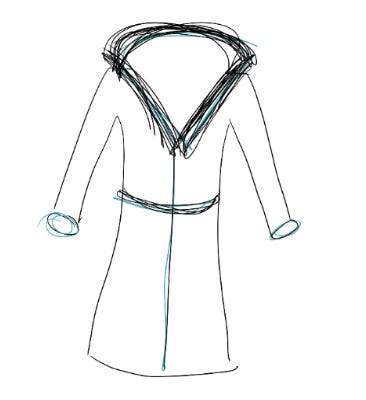

# Optimize for feeling lucky

When I’m deciding between big job choices (like whether to stay at my current role or take a new one), it feels like my whole career hangs in the balance. I convince myself I have to make the exact right choice or my career is over, and I think of all the ways the wrong decision will ruin my future. Sound familiar?

This is a privileged problem to have, of course, especially in a rapidly changing industry when it can be hard to find even one good opportunity. But when this choice does come up, I’ve learned a surprising way to ratchet down the pressure so I can make a calmer choice.

As you might expect, whenever this choice comes up I reflexively start building elaborate spreadsheets in my head, trying to weigh the importance of comp, culture, learning, title, and everything else. All the smart people around me reinforce this with very rational advice about choosing jobs that ladder into my “long-term goals” (even though I’ve never been good about having those!).

This makes sense, of course. As humans, we want to believe we have control. When I’m thinking about my next job, I find myself building elaborate plans: “*I’ll take this job, then I’ll become an expert in this domain, then I’ll get promoted, then I’ll be asked to lead this project, then…”* And they all end in a vague, dreamlike bright future.

Looking back at my actual career, though, I've been consistently *wrong* about which roles led to my growth. Early on, I never would have guessed that working in online advertising would be an inflection point for me. But when I joined a small but growing ads team just because it felt interesting, I felt supported enough to take risks — and that gave me space to learn about global economic trends, figure out how to scale an organization, make lifelong friends, and run product for what turned out to be a big business.

Meanwhile, the jobs I took because I *expected* them to turn into something better…didn’t. I walked away from them frustrated or stuck. In retrospect, this shouldn’t be surprising. If I’m walking into work every day thinking, *“Okay, just 6 more months, then I’ll get my promo and I can get out of here,”* then I’m not bringing my best energy. And in the meantime, reorgs, layoffs, or strategic changes can destroy the exact reason I took the job.

What has been working for me? **Optimizing for feeling lucky.** When I feel lucky in my work, I see more opportunities, take more risks, and am more creative. And because I’m enjoying my work, people are happier to work with me too. There’s also some research ([pdf](http://richardwiseman.com/resources/The_Luck_Factor.pdf)) to support the idea that when you feel lucky, you take actions that make you happier.

Here’s what’s helped me make these decisions with less anxiety:

1. **Make the spreadsheet, then tear it up.** I still create that mental spreadsheet of important factors. It’s helpful for ruling out clear mismatches. But even though it’s tempting to be hyper-rational about my choices, a spreadsheet is not great at helping me actually choose the right job. My intuition knows where I've been happy and successful before, and it has a much better track record than my rational mind at knowing where I’ll be happy again.
2. **Try on the job like I’m putting on a coat.** Before I make any big decisions, I do a test. I wake up in the morning and think: “*Okay, now I’m waking up in potential role X. Here’s what I’m thinking about as I open my laptop. Here’s the first meeting I’ll have every day. Here’s who I eat lunch with.”* That test drive of the job is the single best indicator of whether I’ll be happy in a role. If I feel boredom or distaste in that one day, would I really be happy full time?
3. **Remind myself that all roles are imperfect, but most roles are pretty good**. When I'm looking for a role, I often convince myself that the wrong choice means my career will be over. It feels like whatever decision I make is irrevocable. But that’s just not true! I will probably change jobs again in a few years, just like most people in the industry. And no matter what, I will learn things in any job that I'd never learn otherwise.

These exercises usually teach me that I could be happy in most of the jobs I'm lucky enough to be offered. That alone reduces the pressure to make "the absolute right choice" and lets me make a more intuitive decision about where I'll feel happiest.

The places I've grown the most haven't been characterized by a specific domain or function. Instead, they're the places where I walk in every day and think, *"How lucky am I to get to do this today?"* That feeling makes a job not just enjoyable, but somewhere I’m more likely to do great work.

Thanks for reading The Hard Parts of Growth! Subscribe for free to receive new posts and support my work.