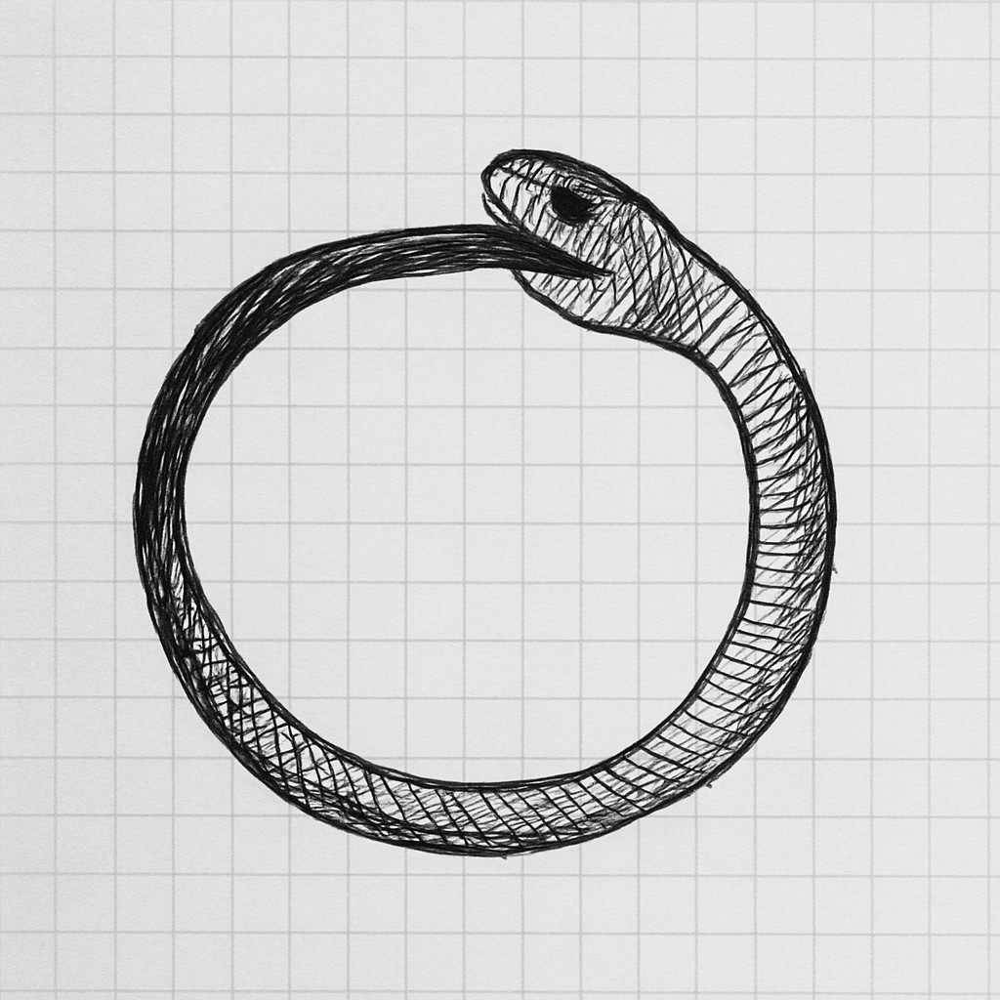

# Beware The Six Finger Trap

Early AI image models gave us people with six fingers, garbled text, and other strange inconsistencies. Fast forward a year, and those problems have largely vanished. Models now spell correctly, and humans have the right number of digits, unless you specifically ask otherwise :)

This pattern repeats across the AI landscape. Today’s limitation becomes tomorrow’s solved problem.

That’s the **Six Finger Trap**: investing significant engineering and product resources to solve a temporary model limitation that will soon be fixed upstream.

So how do we avoid it?

1. **Build for where the model puck is going.** As Ethan Mollick puts it, do the wait calculation. Do you launch with the AI capabilities of today, patching quirks with workarounds? Or do you build for tomorrow’s capabilities, accepting that you can’t serve every need today but skating toward where the model will be?
2. **Design architectures that can swap models in and out.** Today’s cutting-edge model is tomorrow’s legacy system. Expect to replace components as capabilities improve. Today’s workarounds become tomorrow’s technical debt.

### Today’s reminder: Google’s Nano Banana

This week’s Google *Nano Banana* 🍌 release is another reminder.

* **Model is eating the product.** Entire creative suites are collapsing into a single model that can generate in one shot.

Model keeps eating the product

* **NLX is the new UX.** The sprawl of 100 menu drop-downs is collapsing into a single contextual follow-up: *“Move this to a rural setting, long shot.”*

What once required hours of effort in a creative suite, navigating endless toolbars, sliders, and layers (and spending $$ on software) can now be done in a single shot by the latest model.

* **Avoid the Six Finger Trap.** Don’t over-engineer for quirks that won’t last. Build for where the model puck is going.

---

### Closing thought

In AI, today’s magic becomes tomorrow’s commodity. And today’s quirks become tomorrow’s solved problems. The discipline is resisting the urge to fix every six fingers we see, and instead designing for the moment when the model eats the product.