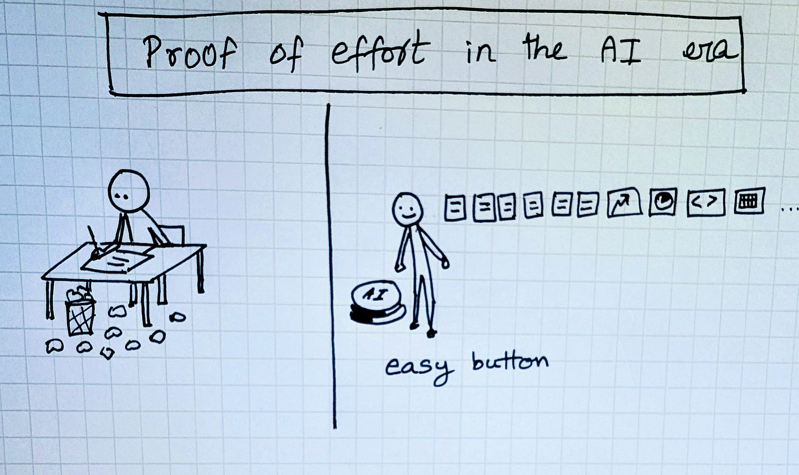
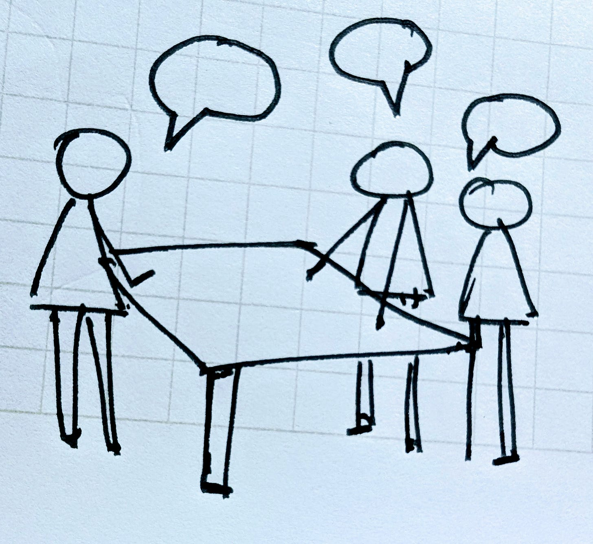

# Doc is cheap. Show me the talk.

“*Talk is cheap. Show me the code.*”

Linus Torvalds wrote that line twenty years ago, when code was the ultimate proof of effort. If you could ship software, you had shown your commitment.

The terrain looks different today. Code is cheap. Docs are cheap. With AI, a memo or a prototype that once consumed days of labor can appear in minutes. The artifact is still useful, but it no longer demonstrates how much effort went into producing it.

Which leaves us with a harder question:

*What is costly and counts as proof of effort?*

My friend Eugene Wei, in his brilliant essay *Status as a Service*, reminds us that every system depends on visible costly signals. Inside companies, memos, decks, and code carried that weight for decades. They were deliverables of course but as importantly, they were proofs of effort, sweat signals that colleagues and managers could point to as evidence of commitment.

AI collapses those signals. When artifacts can be generated instantly, they are no longer functioning as strong proofs of effort.

---

## The New Proofs of Effort

I do think human nature continues to search for new signals of effort and therefore status. When one signal fades, others start to emerge. I see these signals starting to be more important:

* **Presence.** When output content is cheap, synchronous human attention becomes more valuable. Being in the room, guiding a conversation, or answering tough questions live consumes real energy and effort. The key risk is that optics can get easily conflated with value, and leaders risk mistaking airtime for substance.

* **Relationships.** Trust is slow and demanding to build. It shows up in who the customer calls first, who colleagues turn to when stakes are high, who bridges the gaps between teams. Relationships endure as signals of effort but again they can also drift into politics if proximity to power is mistaken for contribution.

* **Gatekeeping.** Even in an age of abundant content, bottlenecks are scarce. Running a review, owning a pipeline, or managing a platform that others rely on requires persistence and credibility to earn. Gatekeeping and handling this responsibility is a clear proof of effort, though again there is a big risk of this hardening into inertia and rewarding incumbency rather than contribution.

---

## The Fork Ahead

Left unchecked, I think that presence, relationships, and gatekeeping will dominate as proofs of effort in the AI era. The big risk here is that organizations can drift into new forms of **effort theater**: longer meetings, constant travel, louder performances, and bottlenecks preserved more for status than for value.

But here is the refreshing truth, especially for builders of productivity tools - While AI potentially devalues some old proofs of effort around docs and code, it can also help us design better proofs of effort!

* Meeting agents that capture and credit contributions from quieter or remote participants.
* Documents that reveal not only the polished draft but also the reasoning and exploration behind it.
* Systems that surface who framed the pivotal question, who connected insights, who carried execution through to the end.

Proofs of effort within organizations don’t disappear. I think they will just migrate. The danger is that they migrate to the easiest visible signals. The opportunity is to use AI to make the invisible visible, and to recognize contributions that have always been overlooked.

AI forces us to ask:

In a world where code is cheap, docs are cheap and human attention is scarce, what takes effort?

The answer will decide whether organizations regress into performance theater, or use this moment to finally reward the contributions that matter most.

*Hat tip to Eugene Wei for sharpening the concept of costly signals, and to Ami Vora for our conversation on the ease of building and writing, sparking this question in my head.*